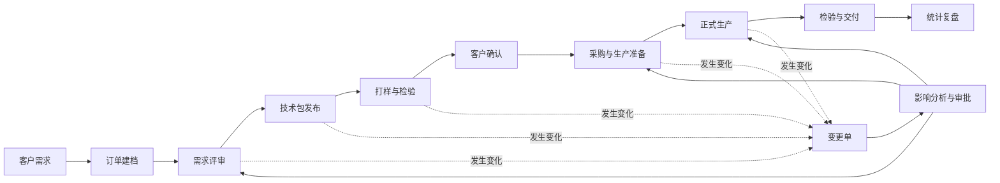
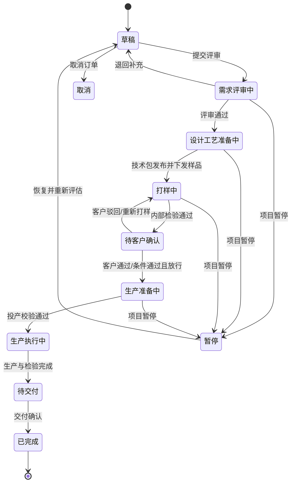
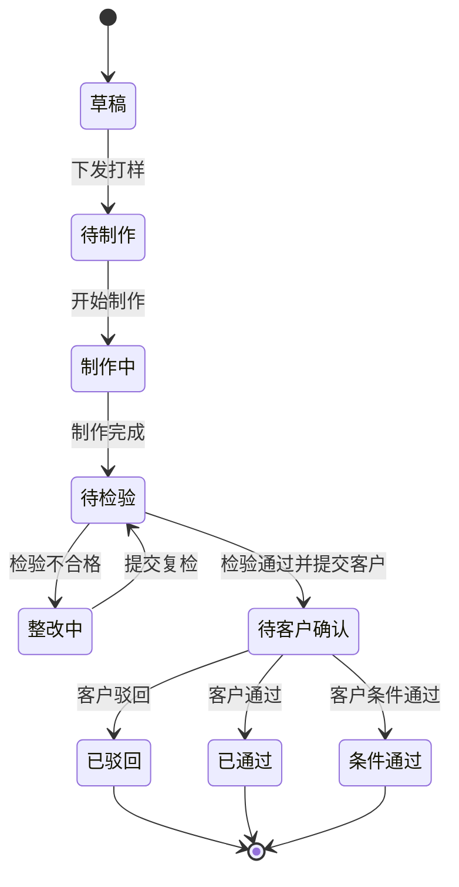
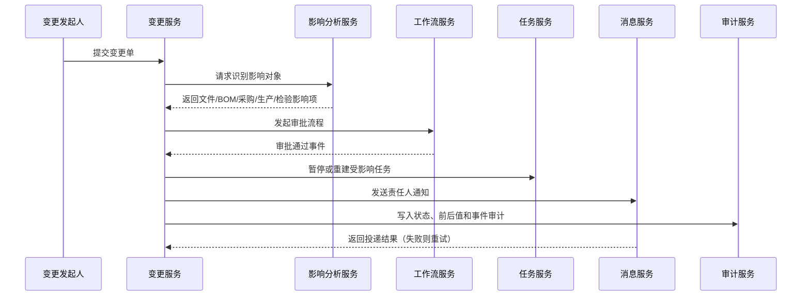
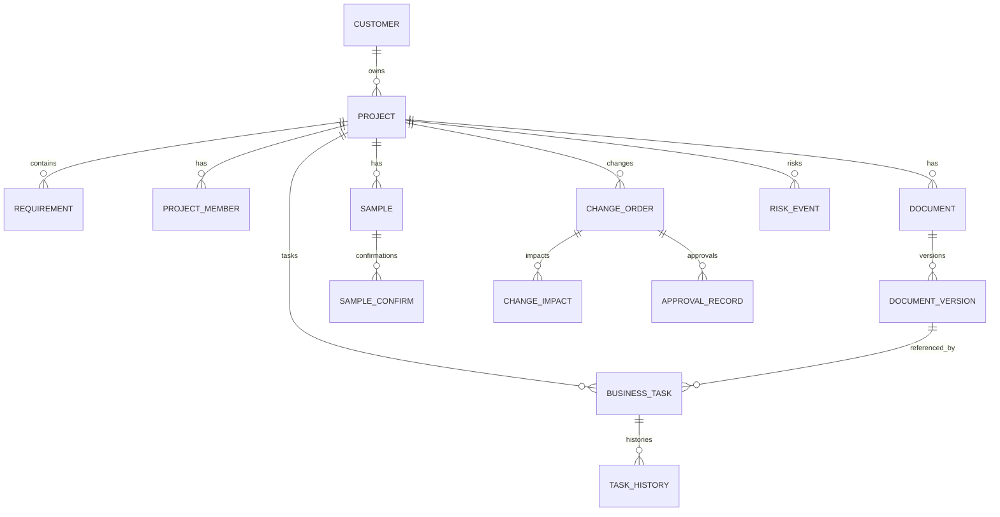
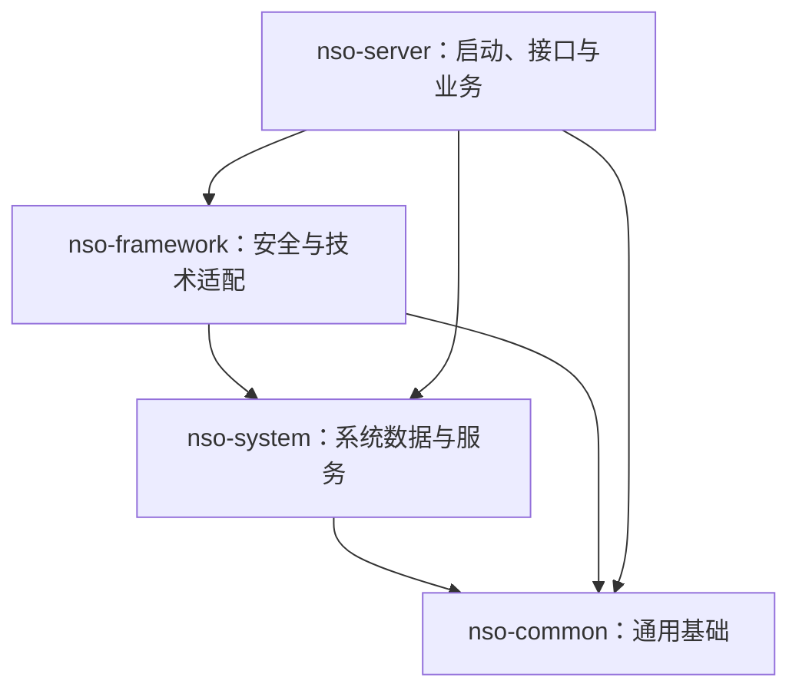
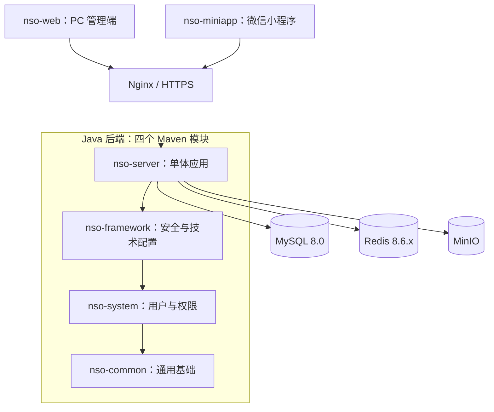

# 智慧非标订单打样与变更协同平台 V1.0

> 需求规格说明书（完善版，含业务需求与技术要求）

> **产品定位**
>
> 面向非标制造企业，从客户需求、设计图纸、工艺/BOM、样品确认、采购与生产任务到变更同步和交付风险，形成可追溯的订单协同闭环。系统通过规则校验、自动通知、临期预警和统计分析，降低图纸错版、样品漏确认、变更未同步和交期延误。


| **项目**     | **内容**                                                 |
|--------------|----------------------------------------------------------|
| 文档名称     | 智慧非标订单打样与变更协同平台 V1.0 需求规格说明书       |
| 文档版本     | V1.4（若依风格精简模块架构版）                           |
| 适用阶段     | 产品立项、需求评审、系统设计、开发测试、软著说明材料整理 |
| 建议建设形态 | 4 个 Maven 模块 + Vue 3 管理端 + uni-app 微信小程序      |
| 编制日期     | 2026年7月                                                |

# 文档修订记录

| **版本** | **日期** | **修订内容**                                                                                   | **状态** |
|----------|----------|------------------------------------------------------------------------------------------------|----------|
| V1.0     | 2026-07  | 首次形成完整需求与技术要求，覆盖订单、图纸版本、样品确认、变更协同、风险预警、统计分析等模块。 | 初稿     |
| V1.1     | 2026-07-24 | 补充范围边界、状态迁移、异常补偿、变更影响算法、通知事件、数据库约束、错误码、部署运维、需求追踪与软著交付清单。 | 评审稿   |
| V1.2     | 2026-07-24 | 技术栈调整为 Redis 8.6.1，并引入 Spring Security，补充 JWT/刷新令牌、Redis 登录态、验证码、限流、幂等、分布式锁、权限注解和安全验收要求。 | 评审稿   |
| V1.3     | 2026-07-24 | 补充 Java 后端、Vue 3 Web 管理端和微信小程序三套总体架构图、分层职责、推荐工程目录、端侧权限控制、状态管理、通信与构建要求。 | 评审稿   |
| V1.4     | 2026-07-25 | 将后端收敛为 nso-common、nso-system、nso-framework、nso-server 四个 Maven 模块；业务功能改为 nso-server 内部包；前端仅保留 nso-web 与 nso-miniapp 两个工程；统一 Controller、接口、配置、Flyway 和部署约定。 | 评审稿   |

# 目录

1. [文档概述](#1-文档概述)
2. [项目背景与建设目标](#2-项目背景与建设目标)
3. [用户角色与权限边界](#3-用户角色与权限边界)
4. [核心业务对象与状态模型](#4-核心业务对象与状态模型)
5. [总体业务流程](#5-总体业务流程)
6. [功能需求](#6-功能需求)
7. [智慧规则与自动化要求](#7-智慧规则与自动化要求)
8. [数据需求与数据模型](#8-数据需求与数据模型)
9. [技术架构与开发要求](#9-技术架构与开发要求)
10. [接口与集成要求](#10-接口与集成要求)
11. [非功能需求](#11-非功能需求)
12. [安全与审计要求](#12-安全与审计要求)
13. [测试与验收标准](#13-测试与验收标准)
14. [实施范围与版本规划](#14-实施范围与版本规划)
15. [软著材料展示建议](#15-软著材料展示建议)
16. [交互与页面要求](#16-交互与页面要求)
17. [部署、运维与灾备要求](#17-部署运维与灾备要求)
18. [需求追踪与交付物](#18-需求追踪与交付物)
19. [风险、假设与约束](#19-风险假设与约束)
20. [产品验收指标](#20-产品验收指标)
21. [附录A：关键业务规则清单](#附录a-关键业务规则清单)
22. [附录B：核心接口示例](#附录b-核心接口示例)
23. [附录C：统一错误码建议](#附录c-统一错误码建议)
24. [附录D：软著源代码目录与类建议](#附录d-软著源代码目录与类建议)
25. [附录E：Redis 键规范与有效期建议](#附录e-redis-键规范与有效期建议)

# 1. 文档概述

## 1.1 编制目的

本文档用于明确“智慧非标订单打样与变更协同平台 V1.0”的业务范围、用户角色、业务流程、功能边界、数据模型、技术实现要求、性能安全要求和验收标准，为产品设计、系统开发、测试验收、部署运维及软件著作权材料编制提供统一依据。

## 1.2 产品范围

平台面向机械加工、钣金、模具、自动化设备、包装设备、家具定制、电子装配等存在“多品种、小批量、频繁变更、图纸驱动、样品确认”特点的制造企业。V1.0 重点解决订单执行过程中信息分散、版本混乱、确认遗漏和变更不同步问题，不替代完整 ERP、MES 或 PLM，而是通过协同和规则控制连接销售、技术、采购、计划、生产和质量岗位。

## 1.3 术语说明

| **术语**   | **说明**                                                                                        |
|------------|-------------------------------------------------------------------------------------------------|
| 非标订单   | 客户对尺寸、材料、结构、工艺、功能或交付方式提出定制要求，不能完全按照标准产品直接生产的订单。  |
| 打样       | 为验证设计、材料、工艺或客户要求而进行的小批量或单件试制。                                      |
| 图纸版本   | 图纸或技术文件每次受控修改形成的可识别版本，如 A、B、C 或 V1.0、V1.1。                          |
| 变更单     | 记录变更原因、内容、影响范围、审批意见、执行状态和相关附件的业务单据。                          |
| 受影响任务 | 因需求、图纸、BOM、工艺或交期变化而需要暂停、重排、返工、补料或重新确认的采购、生产、检验任务。 |
| 交期风险   | 根据关键确认、物料、生产任务、计划日期和延期情况计算的风险等级。                                |


## 1.4 适用读者

| 读者 | 使用目的 |
|---|---|
| 项目负责人/产品经理 | 确认建设范围、优先级、流程边界和验收口径 |
| UI/UX 设计人员 | 设计 PC 管理端、小程序端页面、状态和交互反馈 |
| Java 后端开发人员 | 实现领域对象、状态机、规则校验、接口、定时任务和审计 |
| Web/小程序开发人员 | 实现工作台、表单、扫码、确认、消息、看板和异常处理 |
| 测试人员 | 编制功能、接口、权限、性能、安全和异常场景测试用例 |
| 实施运维人员 | 完成部署、参数初始化、数据导入、备份和运行监控 |
| 软著材料编制人员 | 提取软件功能说明、界面截图、模块说明和源代码结构 |

## 1.5 系统范围边界

### 1.5.1 V1.0 范围内

- 客户、非标订单、需求项、项目成员和目标交期管理。
- 图纸、BOM、工艺卡、检验规范等技术资料的版本化、审批发布、生效和失效。
- 多轮打样、内部检验、客户确认、驳回整改和特殊放行。
- 变更发起、影响分析、动态审批、任务同步、执行反馈、验证和关闭。
- 采购、生产、检验、交付等协同任务及关键节点状态反馈。
- 规则阻断、风险评分、临期预警、超时升级、站内消息和小程序消息。
- 延期、返工、变更、样品效率、任务负载等统计分析。
- 组织权限、流程参数、业务字典、日志、归档、导入导出和基础运维功能。

### 1.5.2 V1.0 范围外

- 不直接承担财务核算、成本会计、工资、发票和资金结算。
- 不替代完整 ERP 的采购合同、库存账、应收应付和供应链结算。
- 不替代完整 MES 的设备采集、工位报工、安灯、OEE 和产线控制。
- 不承担 CAD 三维模型设计、专业图纸编辑和自动生成工艺路线。
- 不在 V1.0 强制建设 AI 图纸识别、智能预测或硬件传感器接入。

## 1.6 需求优先级定义

| 优先级 | 定义 | 发布要求 |
|---|---|---|
| P0/高 | 缺失将导致核心流程不可闭环、数据不可信或发生错版投产风险 | V1.0 必须上线并通过验收 |
| P1/中 | 显著提升效率、可用性、协同和管理能力 | V1.0 原则上完成，可按工期分批启用 |
| P2/低 | 锦上添花或依赖外部条件 | 可进入后续迭代，不阻塞 V1.0 验收 |

## 1.7 需求表达约定

- “必须”表示强制验收项；“应”表示原则上实现；“可”表示选配或后续增强。
- 所有业务状态均由后端状态机控制，前端不得直接写入任意状态值。
- 所有规则阻断均必须返回规则编号、原因、当前值、期望值和可执行的处理入口。
- 所有关键数据对象均应拥有唯一业务编号，并支持按编号全局检索。

# 2. 项目背景与建设目标

## 2.1 典型业务痛点

- 图纸通过微信、邮箱或共享文件夹传递，旧版图纸仍可能被采购、生产或检验继续使用。

- 样品已制作但客户确认结论没有进入统一系统，生产计划临近时仍无法判断是否可投产。

- 客户需求变更只通知了销售或技术人员，采购下单、生产排程、外协加工和质检标准未同步调整。

- 项目状态依靠人工询问，管理人员难以及时发现“等待确认、关键物料未到、生产未启动”等交期风险。

- 变更造成的延期、返工、报废和追加成本缺少结构化记录，无法判断问题主要来自客户、设计、工艺还是执行环节。

## 2.2 建设目标

| **目标编号** | **建设目标**                 | **可衡量结果**                                                         |
|--------------|------------------------------|------------------------------------------------------------------------|
| G-01         | 实现订单全过程单一信息源     | 订单、需求、图纸、样品、变更、任务和风险均可按项目追溯。               |
| G-02         | 阻断错版和未经确认的关键操作 | 存在版本不一致、文件失效或样品未确认时，系统阻止提交或投产。           |
| G-03         | 实现变更影响自动传播         | 变更审批通过后，自动识别并通知相关采购、计划、生产和检验责任人。       |
| G-04         | 提前识别交期风险             | 按规则形成低、中、高、严重四级风险，并给出风险原因和处理建议。         |
| G-05         | 沉淀质量与经营数据           | 统计变更类型、来源、延期天数、返工次数和责任环节，为流程改善提供依据。 |

## 2.3 产品成功标准

- 普通业务人员在小程序端能够完成查询、确认、拍照上传、变更提报和异常反馈。

- 管理人员在 PC 端能够完成项目建档、技术文件管理、流程配置、任务分派、风险处置和统计分析。

- 任何关键状态变化均留下操作者、时间、前后值、审批意见和附件证据。

- 系统支持至少一个企业组织下的多部门、多角色、多项目并行运行。


## 2.4 建议管理指标

以下指标为系统建设和试点验收建议值，不代表企业上线前已经达到的经营结果。

| 指标编号 | 指标名称 | 建议口径 | 建议目标 |
|---|---|---|---|
| KPI-01 | 关键任务版本校验覆盖率 | 采购提交、任务开工、检验提交、交付确认中执行版本校验的次数/应校验次数 | 100% |
| KPI-02 | 错版提交阻断记录完整率 | 具备规则编号、任务版本、当前版本、操作者、时间和处理结果的阻断记录占比 | 100% |
| KPI-03 | 样品确认可追溯率 | 绑定样品批次、技术版本、确认人、时间、结论和凭证的确认记录占比 | 100% |
| KPI-04 | 变更影响项反馈完成率 | 已关闭变更中已完成反馈的影响项/全部影响项 | 100% |
| KPI-05 | 高风险项目处置及时率 | 在配置时限内形成处置计划的高/严重风险项目占比 | ≥95% |
| KPI-06 | 内部消息投递成功率 | 发送成功消息数/计划发送消息数 | ≥99% |
| KPI-07 | 审计覆盖率 | 关键操作已形成审计记录的次数/关键操作总次数 | 100% |

## 2.5 核心价值链



# 3. 用户角色与权限边界

| **角色**                   | **主要权限**                                                     | **权限限制**                                             |
|----------------------------|------------------------------------------------------------------|----------------------------------------------------------|
| 系统管理员                 | 用户、部门、角色、字典、流程、消息模板、系统参数、日志与备份配置 | 不得直接修改已归档业务数据，只能按授权更正并记录审计日志 |
| 销售/项目经理              | 客户、订单、需求、交期、项目成员、客户确认、变更发起、进度跟踪   | 不能替代技术人员发布受控图纸，不能直接关闭未完成技术任务 |
| 技术/设计人员              | 需求评审、图纸上传、版本发布、BOM/工艺维护、技术变更分析         | 不能直接确认客户结论，不能绕过版本校验                   |
| 工艺人员                   | 工艺路线、工序要求、检验要求、工时与外协说明                     | 只能修改授权项目和当前生效版本                           |
| 采购人员                   | 采购任务接收、供应商反馈、到料日期、受变更物料处置               | 不能修改技术版本，只能基于生效版本执行                   |
| 计划/生产人员              | 生产任务、排程、开工、完工、暂停、变更执行反馈                   | 样品未确认或版本失效时不得强制投产，例外需审批           |
| 质量人员                   | 样品检验、首件确认、检验结果、不合格与返工记录                   | 检验标准必须关联当前生效图纸/工艺版本                    |
| 客户确认人（可选外部账号） | 查看授权项目的样品资料、确认/驳回、填写意见                      | 只能访问被邀请项目和脱敏内容                             |
| 管理层                     | 项目看板、交期风险、变更统计、延期与返工分析                     | 默认只读，不参与具体业务编辑                             |

> **权限设计原则**
>
> 采用“数据权限 + 功能权限 + 字段权限 + 操作状态权限”四层控制。即使用户拥有某菜单权限，也必须同时满足所属企业、部门/项目范围和当前业务状态，才能执行修改、审批、发布、作废等操作。


## 3.1 权限控制维度

| 维度 | 控制内容 | 示例 |
|---|---|---|
| 租户维度 | 企业间数据隔离 | A 企业用户不得读取 B 企业项目 |
| 组织维度 | 部门、岗位和下属范围 | 部门负责人可查看本部门任务 |
| 项目维度 | 项目成员和项目内角色 | 非项目成员不可下载受控图纸 |
| 功能维度 | 菜单、按钮和接口权限 | 仅技术负责人可执行“发布版本” |
| 字段维度 | 敏感字段查看和编辑 | 普通生产人员不显示客户联系方式和金额 |
| 状态维度 | 当前状态下允许的动作 | 已关闭变更不可继续编辑，只能补充变更 |

## 3.2 关键职责分离

- 图纸上传人与最终发布审批人原则上不得为同一人，确需同人时必须由流程参数明确允许并记录原因。
- 样品制作人员不能替代质量人员填写检验结论。
- 内部人员不得伪造外部客户确认身份；销售代录客户结论时必须上传凭证并标记“代录”。
- 变更申请人不得单独完成高风险变更的全部审批。
- 特殊放行必须记录申请人、批准人、放行范围、有效期和风险承担说明。

## 3.3 高风险操作二次确认

以下操作应弹出二次确认，并要求填写原因或验证码：发布技术版本、作废生效版本、特殊放行投产、撤销已批准变更、修改目标交期、归档恢复、批量导出、删除未归档附件。

# 4. 核心业务对象与状态模型

## 4.1 核心业务对象

| **对象**      | **主要内容**                                                         |
|---------------|----------------------------------------------------------------------|
| 客户          | 客户基础信息、联系人、沟通偏好、历史项目                             |
| 非标订单/项目 | 项目编号、客户、产品、数量、目标交期、负责人、成员、优先级、当前阶段 |
| 需求项        | 结构化记录尺寸、材料、性能、外观、包装、检验、交付等要求及确认状态   |
| 技术文件      | 图纸、3D 文件、工艺卡、BOM、检验规范、附件及其版本                   |
| 样品单        | 打样目的、样品批次、制作状态、检验结论、客户确认结论                 |
| 变更单        | 变更来源、原因、内容、前后对比、影响分析、审批、执行与关闭           |
| 业务任务      | 需求评审、设计、采购、生产、检验、客户确认、交付等待办任务           |
| 风险事件      | 风险等级、触发规则、影响对象、责任人、处理措施、关闭结果             |
| 延期/返工记录 | 原因分类、发生环节、影响天数、返工数量、损失说明                     |

## 4.2 项目主状态

| **状态**        | **说明**                              | **主要迁移动作**          |
|-----------------|---------------------------------------|---------------------------|
| 草稿            | 项目已建立但未提交评审                | 销售/项目经理提交需求评审 |
| 需求评审中      | 技术、工艺等角色评审需求完整性        | 评审通过或退回补充        |
| 设计/工艺准备中 | 制作图纸、BOM、工艺和检验要求         | 受控技术版本发布          |
| 打样中          | 样品任务已下发并执行                  | 样品完成并提交检验/确认   |
| 待客户确认      | 等待客户确认样品或关键技术信息        | 客户确认、驳回或提出变更  |
| 生产准备中      | 采购、排程和生产资源准备              | 满足投产条件              |
| 生产执行中      | 正式生产、检验和异常处理              | 生产完成                  |
| 待交付          | 包装、出货资料、交付确认              | 完成交付                  |
| 已完成          | 订单业务闭环                          | 归档                      |
| 暂停/取消       | 因客户、技术、物料或经营原因暂停/取消 | 恢复或终止                |

## 4.3 变更单状态

草稿 → 待影响分析 → 待审批 → 已批准待执行 → 执行中 → 待验证 → 已关闭；审批驳回后回到“草稿/已驳回”，撤销后进入“已撤销”。已关闭变更不得直接编辑，必须新建补充变更。


## 4.4 状态迁移通用约束

1. 每次状态迁移必须通过明确的业务动作，例如 `submitReview`、`publishVersion`、`approveChange`，不得使用通用“修改状态”接口。
2. 状态迁移前必须校验当前状态、操作者权限、必填资料、关联对象状态和乐观锁版本。
3. 状态迁移成功后，在同一事务内写入状态历史、业务时间轴和待发送事件。
4. 外部消息发送失败不得回滚核心业务事务，应进入消息重试队列并产生运维告警。
5. 状态历史不可物理删除；作废数据保留作废人、作废时间、原因和原状态。

## 4.5 项目状态机



## 4.6 样品状态机



## 4.7 业务对象编号规则

| 对象 | 编号示例 | 规则建议 |
|---|---|---|
| 项目 | NSO-2026-000123 | 固定前缀 + 年份 + 六位流水号 |
| 技术版本 | DOC-000123-V1.3 | 文件业务号 + 版本号 |
| 样品单 | SMP-2026-000086 | 前缀 + 年份 + 流水号 |
| 变更单 | ECN-2026-000045 | 工程变更前缀 + 年份 + 流水号 |
| 任务 | TSK-20260724-0012 | 日期 + 流水号 |
| 风险事件 | RSK-20260724-0008 | 日期 + 流水号 |

# 5. 总体业务流程

## 5.1 主流程

| **步骤** | **阶段** | **关键活动**                                       | **输出**          |
|----------|----------|----------------------------------------------------|-------------------|
| 1        | 销售建档 | 创建客户和非标订单，录入目标交期、数量、需求与附件 | 订单草稿          |
| 2        | 需求评审 | 技术、工艺、质量等确认需求完整性和可制造性         | 评审结论/问题清单 |
| 3        | 设计发布 | 上传图纸、BOM、工艺和检验要求，校验后发布生效版本  | 受控技术版本      |
| 4        | 打样执行 | 生成样品任务，记录物料、制作、检验和问题           | 样品批次          |
| 5        | 样品确认 | 内部检验后提交客户确认，记录确认/驳回/条件通过     | 确认结论          |
| 6        | 生产准备 | 采购和计划根据生效版本建立任务，检查投产条件       | 采购/生产任务     |
| 7        | 生产交付 | 执行生产、检验、包装和出货，处理异常与变更         | 完工与交付记录    |
| 8        | 项目复盘 | 统计延期、变更、返工和风险处理效果                 | 复盘数据          |

## 5.2 变更协同流程

1.  变更发起：客户、销售、技术、工艺、采购或生产人员发起，必须填写变更原因、变更前后内容和紧急程度。

2.  影响分析：系统根据关联关系自动列出可能受影响的图纸、BOM、采购任务、生产任务、样品和检验标准，责任人补充处理意见。

3.  审批决策：根据变更类型、影响金额、是否已投产等条件选择审批链。

4.  版本发布：涉及技术文件时生成新版本，旧版本自动标记失效，未完成任务重新绑定或暂停。

5.  执行同步：向采购、计划、生产、质量等受影响岗位发送任务和通知，要求反馈执行结果。

6.  验证关闭：确认受影响任务全部完成或已处置，填写延期、返工、追加成本等结果后关闭变更。


## 5.3 异常与补偿流程

| 异常场景 | 系统处理 | 人工处理要求 |
|---|---|---|
| 技术版本发布后发现文件上传错误 | 禁止覆盖原文件；创建更正版本并将错误版本标记撤销/失效 | 填写错误原因并重新审批 |
| 变更审批通过但消息发送失败 | 核心变更保持已批准；消息进入重试队列 | 超过重试上限后运维告警，项目经理可人工催办 |
| 变更影响分析漏项 | 允许在未关闭前追加影响项，追加行为记录审计 | 追加项重新分派并确认是否需要补充审批 |
| 生产任务已开工后版本失效 | 任务自动进入“待变更处理/暂停建议”，禁止完工提交 | 技术、生产、质量共同决定返工、继续、报废或特殊放行 |
| 客户确认链接过期 | 原令牌失效，生成新令牌 | 销售重新发送；旧链接访问记录保留 |
| 定时风险计算失败 | 保留上次成功风险结果并标记“计算待更新” | 运维修复后补算，严重失败通知管理员 |
| 并发编辑冲突 | 返回 `DATA_VERSION_CONFLICT`，不覆盖他人修改 | 用户刷新后比较差异再提交 |
| 文件存储成功但数据库写入失败 | 清理孤立文件或进入定时清理清单 | 运维可查看清理结果 |

## 5.4 事件驱动协同过程



## 5.5 业务时间轴要求

项目详情必须按统一时间轴展示需求评审、文件发布、样品、客户确认、变更、任务、风险、异常、审批和交付事件。每条事件至少包含事件类型、标题、发生时间、操作者、业务对象、状态变化、摘要和详情跳转地址。

# 6. 功能需求

## 6.1 工作台与项目看板

| **编号**    | **功能**   | **需求说明**                                                                 | **优先级** |
|-------------|------------|------------------------------------------------------------------------------|------------|
| FR-DASH-001 | 个人工作台 | 显示本人待办、临期任务、未读通知、关注项目和最近操作。                       | 高         |
| FR-DASH-002 | 项目总览   | 按项目显示当前阶段、目标交期、剩余天数、责任人、样品状态、变更数和风险等级。 | 高         |
| FR-DASH-003 | 风险卡片   | 支持按严重、高、中、低筛选风险，并展示触发原因和建议动作。                   | 高         |
| FR-DASH-004 | 管理看板   | 统计进行中项目、延期项目、待客户确认、待发布图纸、未完成变更和本月返工。     | 中         |
| FR-DASH-005 | 快捷操作   | 根据角色提供新建订单、上传图纸、提交样品确认、发起变更等入口。               | 中         |

## 6.2 客户与非标订单管理

| **编号**   | **功能**   | **需求说明**                                                                   | **优先级** |
|------------|------------|--------------------------------------------------------------------------------|------------|
| FR-ORD-001 | 客户档案   | 维护客户名称、行业、联系人、联系方式、结算与交付说明；支持启用/停用。          | 高         |
| FR-ORD-002 | 订单建档   | 自动生成项目编号，录入客户、产品、数量、目标交期、优先级、负责人和成员。       | 高         |
| FR-ORD-003 | 需求结构化 | 需求按尺寸、材料、性能、外观、工艺、检验、包装、交付等分类录入。               | 高         |
| FR-ORD-004 | 需求确认   | 每条需求支持未确认、内部确认、客户确认、存在异议等状态。                       | 高         |
| FR-ORD-005 | 项目成员   | 支持跨部门选择成员，指定项目经理、技术负责人、采购负责人等。                   | 中         |
| FR-ORD-006 | 项目时间轴 | 按时间展示创建、评审、文件发布、样品、变更、风险和任务状态变化。               | 高         |
| FR-ORD-007 | 项目复制   | 可复制历史订单的需求结构、成员、BOM/工艺模板，但不得复制生效版本号和确认结论。 | 低         |

## 6.3 图纸与技术文件版本管理

| **编号**   | **功能**   | **需求说明**                                                                 | **优先级** |
|------------|------------|------------------------------------------------------------------------------|------------|
| FR-DOC-001 | 文件分类   | 支持图纸、3D 模型、BOM、工艺卡、检验规范、客户附件等分类。                   | 高         |
| FR-DOC-002 | 版本上传   | 上传时填写版本号、变更说明、生效日期、适用物料/部件和来源。                  | 高         |
| FR-DOC-003 | 版本唯一性 | 同一项目、同一文件类型和对象下，版本号不得重复；同一时刻只能有一个生效版本。 | 高         |
| FR-DOC-004 | 发布审批   | 关键技术文件需经技术负责人审核后发布，草稿文件不得被生产任务引用。           | 高         |
| FR-DOC-005 | 版本对比   | 展示前后版本的基础信息、变更说明、关联对象和附件；支持人工上传对比图。       | 中         |
| FR-DOC-006 | 失效控制   | 新版本生效后旧版本自动失效，并通知仍引用旧版本的未完成任务。                 | 高         |
| FR-DOC-007 | 下载水印   | 下载受控文件时叠加项目编号、版本、下载人和时间水印（可配置）。               | 中         |
| FR-DOC-008 | 二维码识别 | 为生效技术文件生成二维码，现场扫码查看当前版本和有效状态。                   | 中         |
| FR-DOC-009 | 版本阻断   | 采购、投产、检验提交前校验引用版本；版本不一致、失效或缺失时禁止提交。       | 高         |

## 6.4 BOM、工艺与检验要求

| **编号**   | **功能** | **需求说明**                                                              | **优先级** |
|------------|----------|---------------------------------------------------------------------------|------------|
| FR-TEC-001 | BOM 维护 | 按项目和版本维护物料编码、名称、规格、数量、单位、采购/自制属性和替代料。 | 高         |
| FR-TEC-002 | BOM 导入 | 支持 Excel 模板导入并校验必填项、重复物料和数量格式。                     | 中         |
| FR-TEC-003 | 工艺路线 | 维护工序顺序、作业说明、设备/工装、标准工时、外协标识和质检点。           | 高         |
| FR-TEC-004 | 检验要求 | 维护样品、首件、过程和成品检验项目、标准、抽样规则和附件。                | 高         |
| FR-TEC-005 | 版本绑定 | BOM、工艺、检验规范必须绑定图纸或技术版本，变更时自动进入影响分析。       | 高         |
| FR-TEC-006 | 发布校验 | 缺少关键物料、工艺或检验要求时禁止发布完整技术包，可按配置允许例外审批。  | 中         |

## 6.5 样品与客户确认管理

| **编号**   | **功能**     | **需求说明**                                                             | **优先级** |
|------------|--------------|--------------------------------------------------------------------------|------------|
| FR-SMP-001 | 样品申请     | 创建样品单，填写打样目的、数量、计划完成时间、引用版本和责任人。         | 高         |
| FR-SMP-002 | 样品任务     | 自动生成备料、制作、检验、提交确认等任务，支持拍照和附件上传。           | 高         |
| FR-SMP-003 | 样品检验     | 记录检验项目、实测值、合格结论、问题和整改结果。                         | 高         |
| FR-SMP-004 | 提交客户确认 | 生成确认链接/二维码或由销售代录，记录提交时间、资料和截止时间。          | 高         |
| FR-SMP-005 | 确认结论     | 支持通过、条件通过、驳回、待补充；必须填写意见，保留确认人、时间和凭证。 | 高         |
| FR-SMP-006 | 确认阻断     | 样品未通过时，不允许项目进入正式生产；特殊放行需指定审批人和原因。       | 高         |
| FR-SMP-007 | 临期预警     | 距离计划投产日期达到阈值且样品未确认时，自动产生预警和催办。             | 高         |
| FR-SMP-008 | 多轮样品     | 支持样品批次迭代，每轮绑定对应技术版本并关联上一轮问题。                 | 中         |

## 6.6 变更管理与影响同步

| **编号**   | **功能**     | **需求说明**                                                               | **优先级** |
|------------|--------------|----------------------------------------------------------------------------|------------|
| FR-CHG-001 | 变更发起     | 支持客户需求、设计、BOM、工艺、材料、数量、交期、包装等变更类型。          | 高         |
| FR-CHG-002 | 前后对比     | 必须记录变更前内容、变更后内容、原因、紧急程度和附件。                     | 高         |
| FR-CHG-003 | 影响对象识别 | 根据项目关联自动列出相关文件、物料、采购任务、生产任务、样品和检验要求。   | 高         |
| FR-CHG-004 | 影响分析协同 | 受影响部门填写是否受影响、处理方案、预计延期、追加成本和责任人。           | 高         |
| FR-CHG-005 | 动态审批     | 根据是否已采购、已投产、影响金额、延期天数等条件选择审批人。               | 高         |
| FR-CHG-006 | 自动暂停     | 高风险变更批准后，可自动暂停引用旧版本且未完成的生产/采购任务。            | 高         |
| FR-CHG-007 | 自动通知     | 变更批准或撤销后向受影响任务责任人发送站内、小程序订阅消息或企业微信通知。 | 高         |
| FR-CHG-008 | 执行反馈     | 责任人逐项反馈已重排、已改单、已退料、已返工、无需处理等结果。             | 高         |
| FR-CHG-009 | 关闭校验     | 受影响项未全部处理或验证不通过时，禁止关闭变更。                           | 高         |
| FR-CHG-010 | 结果归因     | 关闭时记录延期天数、返工数量、报废数量、追加成本和原因分类。               | 高         |

## 6.7 采购、生产与交付协同

| **编号**   | **功能** | **需求说明**                                                        | **优先级** |
|------------|----------|---------------------------------------------------------------------|------------|
| FR-EXE-001 | 采购任务 | 从 BOM 或手工生成采购任务，记录供应商、计划到料、实际到料和异常。   | 中         |
| FR-EXE-002 | 生产任务 | 按项目、部件、工序生成任务，记录计划开始/完成、实际状态和责任班组。 | 高         |
| FR-EXE-003 | 投产校验 | 校验图纸版本、生效技术包、样品确认、关键物料和未关闭高风险变更。    | 高         |
| FR-EXE-004 | 扫码查看 | 现场扫码查看项目、任务、当前图纸版本、工艺和变更提醒。              | 中         |
| FR-EXE-005 | 异常上报 | 支持缺料、设备、质量、技术、外协和进度异常，上传图片并创建风险。    | 高         |
| FR-EXE-006 | 交付检查 | 交付前检查任务完成、检验通过、资料齐套和未关闭严重风险。            | 高         |
| FR-EXE-007 | 交付记录 | 记录出货时间、数量、物流、签收和客户反馈。                          | 中         |

## 6.8 风险预警与消息中心

| **编号**   | **功能** | **需求说明**                                                       | **优先级** |
|------------|----------|--------------------------------------------------------------------|------------|
| FR-RSK-001 | 规则预警 | 按样品确认、图纸发布、物料到货、任务进度、变更状态和交期计算风险。 | 高         |
| FR-RSK-002 | 风险等级 | 支持低、中、高、严重四级，等级变化时记录原因并通知责任人。         | 高         |
| FR-RSK-003 | 风险处置 | 风险需填写处理措施、计划完成时间、责任人和关闭说明。               | 高         |
| FR-RSK-004 | 催办升级 | 待办超时后提醒本人，继续超时可升级至项目经理和部门负责人。         | 中         |
| FR-RSK-005 | 消息模板 | 按事件配置站内信、小程序订阅消息、邮件或企业微信模板。             | 中         |
| FR-RSK-006 | 消息回执 | 记录发送渠道、发送时间、接收人、发送结果和已读状态。               | 中         |

## 6.9 统计分析

| **编号**   | **功能** | **需求说明**                                                   | **优先级** |
|------------|----------|----------------------------------------------------------------|------------|
| FR-ANA-001 | 交期统计 | 按客户、项目经理、产品类型和月份统计按期、延期、平均延期天数。 | 高         |
| FR-ANA-002 | 变更统计 | 统计变更数量、来源、类型、发生阶段、审批时长和关闭时长。       | 高         |
| FR-ANA-003 | 延期归因 | 统计各类变更和异常导致的延期天数，支持主因/次因分类。          | 高         |
| FR-ANA-004 | 返工统计 | 统计返工次数、数量、工序、原因、关联变更和责任环节。           | 高         |
| FR-ANA-005 | 样品效率 | 统计打样轮次、首次通过率、平均确认时长和驳回原因。             | 中         |
| FR-ANA-006 | 部门负载 | 统计各部门待办、超时任务和受影响任务数量。                     | 中         |
| FR-ANA-007 | 数据导出 | 支持按权限导出 Excel；导出文件记录操作日志并可加水印。         | 中         |

## 6.10 系统管理与审计

| **编号**   | **功能**   | **需求说明**                                                 | **优先级** |
|------------|------------|--------------------------------------------------------------|------------|
| FR-SYS-001 | 组织与用户 | 维护企业、部门、岗位、用户、角色和项目成员。                 | 高         |
| FR-SYS-002 | 数据字典   | 维护订单类型、变更类型、风险原因、返工原因、文件类型等字典。 | 高         |
| FR-SYS-003 | 流程配置   | 配置需求评审、文件发布、样品放行、变更审批等流程和条件。     | 中         |
| FR-SYS-004 | 规则参数   | 配置预警阈值、风险权重、催办周期、允许上传格式和文件大小。   | 高         |
| FR-SYS-005 | 操作日志   | 记录登录、查询、导出、上传、发布、审批、作废和关键数据修改。 | 高         |
| FR-SYS-006 | 数据归档   | 已完成项目可归档为只读；恢复需管理员授权并记录原因。         | 中         |


## 6.11 全局检索、筛选与导出

| 编号 | 功能 | 需求说明 | 优先级 |
|---|---|---|---|
| FR-COM-001 | 全局检索 | 按项目编号、客户、产品、变更单号、样品单号、任务号、图纸名称进行权限过滤后的全局检索。 | 高 |
| FR-COM-002 | 组合筛选 | 列表支持状态、负责人、部门、日期范围、风险等级、是否超期等组合筛选并保存个人视图。 | 中 |
| FR-COM-003 | 批量操作 | 支持批量分派责任人、批量催办、批量导出；批量操作必须逐条校验权限和状态。 | 中 |
| FR-COM-004 | 异步导出 | 大数据量导出生成后台任务，完成后通过消息中心提供限时下载。 | 中 |
| FR-COM-005 | 导出审计 | 记录导出人、查询条件、字段范围、文件名、时间、结果和下载次数。 | 高 |

## 6.12 客户短期确认入口

V1.0 不单独建设第三个 H5 前端工程。客户可通过 `nso-miniapp` 的客户确认分包，或 `nso-web` 中不进入后台菜单的公共确认路由完成操作；两种入口均调用 `nso-server` 的受限公共确认接口。

| 编号 | 功能 | 需求说明 | 优先级 |
|---|---|---|---|
| FR-EXT-001 | 短期访问令牌 | 客户通过短期、一次性或可配置次数的令牌访问指定样品确认页面，不创建普通后台账号。 | 中 |
| FR-EXT-002 | 内容脱敏 | 页面仅展示授权样品、图片、必要技术说明和确认项，不暴露内部成本、责任人和其他项目。 | 高 |
| FR-EXT-003 | 身份核验 | 可通过手机号验证码、邮箱验证码或确认口令核验身份。 | 中 |
| FR-EXT-004 | 确认签署 | 记录客户姓名、单位、联系方式、结论、意见、时间、IP/设备摘要和电子签名图片（选配）。 | 高 |
| FR-EXT-005 | 防重复提交 | 已完成确认的令牌禁止重复修改；重新确认必须由内部人员发起新轮次。 | 高 |
| FR-EXT-006 | 工程复用 | 浏览器确认页面归属 `nso-web`，微信内确认页面归属 `nso-miniapp`，不得复制第三套业务工程。 | 高 |

## 6.13 配置中心

- 项目编号规则、版本编号规则、审批条件、风险权重、预警阈值、超时升级周期可配置。
- 文件类别、变更类型、延期原因、返工原因、任务类型采用业务字典管理。
- 规则参数修改后生成新规则版本；历史风险继续引用原规则版本，不得被新参数覆盖。
- 参数发布前应进行格式、范围、依赖和冲突校验；高风险参数修改应经过审批。

## 6.14 数据导入与初始化

- 提供客户、联系人、项目、物料、BOM 基础数据模板。
- 导入过程分为上传、解析、预校验、错误下载、确认导入和结果汇总。
- 导入必须采用业务唯一键去重，并支持“仅新增”“新增并更新”两种模式。
- 单次导入失败不得产生半成品数据；大批量导入可采用分批事务，但必须输出成功和失败清单。

# 7. 智慧规则与自动化要求

本平台中的“智慧”主要由规则引擎、状态机、关联关系和定时任务实现，不依赖 AI 算法或现场硬件。规则必须可配置、可解释、可追溯，任何自动阻断或风险判定都应向用户显示具体原因。

| **规则编号** | **规则名称**       | **触发条件**                                                             | **系统动作**                                       |
|--------------|--------------------|--------------------------------------------------------------------------|----------------------------------------------------|
| BR-001       | 技术版本一致性阻断 | 提交采购、投产、检验或交付时，校验任务引用版本与当前生效版本。           | 不一致、失效、缺失时阻断；显示正确版本和处理入口。 |
| BR-002       | 样品确认阻断       | 项目进入正式生产前校验样品结论。                                         | 未确认、驳回或确认已过期时阻断；特殊放行需审批。   |
| BR-003       | 变更影响传播       | 变更批准后按关联关系查找受影响任务。                                     | 生成影响项、自动通知、必要时暂停旧版本任务。       |
| BR-004       | 样品临期预警       | 计划投产日期减去当前日期小于阈值且样品未确认。                           | 产生高风险，通知销售、项目经理和计划人员。         |
| BR-005       | 交期风险计算       | 综合剩余天数、关键任务完成率、样品状态、物料状态、未关闭变更和历史延期。 | 输出风险等级、主要原因、建议动作。                 |
| BR-006       | 文件发布完整性校验 | 发布技术包前检查图纸、BOM、工艺、检验要求和版本说明。                    | 缺少必需项时阻断或进入例外审批。                   |
| BR-007       | 变更关闭校验       | 关闭变更前检查所有影响项和验证任务。                                     | 存在未完成、未反馈、验证失败项时禁止关闭。         |
| BR-008       | 超时升级           | 待办超过计划完成时间。                                                   | 按配置通知本人、项目经理、部门负责人。             |
| BR-009       | 交付完整性校验     | 出货前检查生产、检验、资料和严重风险。                                   | 不满足时阻断交付确认。                             |
| BR-010       | 统计自动归因       | 变更或异常关闭时读取原因分类、延期和返工数据。                           | 自动进入对应统计维度，允许管理人员复核。           |

## 7.1 交期风险等级建议算法

V1.0 可采用规则加权而非机器学习。系统对每个项目计算风险分值 RiskScore（0～100），并保留每项加分依据。以下为建议初始规则，企业可在系统参数中调整。

| **风险因素**                 | **建议分值**     |
|------------------------------|------------------|
| 样品未确认且距投产≤3天       | +30              |
| 存在未关闭严重/高风险变更    | +25              |
| 关键物料预计到货晚于计划开工 | +25              |
| 生效技术包未发布且距开工≤2天 | +20              |
| 关键任务超期                 | 每项+10，最多+30 |
| 剩余工期小于计划工时         | +20              |
| 项目已延期                   | +40              |
| 所有关键条件满足且进度正常   | -10，最低为0     |

建议等级：0～19 为低风险，20～39 为中风险，40～69 为高风险，70～100 为严重风险。风险等级变化必须记录触发时间、分值明细和规则版本，便于后续复盘。


## 7.2 规则执行生命周期

1. **触发**：业务动作、领域事件或定时任务触发规则。
2. **取数**：按项目、业务对象和规则版本读取一致性数据。
3. **匹配**：判断规则适用阶段、对象类型、企业参数和启停状态。
4. **决策**：输出通过、警告、阻断、创建风险、创建任务、暂停任务或发送消息。
5. **落库**：保存规则编号、规则版本、输入摘要、决策结果、耗时和追踪号。
6. **通知**：根据事件矩阵通知责任人；失败进入重试。
7. **解除**：触发条件消失后自动解除风险，或由授权人员验证关闭。

## 7.3 变更影响识别逻辑

影响分析不依赖 AI，可基于“业务关联表 + 当前状态 + 版本引用”完成：

1. 根据变更对象获取直接关联对象，例如需求项关联图纸，图纸关联 BOM、工艺和检验规范。
2. 根据技术版本引用关系查找使用该版本的样品、采购、生产和检验任务。
3. 根据物料编码、部件编码、工序编码和项目 ID 查找间接影响对象。
4. 过滤已完成且无需追溯处理的对象；已完成但可能产生返工、报废或客户风险的对象仍应保留。
5. 按对象状态计算建议动作：重新绑定、暂停、改单、退料、补料、返工、复检、重新确认或无需处理。
6. 每项自动识别结果允许责任人确认、调整或补充，但删除系统识别项必须填写原因。

### 7.3.1 建议影响判定矩阵

| 变更类型 | 直接影响 | 可能间接影响 | 默认建议动作 |
|---|---|---|---|
| 尺寸/结构 | 图纸、检验规范 | BOM、工艺、样品、生产任务 | 新建版本、暂停旧任务、复核样品 |
| 材料/规格 | BOM、采购任务 | 工艺、生产、检验、成本 | 改单/退料/补料、重新评估交期 |
| 工艺路线 | 工艺版本、生产任务 | 工装、外协、检验点 | 重排任务、确认已制品处理 |
| 数量 | 订单、采购、生产任务 | 包装、交付、成本 | 调整数量并记录差额 |
| 交期 | 项目计划 | 采购到货、生产排程、外协 | 重算风险、通知计划和采购 |
| 包装/标签 | 包装规范、交付资料 | 采购物料、成品返工 | 修改包装任务、检查已完成品 |

## 7.4 消息事件矩阵

| 事件 | 接收人 | 默认渠道 | 发送时机 | 升级规则 |
|---|---|---|---|---|
| 技术版本发布 | 项目经理、采购、计划、生产、质量 | 站内信/小程序 | 事务提交后 | 无 |
| 旧版本失效且存在未完成任务 | 任务责任人、项目经理 | 站内信/小程序 | 立即 | 2小时未处理升级部门负责人 |
| 样品待客户确认 | 销售、客户确认人 | 小程序/短信/邮件（选配） | 提交确认后 | 距截止24小时催办 |
| 样品临近投产仍未确认 | 项目经理、销售、计划 | 站内信/小程序 | 定时扫描 | 每日升级一次 |
| 高/严重风险生成 | 项目经理、对应责任人、管理层（可配） | 站内信/小程序 | 风险计算后 | 超时未建处置计划升级 |
| 变更批准 | 全部影响项责任人 | 站内信/小程序 | 批准后 | 未读或未反馈按时限催办 |
| 任务超期 | 责任人 | 站内信 | 超期时 | 继续超期升级项目经理/部门负责人 |

## 7.5 风险分数计算约束

- 风险分数限定为 0～100，计算后使用 `min(100, max(0, score))` 截断。
- 同一风险因素不得因多个重复数据被无限累加，必须设置单项上限。
- 严重风险可由“分数达到阈值”或“命中一票严重规则”产生，例如目标交期已过且未完成。
- 项目手工调整风险等级只能作为临时覆盖，必须填写原因和有效期；到期后恢复自动计算。
- 风险页面必须展示原始指标、加减分明细、规则版本、计算时间和建议动作。

### 7.5.1 风险计算伪代码

```text
score = 0
reasons = []

for rule in enabledRules(project.stage, tenantId):
    result = rule.evaluate(projectSnapshot)
    if result.matched:
        score += result.score
        reasons.append(result.reason)

score = clamp(score, 0, 100)
level = mapLevel(score, fatalRuleMatched)
saveRiskSnapshot(projectId, score, level, reasons, ruleVersion)
```

## 7.6 规则幂等与重复处理

- 同一规则、同一业务对象、同一触发批次只允许生成一条有效风险或待办。
- 定时任务采用分布式锁或任务分片，避免多实例重复扫描。
- 消息表使用业务事件 ID + 接收人 + 模板编号作为幂等键。
- 规则执行失败应记录失败原因和重试次数，不得静默跳过。

# 8. 数据需求与数据模型

## 8.1 数据设计原则

- 所有核心业务表包含企业标识、创建人、创建时间、修改人、修改时间、逻辑删除和乐观锁版本字段。

- 文件本体存储在对象存储中，数据库保存文件元数据、哈希值、业务关联、版本和权限信息。

- 状态变化采用业务流水或事件表记录，不仅保存最终状态。

- 变更前后值、审批意见和关键确认结论应采用不可覆盖的历史记录，禁止直接更新覆盖。

- 统计字段优先来源于业务数据自动汇总，不允许仅手工填报。

## 8.2 建议核心数据表

| **表/表组**                                          | **用途**                   |
|------------------------------------------------------|----------------------------|
| sys_user / sys_dept / sys_role                       | 用户、部门、角色与权限     |
| crm_customer / crm_contact                           | 客户及联系人               |
| nso_project                                          | 非标订单/项目主表          |
| nso_project_member                                   | 项目成员与项目内角色       |
| nso_requirement / nso_requirement_history            | 需求项及变更历史           |
| nso_document / nso_document_version                  | 技术文件及版本             |
| nso_bom / nso_bom_item                               | BOM 版本及明细             |
| nso_process_route / nso_process_step                 | 工艺路线及工序             |
| nso_inspection_spec / nso_inspection_item            | 检验规范及项目             |
| nso_sample / nso_sample_check / nso_sample_confirm   | 样品、检验与客户确认       |
| nso_change / nso_change_impact / nso_change_approval | 变更、影响项和审批记录     |
| nso_task / nso_task_log                              | 业务任务和状态流水         |
| nso_risk / nso_risk_action                           | 风险事件与处置记录         |
| nso_delay_rework                                     | 延期、返工、报废和成本记录 |
| nso_message / nso_message_receipt                    | 消息和回执                 |
| sys_operation_log / sys_login_log                    | 审计与登录日志             |

## 8.3 关键字段示例：项目主表 nso_project

| **字段**               | **类型**      | **说明**           |
|------------------------|---------------|--------------------|
| id                     | bigint        | 主键               |
| tenant_id              | bigint        | 企业/租户标识      |
| project_no             | varchar(32)   | 项目编号，唯一     |
| customer_id            | bigint        | 客户ID             |
| project_name           | varchar(128)  | 项目名称           |
| product_name           | varchar(128)  | 产品/设备名称      |
| quantity               | decimal(12,3) | 订单数量           |
| target_delivery_date   | date          | 目标交期           |
| plan_start_date        | date          | 计划开工日期       |
| owner_id               | bigint        | 项目经理           |
| stage                  | varchar(32)   | 当前阶段           |
| status                 | varchar(32)   | 业务状态           |
| risk_level             | varchar(16)   | 当前风险等级       |
| risk_score             | int           | 风险分值           |
| current_doc_version_id | bigint        | 当前生效技术包版本 |
| sample_confirm_status  | varchar(24)   | 样品确认状态       |
| version                | int           | 乐观锁版本         |
| created_at             | datetime      | 创建时间           |

## 8.4 数据关系要求

- 一个项目可包含多条需求、多份技术文件、多轮样品、多张变更单和多项采购/生产任务。

- 每个样品批次必须绑定其使用的图纸、BOM、工艺和检验版本。

- 每个采购、生产和检验任务必须保存创建时引用的版本，并在执行前与当前生效版本比对。

- 变更影响项必须指向具体业务对象及原状态，不能只保存文字描述。

- 风险事件既可由规则自动生成，也可人工创建；自动风险需保存规则编号和规则版本。


## 8.5 领域关系示意



## 8.6 数据库约束与索引

- `tenant_id + project_no`、`tenant_id + change_no`、`tenant_id + sample_no` 建立唯一索引。
- 文件版本表对“企业 + 项目 + 技术对象 + 版本号”建立唯一索引。
- 同一技术对象仅允许一个 `effective_status = EFFECTIVE` 的版本；MySQL 可通过事务锁和业务校验实现。
- 高频列表索引建议覆盖 `tenant_id`、状态、负责人、目标交期、更新时间、项目 ID。
- 任务表建立 `(tenant_id, assignee_id, status, plan_end_time)` 组合索引，用于工作台和超期扫描。
- 风险表建立 `(tenant_id, project_id, status, risk_level)` 索引。
- 关联表必须建立双向查询索引，避免影响分析产生全表扫描。

## 8.7 数据一致性与事务边界

| 业务动作 | 必须处于同一事务的数据 | 异步处理 |
|---|---|---|
| 发布技术版本 | 新版本生效、旧版本失效、发布记录、状态历史、业务事件落库 | 通知、二维码/水印预生成 |
| 审批变更 | 审批记录、变更状态、影响项状态、业务事件落库 | 消息发送、非关键统计汇总 |
| 任务开工 | 投产校验结果、任务状态、任务历史、引用版本快照 | 现场通知 |
| 样品确认 | 确认记录、样品状态、项目状态候选迁移、业务事件 | 通知和风险重算 |

## 8.8 数据保留与归档

- 核心业务数据、审批记录、确认记录、版本历史和审计日志默认保留不少于 3 年，可按企业制度延长。
- 已完成项目归档后，业务表保持可查询，附件可迁移至低频对象存储。
- 归档数据仍须支持按项目编号、客户、年份和变更单号检索。
- 删除仅适用于未提交草稿或无业务引用的临时文件；其他数据采用逻辑删除、作废或归档。

## 8.9 数据字典治理

字典项需包含编码、名称、所属字典、排序、启用状态、是否系统内置、创建人和停用时间。已被业务数据引用的字典编码不得修改或物理删除，只能停用并保留历史显示名称。

# 9. 技术架构与开发要求

## 9.1 架构结论

V1.0 采用“**若依风格的前后端分离 + 四模块 Maven 模块化单体 + 两个前端工程**”。系统不按每个业务域拆分 Maven 模块，不建设微服务集群，所有后端能力最终由 `nso-server` 打包为一个 Spring Boot 应用运行。

本架构保留若依体系中成熟的用户、角色、菜单、部门、字典、参数、日志、数据权限和统一返回能力，但业务代码按本项目重新组织，不直接照搬大型脚手架中过多的模块、依赖和扩展组件。

V1.0 必须遵守以下原则：

- 只保留 `nso-common`、`nso-system`、`nso-framework`、`nso-server` 四个 Maven 模块。
- 客户、项目、技术资料、样品、变更、任务、风险、消息、报表九个业务域只作为 `nso-server` 内部包，不再分别建立 Maven 模块。
- 管理端和小程序共用同一套 Service、Mapper、实体和业务规则，只分别提供 Controller/DTO 适配。
- 后端只发布一个可执行 JAR，保持本地事务简单、部署成本可控。
- V1.0 不强制引入微服务、API 网关、消息队列、Flowable/Activiti、独立任务执行器或独立文件服务。
- MySQL 是业务事实数据的唯一可信来源；Redis、MinIO 和异步任务只承担各自的辅助职责。
- 模块数量可以少，但版本阻断、样品确认、变更传播、交期风险和审计证据链不得因架构精简而削弱。

## 9.2 工程组成

| 工程/模块 | 类型 | 核心职责 | 内部依赖 | 交付形态 |
|---|---|---|---|---|
| `nso-common` | Maven JAR | 通用注解、常量、枚举、业务异常、`AjaxResult<T>`、基础实体、纯工具类 | 无 | 被其他后端模块依赖 |
| `nso-system` | Maven JAR | 用户、角色、菜单、部门、岗位、字典、参数、登录/操作日志及其 Domain/Mapper/Service | `nso-common` | 被框架层和服务层依赖 |
| `nso-framework` | Maven JAR | Spring Security、JWT、微信登录适配、AOP、全局异常、Web/MyBatis/Redis/MinIO/Knife4j 配置 | `nso-common`、`nso-system` | 被启动模块依赖 |
| `nso-server` | Maven JAR | Spring Boot 启动、全部 Controller、九个业务包、定时任务、业务配置与 Flyway 脚本 | `nso-common`、`nso-system`、`nso-framework` | 单个可执行 JAR |
| `nso-web` | npm 工程 | Vue 3 PC 管理端 | 通过 HTTPS 调用后端 | 静态资源 |
| `nso-miniapp` | npm 工程 | uni-app 微信小程序 | 通过 HTTPS 调用后端 | 微信小程序包 |

> `nso-server` 应在 `pom.xml` 中显式声明自己直接使用的后端模块，不依赖 Maven 的传递依赖来“顺带”获得 `nso-system`。这样依赖关系更清晰，后续排查编译和版本问题也更容易。

## 9.3 Maven 依赖方向



依赖约束如下：

- `nso-common` 不得依赖其他项目内模块。
- `nso-system` 不得依赖 `nso-framework` 或 `nso-server`，否则会形成循环依赖。
- `nso-framework` 可以调用 `nso-system` 的用户、角色、权限、字典和参数 Service，用于完成认证授权和系统配置。
- `nso-server` 负责最终装配，可依赖前三个模块。
- 前端工程不参与 Maven 依赖，只通过接口契约与 `nso-server` 协作。
- Maven 模块之间禁止使用相对路径读取对方资源，公共依赖版本统一由父 `pom.xml` 的 `dependencyManagement` 管理。

## 9.4 推荐项目目录

```text
nso-platform/
├── pom.xml                                  # 父工程、模块声明、依赖与插件版本
├── nso-common/
│   └── src/main/java/com/nso/common/
│       ├── annotation/                      # 通用业务注解，不含切面实现
│       ├── constant/                        # 常量
│       ├── core/
│       │   ├── domain/BaseEntity.java       # 审计字段、乐观锁等基础字段
│       │   └── web/AjaxResult.java          # 统一响应模型
│       ├── enums/                           # 跨模块稳定枚举
│       ├── exception/                       # 业务异常与错误码
│       └── utils/                           # 不依赖 Web/Security 的纯工具
├── nso-system/
│   └── src/main/
│       ├── java/com/nso/system/
│       │   ├── domain/                      # 用户、角色、菜单、部门、字典、参数、日志
│       │   ├── mapper/                      # MyBatis-Plus Mapper
│       │   └── service/
│       │       ├── I*Service.java
│       │       └── impl/*ServiceImpl.java
│       └── resources/mapper/system/         # 必需的 XML 映射文件
├── nso-framework/
│   └── src/main/java/com/nso/framework/
│       ├── aspect/                          # 操作日志、数据权限、防重复提交
│       ├── config/                          # Web、MyBatis、Redis、Jackson 等配置
│       ├── exception/                       # 全局异常处理
│       ├── security/
│       │   ├── config/
│       │   ├── filter/
│       │   ├── handler/
│       │   ├── jwt/
│       │   ├── service/
│       │   └── wechat/                      # code2Session 与账号绑定适配
│       ├── redis/                           # 缓存、幂等、限流、分布式锁
│       ├── storage/                         # MinIO 低层客户端与受控地址
│       ├── web/                             # BaseController、TraceId、Web 拦截器
│       └── swagger/                         # Knife4j/OpenAPI 配置
├── nso-server/
│   └── src/
│       ├── main/
│       │   ├── java/com/nso/
│       │   │   ├── NsoServerApplication.java
│       │   │   ├── config/                  # 应用级配置：微信、异步线程池等
│       │   │   ├── support/                 # 项目级共享业务能力
│       │   │   │   ├── approval/            # 轻量审批记录与审批人计算
│       │   │   │   ├── event/               # 事务后事件与消息落库
│       │   │   │   ├── export/              # 异步导出
│       │   │   │   └── timeline/            # 统一业务时间轴
│       │   │   ├── modules/                 # PC 管理端业务模块
│       │   │   │   ├── customer/
│       │   │   │   ├── project/
│       │   │   │   ├── document/
│       │   │   │   ├── sample/
│       │   │   │   ├── change/
│       │   │   │   ├── task/
│       │   │   │   ├── risk/
│       │   │   │   ├── message/
│       │   │   │   └── report/
│       │   │   ├── mp/                      # 小程序接口适配，只放 Controller/DTO
│       │   │   │   ├── auth/
│       │   │   │   ├── project/
│       │   │   │   ├── document/
│       │   │   │   ├── sample/
│       │   │   │   ├── change/
│       │   │   │   ├── task/
│       │   │   │   └── message/
│       │   │   ├── publicapi/               # 可选短期客户确认入口
│       │   │   ├── job/                     # 风险、催办、消息重试、导出任务
│       │   │   └── web/controller/system/   # PC 管理端系统 Controller
│       │   └── resources/
│       │       ├── application.yml
│       │       ├── application-dev.yml
│       │       ├── application-test.yml
│       │       ├── application-prod.yml
│       │       ├── db/migration/             # 唯一 Flyway 生产脚本目录
│       │       ├── mapper/                   # 业务 XML 映射文件
│       │       └── logback-spring.xml
│       └── test/
│           ├── java/                         # 单元与集成测试
│           └── resources/db/demo/            # 仅测试/演示使用的数据
├── nso-web/                                  # Vue 3 + TypeScript + Vite
├── nso-miniapp/                              # uni-app + Vue 3 + TypeScript
└── docs/
    ├── api/
    ├── database/
    └── deployment/
```

目录修订说明：

- 不再建立 `nso-adapter-api`、`nso-module-*`、`nso-integration`、`nso-job-executor` 等独立 Maven 模块。
- `BaseController` 涉及 Spring Web，应放在 `nso-framework/web`，不能放入声称“无框架依赖”的 `nso-common`。
- `nso-server` 内使用 `support` 而不是再次使用 `common` 包，避免与 `nso-common` 模块重名混淆。
- Flyway 生产脚本只保留一份，统一位于 `nso-server/src/main/resources/db/migration`；不得再在项目根目录维护另一份同名迁移脚本。
- 演示数据不得随生产包自动执行，应放在测试资源或单独的演示环境脚本中。

## 9.5 业务模块统一四层

九个业务包统一使用简化四层结构，不强制套用复杂 DDD 目录：

```text
modules/<name>/
├── controller/                             # PC 管理端 REST Controller
├── domain/
│   ├── entity/                             # 数据库实体
│   ├── dto/                                # 新增、修改、查询、动作入参
│   ├── vo/                                 # 页面和接口返回对象
│   └── enums/                              # 模块内部枚举
├── mapper/                                 # MyBatis-Plus Mapper
└── service/
    ├── I*Service.java
    ├── impl/*ServiceImpl.java
    ├── rule/                               # 复杂校验和规则策略，可选
    └── support/                            # 转换器、状态机、影响分析器，可选
```

四层调用方向必须为：

```text
Controller → Service → Mapper → MySQL
                 ├── Redis/Redisson（经框架封装）
                 ├── MinIO（经框架封装）
                 └── 其他模块 Service
```

具体约束如下：

- Controller 只处理权限、参数校验、客户端 DTO 转换和响应封装，不直接调用 Mapper。
- Service 负责事务、状态迁移、规则校验和跨模块编排。
- Mapper 只负责本模块数据访问，不包含业务判断。
- 一个模块需要其他模块数据时，应调用对方 Service 或只读查询接口，不得直接调用对方 Mapper。
- 小程序 `mp` 包只提供移动端 Controller 和专用 DTO，必须复用 `modules` 中的 Service，不得复制一套业务实现。
- 对风险计算、变更影响分析、版本校验等复杂逻辑，可在 `service/rule` 或 `service/support` 中拆分类，但不因此新增 Maven 模块。

## 9.6 九个业务包的职责边界

| 业务包 | 包含功能 | 明确不包含 |
|---|---|---|
| `customer` | 客户、联系人、客户状态、联系偏好 | 用户登录、角色权限 |
| `project` | 非标项目、需求项、项目成员、里程碑、项目时间轴入口 | 图纸文件本体、生产报工 |
| `document` | 图纸、技术文件、版本、BOM、工艺路线、检验规范、二维码、水印、文件业务元数据 | MinIO 低层连接配置 |
| `sample` | 打样申请、样品批次、内部检验、客户确认、多轮整改 | 正式生产任务 |
| `change` | 变更单、前后差异、影响分析、审批、执行反馈、验证关闭 | 通用用户角色维护 |
| `task` | 采购、生产、检验、交付协同任务，开工/完工校验和异常上报 | 完整 ERP/MES 单据核算 |
| `risk` | 风险规则、风险快照、评分、预警、处置、超时升级 | 通用消息渠道实现 |
| `message` | 站内信、订阅消息、模板、回执、重试与去重 | 业务状态修改 |
| `report` | 看板、统计口径、Excel 导入导出、异步报表任务 | 原始业务数据维护 |

为保持九个包不增加：

- 原 `technical` 模块并入 `document`，在其内部按 `bom`、`process`、`inspection` 子包组织。
- 文件业务元数据与技术版本属于 `document`；MinIO 客户端、临时地址和存储配置属于 `nso-framework/storage`。
- 审批不建立独立工作流模块。V1.0 采用 `support/approval` 的轻量审批记录、审批节点和审批人计算，各业务模块保存自己的审批结果。
- 定时任务不建立独立执行器模块，统一放在 `nso-server/job`。
- 外部 ERP/MES 集成在 V1.0 不启用；后续需要时先放入 `nso-server/integration` 包，再根据规模决定是否拆模块。

## 9.7 Controller 与 API 边界

| 客户端 | Controller 位置 | 路径前缀 | 说明 |
|---|---|---|---|
| PC 管理端业务 | `modules/*/controller` | `/api/v1/admin/**` | 项目、文件、样品、变更、任务、风险、报表等 |
| PC 系统管理 | `web/controller/system` | `/api/v1/admin/system/**` | 用户、角色、菜单、部门、字典、参数、日志 |
| 微信小程序 | `mp/*` | `/api/v1/mp/**` | 移动工作台、扫码、拍照、任务反馈、确认、消息 |
| 客户短期确认 | `publicapi` | `/api/v1/public/confirm/**` | 可选入口，仅访问指定样品和确认动作 |

接口边界要求：

- `nso-common`、`nso-system`、`nso-framework` 均不放业务 Controller。
- PC 与小程序 Controller 可采用不同 DTO 和字段裁剪，但必须调用同一业务 Service。
- 小程序接口不得转调 PC Controller；Controller 之间不得互相调用。
- 客户确认不再建立独立 H5 Maven/前端工程。需要浏览器页面时，在 `nso-web` 中增加无后台菜单的公共确认路由；需要微信内操作时，在 `nso-miniapp` 增加客户确认分包。
- 服务端必须再次执行功能权限、租户/部门/项目数据权限和状态权限校验，不能信任前端隐藏按钮。

## 9.8 公共能力放置规则

| 能力 | 正确位置 | 原因 |
|---|---|---|
| `AjaxResult<T>`、业务错误码、通用枚举 | `nso-common` | 不依赖 Web 容器，可被所有模块使用 |
| `BaseEntity` | `nso-common` | 仅包含通用审计字段和序列化能力 |
| `BaseController` | `nso-framework/web` | 依赖 Spring MVC/Web |
| `SecurityUtils`、JWT、权限注解切面 | `nso-framework/security` | 依赖 Spring Security |
| MyBatis-Plus 插件、字段填充、数据权限 | `nso-framework/config` 或 `aspect` | 属于持久化技术配置 |
| Redis、Redisson、幂等、限流、锁 | `nso-framework/redis` | 属于通用技术能力 |
| MinIO 客户端与临时 URL | `nso-framework/storage` | 属于基础设施适配 |
| 用户、角色、菜单、部门、字典、参数、系统日志 | `nso-system` | 属于系统基础业务 |
| 状态机、版本规则、影响分析 | 对应 `nso-server/modules/*/service` | 属于具体业务规则 |
| 审批记录、时间轴、导出编排 | `nso-server/support` | 跨业务但与本项目强相关 |

`nso-common` 应保持轻量，禁止放入以下内容：Spring Security 上下文、Servlet 请求、RedisTemplate、RedissonClient、MinIOClient、Mapper、具体业务 Service、微信配置和数据库连接配置。

## 9.9 技术栈基线

| 层面 | 技术选型 | 使用要求 |
|---|---|---|
| JDK | Java 17 | 全体开发、测试、生产使用同一主版本 |
| 基础框架 | Spring Boot 3.5.x | 由父 POM 锁定具体补丁版本，依赖版本跟随 BOM |
| 构建 | Maven 3.9.x | 父 POM 统一插件与依赖版本 |
| ORM | MyBatis-Plus 3.5.x | 分页、乐观锁、逻辑删除、字段填充；复杂 SQL 可使用 XML |
| 数据库 | MySQL 8.0.x | InnoDB、utf8mb4，业务事实数据最终落库 |
| 安全 | Spring Security + JWT | PC 账号密码、微信小程序登录、方法与数据权限 |
| 缓存/锁 | Redis 8.6.x + Spring Data Redis + Redisson | 会话、验证码、权限缓存、幂等、限流、锁和短期缓存 |
| 数据库迁移 | Flyway | 所有生产库结构和基础数据变更均版本化 |
| 对象存储 | MinIO | 图纸、样品照片、确认凭证、导出文件 |
| API 文档 | Knife4j/OpenAPI 3 | 按 admin、mp、public 分组 |
| 工具 | Hutool、Lombok | 只用于明确场景，禁止掩盖复杂业务逻辑 |
| Excel | EasyExcel | BOM 导入、统计导出和错误清单 |
| PC 前端 | Vue 3 + TypeScript + Vite + Element Plus | 管理端页面 |
| 状态与请求 | Pinia + Axios | 登录、字典、页面状态和统一请求 |
| 图表 | ECharts | 看板和统计分析 |
| 小程序 | uni-app + Vue 3 + TypeScript | 编译为微信小程序 |
| 测试 | JUnit 5 + Mockito + Spring Boot Test | 核心规则、权限、Mapper 和接口测试 |

版本管理要求：

- 文档中的 Redis 兼容基线为 8.6.1；生产环境应在上线验证后使用 8.6 分支内包含最新安全修复的补丁版本，并锁定具体镜像版本与摘要，不使用 `latest`。
- Spring Boot 使用 3.5.x 与 Java 17，具体补丁版本由父 POM 固定；升级前执行编译、单元测试、数据库迁移测试和核心接口回归。
- MyBatis-Plus、Redisson、Knife4j、MinIO SDK 等版本不得由子模块分别声明。

## 9.10 PC 管理端工程结构

```text
nso-web/
├── package.json
├── vite.config.ts
├── tsconfig.json
├── .env.development
├── .env.production
└── src/
    ├── api/
    │   ├── auth/
    │   ├── system/
    │   ├── customer/
    │   ├── project/
    │   ├── document/
    │   ├── sample/
    │   ├── change/
    │   ├── task/
    │   ├── risk/
    │   ├── message/
    │   └── report/
    ├── assets/
    ├── components/
    │   ├── common/
    │   ├── business/
    │   ├── file/
    │   └── permission/
    ├── directives/                        # 权限、防重复点击等
    ├── layout/
    ├── router/
    ├── stores/                            # 用户、权限、字典、消息、应用状态
    ├── types/
    ├── utils/                             # request、auth、download、formatter
    ├── views/
    │   ├── dashboard/
    │   ├── system/
    │   ├── customer/
    │   ├── project/
    │   ├── document/
    │   ├── sample/
    │   ├── change/
    │   ├── task/
    │   ├── risk/
    │   ├── message/
    │   ├── report/
    │   └── public/confirm/                # 可选客户短期确认页面
    ├── App.vue
    └── main.ts
```

PC 端要求：

- 菜单和路由可根据后端菜单动态生成，按钮使用统一权限码，例如 `change:approve`、`document:publish`。
- Pinia 只保存用户摘要、权限、字典、消息未读数和页面偏好，不把项目、版本、审批等事实数据当作长期可信状态。
- Axios 统一处理 Token、刷新队列、`requestId`、错误码、TraceId 和文件下载。
- 页面权限只改善交互，不能替代后端鉴权。
- 大数据量导出使用后台任务，前端轮询或通过消息中心获取结果。

## 9.11 微信小程序工程结构

```text
nso-miniapp/
├── package.json
├── vite.config.ts
├── tsconfig.json
└── src/
    ├── api/                               # auth、project、document、sample 等
    ├── components/                        # 状态、风险、时间轴、上传、确认组件
    ├── composables/                       # 登录、权限、上传、订阅消息
    ├── pages/                             # 主包：登录、首页、消息、我的
    ├── pages-project/                     # 项目分包
    ├── pages-sample/                      # 样品分包
    ├── pages-change/                      # 变更分包
    ├── pages-task/                        # 任务与风险分包
    ├── pages-confirm/                     # 可选客户确认分包
    ├── stores/
    ├── utils/                             # request、storage、permission、upload
    ├── static/
    ├── App.vue
    ├── main.ts
    ├── pages.json
    ├── manifest.json
    └── uni.scss
```

小程序端要求：

- 使用 `wx.login()` 获取短期 `code`，由后端调用微信 `code2Session` 接口并完成企业账号绑定；前端不得把 openId 当作可自行声明的可信身份。
- 主包仅放高频页面，项目、样品、变更、任务和客户确认使用分包。
- 小程序使用独立 `clientId=miniapp`，与 PC 会话、Token 期限和设备信息隔离。
- 审批、确认、任务开工和完工必须在线提交并由后端重新校验状态；本地只允许保存未提交草稿。
- 拍照上传需显示压缩、进度、失败重试和最终业务绑定状态；“文件上传成功”不等于“业务提交成功”。
- 扫码内容只保存业务短标识或签名地址，后端校验租户、对象、版本、有效期和访问权限。

## 9.12 认证与授权实现

| 场景 | 实现方式 | 关键约束 |
|---|---|---|
| PC 登录 | 账号/手机号 + 密码 + 验证码 | 使用 Spring Security `AuthenticationManager` 和 `PasswordEncoder` |
| 小程序登录 | 微信 `code` 换取会话信息，再绑定企业用户 | openId 只用于微信身份映射，业务权限来自企业用户、角色和项目范围 |
| 客户短期确认 | 一次性/短期确认令牌，可叠加验证码 | 只能访问令牌绑定的样品轮次和确认动作 |
| 高风险操作 | 已登录基础上的密码或验证码二次确认 | 发布、作废、放行、撤销、批量导出等按配置启用 |

安全实现要求：

- Access Token 建议默认 30 分钟，Refresh Token 建议默认 7 天，实际值可配置。
- Redis 只保存 Refresh Token 哈希、会话版本、设备摘要和撤销信息，不保存明文令牌。
- 刷新令牌必须轮换；退出、改密、禁用、权限重大变更和强制下线后撤销对应会话。
- 权限控制包括菜单/按钮权限、接口/方法权限、租户/部门数据范围、项目成员范围和业务状态权限。
- `SecurityConfig` 只放在 `nso-framework`；具体业务 Service 仍要检查项目成员、版本状态和审批条件。
- 匿名白名单只能包含登录、验证码、健康检查和受限客户确认入口。

## 9.13 Redis 与 Redisson 使用要求

Redis 用于非最终事实数据：

| 场景 | 数据 | 实现 |
|---|---|---|
| 登录会话 | 会话版本、设备、客户端、刷新令牌哈希 | Spring Security 登录/退出时维护 |
| Token 撤销 | Access Token `jti` 黑名单 | TTL 为 Token 剩余有效期 |
| 验证码/登录限制 | 验证码、失败次数、临时锁定 | 原子计数与短 TTL |
| 权限与字典缓存 | 权限摘要、字典、低频参数 | 主动失效 + TTL |
| 幂等 | `requestId`、动作类型、处理结果摘要 | `SET NX EX` 或 Lua |
| 限流 | 登录、下载、导出、客户确认请求数 | Lua 或 Redisson RateLimiter |
| 分布式锁 | 文件发布、变更审批、任务开工、定时扫描 | Redisson，配置等待时间和租约 |
| 短期查询缓存 | 看板、统计摘要 | Spring Cache + 短 TTL |

Redis 约束：

- 键名统一使用 `nso:{env}:{tenantId}:{module}:{biz}:{id}`。
- 所有会话、验证码、幂等、限流和锁键必须设置 TTL。
- 缓存更新采用“数据库事务提交后删除缓存”，删除失败进入重试或由短 TTL 兜底。
- Redis 锁不能替代数据库唯一索引、乐观锁和事务。
- Redis 不可用时，普通查询缓存可回源；登录、验证码、幂等和关键锁不可静默绕过。
- Redis 不保存正式审批结论、技术版本、客户确认凭证或永久审计日志。

## 9.14 文件与对象存储

- `nso-framework/storage` 只封装 MinIO 连接、上传、下载、临时 URL、桶配置和基础异常。
- `document` 模块负责文件元数据、业务归属、版本、生效状态、哈希、二维码、水印和下载审计。
- 文件上传后计算 SHA-256；数据库提交失败时将对象标记为孤立文件并由定时任务清理。
- 已发布文件不得覆盖，修改必须生成新版本和新对象。
- 对象桶不公开；预览和下载通过后端鉴权或短期签名地址完成。
- V1.0 支持 PDF、PNG、JPG 在线预览；DWG、STEP 等格式先受控下载。
- 单文件上限默认 200 MB，可配置；确有需要时由 `document` 服务提供分片上传和合并。

## 9.15 规则、审批、事件与定时任务

为降低实现复杂度，V1.0 采用以下方式：

- 业务规则：规则配置表 + Java 策略类，不引入商业规则引擎。
- 状态流转：明确动作方法 + 状态枚举 + 前置校验，不引入独立状态机框架。
- 审批：审批记录表 + 节点表 + 审批人计算，不强制引入 Flowable/Activiti。
- 异步消息：业务事务内写入消息事件表，事务提交后异步发送；失败由重试任务处理，不强制引入消息队列。
- 定时任务：Spring `@Scheduled` + Redisson 锁，执行风险计算、临期预警、超时升级、消息重试、孤立文件清理和导出清理。

关键一致性要求：

1. 技术版本发布、变更批准、样品确认、任务开工等核心数据在一个本地数据库事务内完成。
2. 状态历史、时间轴和待发送事件必须与核心业务动作同时落库。
3. 外部通知失败不得回滚已经成功的核心业务事务。
4. 定时任务必须设置业务幂等键和执行日志，重复运行不能生成重复风险、消息或任务。
5. 当单次影响分析对象超过配置阈值时，可转为后台任务，但最终结果仍需可追踪。

## 9.16 配置与数据库迁移

配置文件职责：

| 文件 | 用途 | 是否可提交敏感值 |
|---|---|---|
| `application.yml` | 公共默认配置、Profile 激活规则 | 否 |
| `application-dev.yml` | 本地开发连接与调试开关 | 仅允许无真实敏感性的开发值 |
| `application-test.yml` | 自动化测试配置 | 否 |
| `application-prod.yml` | 生产参数名和占位符 | 否 |
| 环境变量/密钥管理 | 数据库、Redis、MinIO、JWT、微信密钥 | 是，运行时注入 |

Flyway 要求：

- 脚本唯一目录为 `nso-server/src/main/resources/db/migration`。
- 版本脚本命名示例：`V1_0_001__create_system_tables.sql`、`V1_0_002__create_project_tables.sql`。
- 已在任一环境执行的版本脚本不得修改；修正必须新增脚本。
- 表结构、索引、基础字典、菜单和角色初始化均应版本化。
- 演示数据不得进入生产迁移；测试数据放在 `src/test/resources/db/demo`。
- 应在空库和已有上一版本数据库上分别验证迁移。

## 9.17 总体技术架构图



## 9.18 构建、部署与质量要求

构建与部署：

- 父工程执行 `mvn clean package`，产出一个 `nso-server` 可执行 JAR。
- `nso-web` 和 `nso-miniapp` 分别执行 npm 构建，不与 Maven 强绑定，避免前端失败阻塞后端日常编译。
- PC 静态资源由 Nginx 部署；小程序代码提交微信平台；API 由 Nginx 反向代理至 `nso-server`。
- 开发环境可使用 Docker Compose 启动 MySQL、Redis、MinIO；生产环境锁定镜像版本和摘要。
- 多实例部署时，文件发布、变更审批和定时任务继续使用数据库约束、乐观锁与 Redisson 锁控制并发。

编码与质量：

- 禁止在 Controller 编写状态迁移、审批、版本判断和影响分析逻辑。
- 禁止跨业务包直接调用 Mapper 或直接更新对方数据表。
- 禁止 `nso-system` 反向依赖 `nso-framework`。
- 禁止在日志输出密码、Token、验证码、完整手机号、对象存储签名地址和微信密钥。
- 所有写接口返回最新业务状态和乐观锁版本。
- 核心状态机、版本一致性、样品阻断、变更影响、风险计算和权限判断必须有单元测试。
- 关键接口必须有集成测试，数据库脚本必须能从空库自动初始化。
- 日志至少包含 `traceId`、`tenantId`、`userId`、`module`、`bizId` 和错误码。
- API 文档按 `admin`、`mp`、`public` 分组，DTO、枚举、错误码和权限码保持唯一来源。


# 10. 接口与集成要求

## 10.1 API 设计原则

- API 总前缀为 `/api/v1`，按客户端继续划分为 `/admin`、`/mp`、`/public`；使用 HTTPS 和 JSON，文件上传采用 `multipart/form-data`。

- 鉴权统一采用 Spring Security + Bearer JWT；Access Token 短时有效，Refresh Token 哈希和会话状态保存在 Redis 8.6.x，PC、小程序和客户确认入口使用不同 `clientId` 与权限范围。

- 列表接口统一支持分页、排序、关键字和权限过滤；导出接口采用异步任务避免超时。

- 所有写操作返回业务对象 ID、最新状态和版本号，前端据此刷新。

- 关键动作接口需传入乐观锁版本，发现并发修改时返回明确冲突提示。

- PC 与小程序接口可以使用不同 DTO，但必须调用同一业务 Service，业务规则不得在 Controller 中重复实现。

## 10.2 核心接口清单

| 客户端 | 方法 | 路径 | 用途 |
|---|---|---|---|
| PC | POST | `/api/v1/admin/auth/login` | PC 账号密码登录 |
| PC | POST | `/api/v1/admin/auth/refresh` | PC 轮换刷新令牌 |
| PC | POST | `/api/v1/admin/auth/logout` | PC 退出并撤销会话 |
| PC | GET | `/api/v1/admin/auth/me` | 查询当前用户、菜单和权限 |
| 小程序 | POST | `/api/v1/mp/auth/wechat-login` | 使用微信 `code` 登录并绑定企业账号 |
| 小程序 | POST | `/api/v1/mp/auth/refresh` | 小程序轮换刷新令牌 |
| 小程序 | POST | `/api/v1/mp/auth/logout` | 小程序退出并撤销会话 |
| PC | POST | `/api/v1/admin/projects` | 创建非标订单/项目 |
| PC | POST | `/api/v1/admin/projects/{id}/submit-review` | 提交需求评审 |
| PC | POST | `/api/v1/admin/documents/{id}/versions` | 上传新文件版本 |
| PC | POST | `/api/v1/admin/document-versions/{id}/publish` | 审批并发布技术版本 |
| PC/小程序 | POST | `/api/v1/{client}/samples` | 创建样品单或移动提交样品资料 |
| PC | POST | `/api/v1/admin/samples/{id}/submit-confirm` | 发起客户确认 |
| 公共入口 | POST | `/api/v1/public/confirm/{token}/decision` | 记录客户确认结论 |
| PC/小程序 | POST | `/api/v1/{client}/changes` | 发起变更 |
| PC | POST | `/api/v1/admin/changes/{id}/analyze-impact` | 执行或刷新影响分析 |
| PC/小程序 | POST | `/api/v1/{client}/changes/{id}/approve` | 按权限审批变更 |
| PC/小程序 | POST | `/api/v1/{client}/changes/{id}/feedback` | 提交影响项执行反馈 |
| PC/小程序 | POST | `/api/v1/{client}/tasks/{id}/start` | 任务开工并执行版本校验 |
| PC/小程序 | GET | `/api/v1/{client}/projects/{id}/risk` | 查询风险等级和分值明细 |
| PC | GET | `/api/v1/admin/reports/change-delay` | 查询变更延期统计 |
| PC/小程序 | POST | `/api/v1/{client}/files/upload` | 上传文件 |
| PC/小程序 | GET | `/api/v1/{client}/files/{id}/download` | 鉴权下载并记录日志 |

> 表中的 `{client}` 仅用于说明 PC 与小程序存在同类接口。实际 OpenAPI 文档必须分别生成明确路径，不得在真实接口中使用动态客户端占位符。

## 10.3 可选外部集成

| **系统**      | **集成内容**                                           | **优先级** |
|---------------|--------------------------------------------------------|------------|
| ERP           | 同步客户、销售订单、物料、采购订单、供应商和出入库状态 | 后续       |
| MES           | 同步生产工单、工序进度、报工和质量结果                 | 后续       |
| 企业微信/钉钉 | 统一身份、消息通知、待办链接                           | 可选       |
| 邮件/短信     | 客户确认通知、超时催办、交付通知                       | 可选       |
| CAD/PDM/PLM   | 图纸元数据和版本同步                                   | 后续       |


## 10.4 统一响应结构

```json
{
  "code": "0",
  "message": "success",
  "traceId": "9f7c2e6d2f3a4c55",
  "data": {},
  "timestamp": "2026-07-25T20:00:00+08:00"
}
```

- Java 统一响应类型为 `AjaxResult<T>`，定义在 `nso-common`，不得在各 Controller 重复定义响应对象。
- `code=0` 表示成功，其他值为业务或系统错误码。
- 业务规则错误使用稳定错误码，前端不得仅根据中文消息判断逻辑。
- 列表接口返回 `list`、`total`、`pageNo`、`pageSize`。
- 关键对象返回 `version` 字段，用于乐观锁更新。

## 10.5 接口幂等要求

| 场景 | 幂等策略 |
|---|---|
| 创建项目/变更/样品 | 客户端 `requestId` + 用户 + 接口作为幂等键 |
| 审批动作 | 业务对象 ID + 当前节点 ID + 审批人唯一 |
| 客户确认 | 确认令牌 + 样品轮次唯一，完成后令牌失效 |
| 消息发送 | 业务事件 ID + 接收人 + 渠道 + 模板唯一 |
| 文件上传合并 | uploadId + 分片号唯一，合并动作可重复查询结果 |

## 10.6 Webhook/外部回调（预留）

外部系统回调必须支持签名校验、时间戳、防重放、来源白名单、幂等键和重试。V1.0 未接入外部系统时也应预留集成日志表，记录请求方向、系统名称、业务对象、请求摘要、响应码、重试次数和最终状态。

## 10.7 API 版本兼容

- V1.0 使用 `/api/v1/admin`、`/api/v1/mp`、`/api/v1/public`；破坏性变更必须发布新主版本。
- 新增非必填字段和新增枚举值原则上保持向后兼容。
- 废弃字段至少保留一个小版本，并在接口文档中标注替代字段。

# 11. 非功能需求

| **编号/类别**      | **要求**                                                                       |
|--------------------|--------------------------------------------------------------------------------|
| NFR-001 性能       | 常用列表/详情接口在正常负载下 95% 响应时间≤2秒；复杂统计≤5秒；大文件上传除外。 |
| NFR-002 并发       | V1.0 建议支持单企业 200 在线用户、50 并发写操作；架构可水平扩展。              |
| NFR-003 可用性     | 工作时段月可用性目标≥99.5%；服务异常应有健康检查和重启机制。                   |
| NFR-004 兼容性     | PC 端支持主流 Chrome/Edge 最近两个大版本；小程序支持微信当前主流基础库。       |
| NFR-005 易用性     | 高频移动操作不超过 3 个主要步骤；阻断提示必须说明原因和处理入口。              |
| NFR-006 可维护性   | 四个 Maven 模块边界清晰，九个业务包职责独立；数据库变更可迁移、日志可检索、配置不硬编码。 |
| NFR-007 可追溯性   | 关键操作和状态变化保留完整历史，默认保存不少于 3 年，可按企业配置。            |
| NFR-008 备份恢复   | 数据库每日全量/增量备份，对象存储定期备份；明确恢复演练流程。                  |
| NFR-009 可观测性   | 提供请求追踪号、应用日志、慢 SQL、任务失败和消息失败监控。                     |
| NFR-010 国际化扩展 | 字段、字典、时间和单位设计应为后续多语言/多时区预留，但 V1.0 以中文为主。      |


## 11.1 补充性能指标

| 场景 | 数据规模建议 | 验收目标 |
|---|---|---|
| 项目列表 | 10万项目记录，单租户权限过滤 | P95 ≤ 2秒 |
| 项目详情 | 含100条任务、30个文件版本、20条时间轴 | P95 ≤ 2秒 |
| 变更影响分析 | 关联对象总数1000以内 | 同步结果 ≤ 5秒；超出转异步 |
| 风险批量计算 | 单租户1万进行中项目 | 计划周期内完成且无重复结果 |
| Excel 导入 | 1万行 BOM | 完成预校验并输出错误清单 |
| 大文件上传 | 200MB | 支持断点/重试，失败不产生脏数据 |

## 11.2 可用性与无障碍

- 表单必填项、错误项和阻断原因应清晰标识，不仅依赖颜色区分。
- PC 端支持键盘焦点、合理 Tab 顺序和常用快捷操作。
- 小程序按钮触控区域应适合现场操作，关键提交必须防止连续点击。
- 表格空状态、加载状态、无权限状态和系统异常状态应分别设计。
- 时间、数量、金额和单位格式保持一致，重要数字避免仅使用缩写。

## 11.3 可配置性

企业差异应优先通过参数、字典、流程和规则配置解决，不应为单个企业大量硬编码。配置必须支持发布、版本、回滚和审计。

# 12. 安全与审计要求

| **安全领域** | **具体要求**                                                                            |
|--------------|-----------------------------------------------------------------------------------------|
| 身份认证     | 使用 Spring Security；密码采用 `PasswordEncoder` 强哈希；支持验证码、登录失败限制、JWT 失效、刷新令牌轮换和外部客户短期令牌。 |
| 访问控制     | Spring Security RBAC + 方法鉴权 + 数据范围；所有后端接口重新校验权限，不能仅依赖前端隐藏按钮。 |
| 数据隔离     | 如支持多企业，所有业务查询必须带 tenant_id 条件；Redis 键必须包含 tenantId，禁止跨租户缓存和会话污染。 |
| 文件安全     | 限制扩展名和 MIME；可接入病毒扫描；对象存储桶不公开；下载使用临时签名或后端流式输出。   |
| 接口安全     | HTTPS、Bearer Token、参数校验、防 SQL 注入、防 XSS、按认证模式配置 CSRF、Redis 限流、幂等和防重放。 |
| Token 安全   | Redis 只保存刷新令牌哈希、会话状态和撤销标识；日志不得记录 Access Token、Refresh Token、密码或完整验证码。 |
| 敏感信息     | 手机号、邮箱等按权限脱敏；日志中不得记录密码、Token 和完整敏感参数。                    |
| 审计日志     | 记录登录、导出、下载、发布、审批、放行、作废、变更关闭和权限变更。                      |
| 数据更正     | 对已确认、已发布、已关闭数据的更正必须通过专用流程并保留前后值。                        |


## 12.1 审计记录字段

审计记录至少包括：租户、用户、角色、客户端类型、IP/设备摘要、模块、操作类型、业务对象类型、业务对象 ID、操作前摘要、操作后摘要、请求追踪号、结果、失败原因和操作时间。

## 12.2 文件与确认凭证防篡改

- 受控文件和确认凭证保存 SHA-256 哈希；下载或归档时可再次校验完整性。
- 已发布文件、客户确认凭证和已关闭变更附件不可覆盖。
- 电子签名图片仅作为业务确认凭证，不宣称具备特定法律效力；正式电子签章需对接合规服务。

## 12.3 安全事件处理

发现越权访问、批量下载异常、重复登录失败、非法文件上传或高频接口请求时，系统应记录安全事件，并按严重程度通过 Spring Security 和 Redis 执行接口限流、Token 黑名单、刷新令牌撤销、账号临时锁定、会话版本提升或管理员告警。

## 12.4 Spring Security 安全验收基线

- 未携带 Token、Token 过期、Token 签名错误和 Token 已撤销时均返回 401，且不得进入业务 Service。
- 用户拥有菜单但没有按钮/接口权限时返回 403；用户拥有功能权限但不属于项目成员时仍应被数据权限拒绝。
- 修改用户角色、禁用账号、修改密码和强制下线后，旧 Refresh Token 必须立即失效，旧 Access Token 在黑名单或会话版本校验后失效。
- 同一 Refresh Token 不得成功使用两次；检测到刷新令牌重放时撤销对应设备会话。
- 登录失败锁定、验证码一次性消费、下载限流、导出限流和重复提交防护必须分别形成接口测试。

# 13. 测试与验收标准

## 13.1 测试范围

- 功能测试：覆盖正常流程、退回、撤销、作废、重复提交、并发修改和异常状态。

- 规则测试：逐条验证版本阻断、样品阻断、影响传播、风险计算、超时升级和关闭校验。

- 权限测试：不同角色、部门、项目成员和外部客户账号的数据隔离。

- 接口测试：参数边界、幂等、错误码、Token 过期、文件上传和大数据分页。

- 性能测试：常用查询、项目看板、风险批量计算、统计导出和高并发写入。

- 安全测试：越权、注入、XSS、非法文件、直接对象引用、重复确认链接等。

- 兼容性与易用性测试：PC 浏览器和小程序端关键流程。

## 13.2 核心验收用例

| **用例** | **场景**       | **前置条件**                                 | **预期结果**                                             |
|----------|----------------|----------------------------------------------|----------------------------------------------------------|
| AC-01    | 旧版图纸阻断   | 任务引用 V1，项目当前生效为 V2               | 点击投产时系统拒绝，并提示 V2 为当前版本及处理入口。     |
| AC-02    | 样品未确认预警 | 距投产 2 天，样品状态为待客户确认            | 自动产生高风险并通知项目经理、销售和计划。               |
| AC-03    | 变更自动影响   | 变更修改某物料规格，该物料已有采购和生产任务 | 影响分析自动列出相关任务；批准后通知责任人并按配置暂停。 |
| AC-04    | 变更关闭校验   | 存在一项采购影响未反馈                       | 系统禁止关闭并显示未完成影响项。                         |
| AC-05    | 交期风险解释   | 多个关键任务超期且物料晚到                   | 风险等级为高/严重，页面显示各项加分和建议处理动作。      |
| AC-06    | 统计追溯       | 关闭变更时记录延期 3 天、返工 20 件          | 统计报表能按变更类型、项目和月份汇总，并可下钻到原单据。 |
| AC-07    | 权限隔离       | 普通生产人员访问非本项目文件                 | 接口返回无权限且记录越权访问日志。                       |
| AC-08    | 审计完整       | 管理员修改流程参数并发布新图纸版本           | 日志中保留操作者、时间、前后值、对象和追踪号。           |

## 13.3 验收通过条件

- 高优先级功能全部实现，关键流程无阻断性缺陷。

- 核心验收用例全部通过；高危安全问题为零，严重性能问题为零。

- 数据库脚本、部署文档、接口文档、用户操作手册和测试报告齐全。

- 试点项目能够完成从建档到交付/关闭的完整业务闭环。


## 13.4 状态迁移测试矩阵要求

每个状态必须至少验证：合法迁移成功、非法迁移被拒、无权限被拒、缺少资料被拒、重复提交幂等、并发版本冲突、事件和审计是否生成。项目、样品、变更、任务、风险五类状态机应分别形成测试矩阵。

## 13.5 数据一致性验收

- 任一生产任务可追溯到其开工时引用的图纸、BOM、工艺和检验版本。
- 任一客户确认可追溯到样品批次和当时技术版本。
- 任一变更可追溯到全部影响项、审批、执行反馈和最终影响结果。
- 任一风险等级可追溯到计算规则、输入指标和分值明细。
- 任一报表汇总值可下钻到业务明细，且汇总口径与明细一致。

## 13.6 缺陷准出标准

| 缺陷级别 | 定义 | 上线要求 |
|---|---|---|
| 阻断/致命 | 核心流程无法完成、数据丢失、错版未阻断、严重越权 | 必须为 0 |
| 严重 | 主要功能错误、重要数据不一致、无可用绕行方案 | 必须为 0 |
| 一般 | 次要功能错误，有明确绕行方案 | 经评审后可带少量上线 |
| 建议 | 文案、样式和低频体验优化 | 可进入后续版本 |

# 14. 实施范围与版本规划

## 14.1 V1.0 建议范围（必须完成）

- 组织用户权限、客户与项目建档、需求管理。

- 图纸/技术文件上传、版本发布、生效失效和提交阻断。

- 样品单、内部检验、客户确认和临期预警。

- 变更发起、影响分析、审批、通知、执行反馈和关闭。

- 采购/生产协同任务、投产校验、异常上报。

- 交期风险等级、消息中心、项目时间轴。

- 变更延期、返工、样品和交期基础统计。

- PC 管理端 + 小程序端关键业务流程。

- 后端完成四个 Maven 模块搭建，九个业务包全部收敛在 `nso-server`，并以一个可执行 JAR 部署。

- Flyway、Redis/Redisson、MinIO、Knife4j、统一异常、操作审计和自动化测试基线。

## 14.2 后续增强版本

- V1.1：企业微信/钉钉集成、客户确认增强（短信核验/电子签章）、二维码批量打印、更多统计看板。

- V1.2：ERP/MES 对接、采购和生产进度自动同步、CAD 文件转换预览。

- V2.0：基于历史数据的交期预测、变更相似案例推荐、图纸差异识别等 AI 增强能力。

## 14.3 建议开发里程碑

| **阶段**              | **主要输出**                               |
|-----------------------|--------------------------------------------|
| 阶段1：精简框架与原型 | 四个 Maven 模块、权限、项目、基础字典、PC/小程序原型 |
| 阶段2：技术文件与样品 | 版本管理、发布审批、样品与确认、二维码     |
| 阶段3：变更与任务协同 | 影响分析、动态审批、通知、任务暂停/反馈    |
| 阶段4：风险与统计     | 风险规则、临期预警、交期/变更/返工报表     |
| 阶段5：联调与试点     | 安全、性能、数据初始化、试点项目和验收文档 |


## 14.4 建议团队模块分工

| 角色 | 主要职责 |
|---|---|
| 产品/项目负责人 | 需求拆解、原型、流程规则、评审、里程碑和验收 |
| Java 后端开发A | `nso-common`、`nso-system`、`nso-framework`，以及客户、项目包 |
| Java 后端开发B | `nso-server` 中技术资料、样品、变更、任务、风险、消息、报表包 |
| 前端开发 | Vue 3 PC端、统计看板、流程页面和文件交互 |
| 小程序开发 | 工作台、扫码、拍照、确认、任务反馈和消息 |
| 测试/实施 | 用例、接口测试、数据初始化、部署、培训和试点 |

小型团队可由成员兼任角色，但必须保留需求、开发和验收的职责边界。

后端开发不得按人员重新拆分 Maven 模块。两名后端开发可以按业务包分工，但共同维护同一个 `nso-server`，并通过代码评审控制跨包依赖。

## 14.5 上线切换建议

1. 完成组织、用户、字典、项目编号、规则参数和流程初始化。
2. 导入客户、联系人、进行中项目和当前生效技术版本。
3. 选择 3～5 个新项目作为试点，不建议首次上线直接迁移全部历史过程数据。
4. 试运行期间保留原沟通方式作为应急渠道，但系统作为唯一有效版本和确认记录来源。
5. 试点稳定后逐步停用共享文件夹中的“生效图纸”，历史文件夹改为只读。

# 15. 软著材料展示建议

为了使软件功能具有较强完整性和辨识度，建议在软件说明书、操作截图和源代码中重点体现以下内容。该部分是产品材料组织建议，不代替正式申报要求。

| **展示重点**   | **建议截图/说明**                                                    |
|----------------|----------------------------------------------------------------------|
| 版本一致性控制 | 展示当前生效版本、任务引用版本、失效提示和阻断弹窗。                 |
| 多角色协同     | 展示销售、技术、采购、计划、生产、质量、客户确认等不同工作台和权限。 |
| 变更影响矩阵   | 展示变更关联的图纸、BOM、采购、生产、样品和检验影响项。              |
| 样品确认闭环   | 展示多轮样品、检验结果、客户确认、驳回与再次打样。                   |
| 交期风险解释   | 展示风险分、等级、触发规则、责任人和处置记录。                       |
| 统计追溯       | 展示变更导致的延期、返工、报废和追加成本，并能下钻到原单据。         |
| 审计与时间轴   | 展示关键操作、状态变化、审批意见和前后版本。                         |
| 移动现场操作   | 展示扫码查看、拍照上传、任务反馈和异常上报。                         |

> **避免做成“简单待办系统”**
>
> 项目、需求、技术版本、样品、变更、任务、风险和统计之间必须建立真实数据关联。系统的核心价值不是“发通知”，而是根据状态和版本自动判断能否继续执行，并保留完整证据链。


# 16. 交互与页面要求

## 16.1 PC 管理端建议页面

| 一级模块 | 核心页面 |
|---|---|
| 工作台 | 我的待办、风险卡片、项目关注、快捷入口、消息中心 |
| 项目中心 | 项目列表、项目详情、需求清单、时间轴、成员与权限 |
| 技术资料 | 文件目录、版本列表、发布审批、版本对比、二维码 |
| 样品管理 | 样品列表、打样任务、检验记录、客户确认、轮次对比 |
| 变更中心 | 变更列表、前后对比、影响矩阵、审批、执行反馈、验证关闭 |
| 任务中心 | 采购任务、生产任务、检验任务、超时任务、异常上报 |
| 风险中心 | 风险看板、风险详情、处置计划、升级记录、规则明细 |
| 统计分析 | 交期、变更、延期、返工、样品效率、部门负载 |
| 系统管理 | 组织用户、角色权限、流程、规则参数、字典、日志、归档 |

## 16.2 小程序建议页面

- 首页：我的待办、临期提醒、高风险项目、扫码入口。
- 项目：项目概览、当前阶段、目标交期、最新版本、样品和变更摘要。
- 任务：接收、开始、暂停、完成、拍照、异常反馈。
- 扫码：查看文件/任务当前有效状态，失效时突出警告。
- 样品：拍照、检验摘要、提交确认、客户结论查看。
- 变更：发起简版变更、查看影响项、执行反馈。
- 消息：未读、已读、业务跳转、催办记录。
- 我的：个人信息、项目关注、消息设置、登录设备。

## 16.3 阻断弹窗统一规范

阻断弹窗必须包括：标题、规则编号、当前问题、当前值、正确值或缺失项、影响、建议处理方式、可执行按钮和取消按钮。禁止仅显示“提交失败”“系统错误”等无法指导用户的提示。

## 16.4 页面状态规范

每个业务详情页应明确显示业务编号、当前状态、负责人、更新时间、可执行动作、历史记录和关联对象。失效、作废、关闭、归档状态使用明显但不刺眼的视觉标识，并禁止误导用户继续操作。

# 17. 部署、运维与灾备要求

## 17.1 环境划分

至少建立开发、测试、预生产和生产环境。生产数据不得直接复制到开发环境；确需用于排障时必须脱敏并经授权。

## 17.2 推荐部署

- Nginx 提供 HTTPS、静态资源、反向代理和上传限制。
- `nso-server` 以一个 Spring Boot 可执行 JAR 部署，可使用 Docker 或标准化服务包；四个 Maven 模块不是四个运行服务。
- MySQL 使用独立实例；Redis 使用 **8.6.x** 兼容分支并部署已验证的安全补丁版本，MinIO 采用持久化部署。Redis 容器或安装包不得使用浮动版本标签。
- 定时任务在多实例环境下需具备单节点执行或分片能力。
- 配置和密钥通过环境变量或配置中心管理，不写入源代码仓库。

## 17.3 监控告警

| 监控类别 | 监控项 |
|---|---|
| 应用 | 存活、响应时间、错误率、线程池、JVM、接口慢请求 |
| 数据库 | 连接数、慢 SQL、锁等待、磁盘、主从状态（如有） |
| Redis 8.6.x | 具体补丁版本、内存、命中率、连接、阻塞客户端、慢命令、持久化、过期键、淘汰键、主从/集群状态、登录态与限流键数量 |
| 文件存储 | 容量、上传失败、下载失败、孤立文件、哈希校验失败 |
| 任务调度 | 风险计算失败、消息重试超限、导入导出失败 |
| 业务 | 严重风险数量异常、消息积压、长时间未迁移状态项目 |

## 17.4 备份与恢复目标

- 数据库至少每日备份，并根据条件配置增量或日志备份。
- Redis 8.6.x 应启用 AOF 并结合 RDB 快照备份；恢复后允许普通缓存重建，但登录态、刷新令牌和幂等键的恢复策略必须经过安全评估。
- 对象存储按日增量备份或启用版本保护。
- 建议恢复点目标 RPO ≤ 24 小时，恢复时间目标 RTO ≤ 4 小时；企业可按成本调整。
- 每季度至少执行一次恢复演练，并记录演练时间、数据范围、耗时和问题。

## 17.5 运维操作审计

生产环境数据库修复、参数修改、批量补偿、数据导入、归档恢复等运维操作必须通过工单或后台专用工具执行，记录操作人、脚本/参数、影响范围、审批人和结果。

## 17.6 Redis 故障与恢复处理

- Redis 连接异常时，应用健康检查应标识为降级或不可用，并产生告警，禁止长期静默重试。
- 普通字典和查询缓存可回源 MySQL；登录、刷新令牌、验证码、幂等、限流和分布式锁依赖不可用时，相关写操作应受控失败。
- Redis 恢复后应校验 AOF/RDB 状态、连接权限、关键键空间、主从状态和时间同步，再解除告警。
- 不得通过临时关闭 Spring Security、跳过 Token 校验或绕过分布式锁的方式处理 Redis 故障。

# 18. 需求追踪与交付物

## 18.1 需求追踪规则

每项功能需求应形成“业务目标 → 功能需求编号 → 页面/接口 → 数据表 → 测试用例 → 验收结果”的追踪链。例如：

| 业务目标 | 功能需求 | 接口/模块 | 测试用例 | 验收证据 |
|---|---|---|---|---|
| G-02 阻断错版 | FR-DOC-009、FR-EXE-003、BR-001 | `modules/document`、`modules/task` | AC-01 | 阻断截图、接口响应、审计日志 |
| G-03 变更传播 | FR-CHG-003～009、BR-003 | `modules/change`、`modules/task`、`modules/message` | AC-03、AC-04 | 影响矩阵、消息、执行反馈 |
| G-04 交期风险 | FR-RSK-001～004、BR-004/005/008 | `modules/risk`、`job`、`modules/message` | AC-02、AC-05 | 风险明细、规则版本、处置记录 |
| G-05 数据复盘 | FR-ANA-001～007 | `modules/report`、`support/export` | AC-06 | 报表与下钻明细 |

## 18.2 开发交付物

- 产品需求规格说明书、业务流程图、页面原型和数据字典。
- 系统架构说明、数据库设计、接口文档和部署文档。
- `nso-web`、`nso-miniapp`、四个 Maven 模块源代码，以及 `nso-server` 中的 Flyway 迁移脚本。
- 单元测试、接口测试、系统测试、性能测试和安全测试报告。
- 初始化模板、操作手册、管理员手册和试点培训材料。
- 软著申请所需的软件说明、界面截图和可整理的源代码页。

## 18.3 需求变更管理

需求基线确认后，新增或修改需求应记录变更原因、影响模块、优先级、预计工期、是否影响上线范围和批准人。被延期到后续版本的需求必须保留编号和延期原因，不得直接从文档删除。

# 19. 风险、假设与约束

| 类型 | 内容 | 应对措施 |
|---|---|---|
| 数据基础风险 | 企业物料编码、图纸命名和项目编号不统一 | 上线前制定编码规则和数据清洗模板 |
| 使用习惯风险 | 员工继续通过微信发送图纸 | 明确系统为唯一受控版本来源，现场通过二维码核验 |
| 流程过重风险 | 所有变更都走复杂审批导致效率下降 | 按变更等级配置简易、普通、高风险流程 |
| 客户配合风险 | 外部客户不愿登录系统 | 支持短链接/二维码确认和销售凭证代录 |
| 集成风险 | ERP/MES 接口不稳定或暂不可用 | V1.0 保持独立闭环，外部同步采用可重试和人工补偿 |
| 文件预览风险 | DWG/STEP 在线预览成本较高 | V1.0 优先 PDF/图片预览，其他格式受控下载 |
| 规则误报风险 | 初始风险权重不符合企业实际 | 保留可解释明细，试运行后调整规则版本 |
| 软著材料风险 | 系统仅展示待办，业务辨识度不足 | 突出版本阻断、影响矩阵、状态机、风险算法和统计下钻 |

## 19.1 关键假设

- 企业能够指定项目经理、技术负责人和关键审批人。
- 技术文件可以通过版本号进行受控识别。
- 项目、任务、样品和变更均能够关联到统一项目 ID。
- V1.0 允许采购和生产任务以协同进度为主，不要求完全替代 ERP/MES 单据。

# 20. 产品验收指标

| 编号 | 验收指标 | 验收方法 |
|---|---|---|
| PA-01 | 可完成订单从建档、评审、技术发布、打样、确认、生产到交付归档的全流程 | 使用试点项目完整演示并核对时间轴 |
| PA-02 | 旧版、失效版和缺失版本在关键动作中均被阻断 | 执行 AC-01 及扩展场景 |
| PA-03 | 样品未确认临近投产时自动预警，未放行不得投产 | 调整日期或模拟定时任务验证 |
| PA-04 | 变更可自动识别至少图纸、BOM、采购、生产、样品、检验六类影响对象 | 使用包含关联数据的变更场景验证 |
| PA-05 | 风险等级可解释并保留规则版本和分值明细 | 查看风险快照和历史 |
| PA-06 | 已关闭变更的影响项反馈率为 100% | 尝试在存在未反馈项时关闭 |
| PA-07 | 关键操作审计记录完整且不可被普通用户删除 | 抽查发布、审批、放行、导出和参数变更 |
| PA-08 | 报表汇总可下钻到原始项目、变更、任务和返工记录 | 随机抽样核对汇总与明细 |
| PA-09 | PC 端和小程序端均能完成各自高频业务操作 | 按角色执行端到端用例 |
| PA-10 | 部署、备份、恢复、监控和错误追踪文档齐全 | 检查交付物并执行一次恢复演练 |


# 附录A. 关键业务规则清单

| **编号** | **业务规则**                                                            |
|----------|-------------------------------------------------------------------------|
| A-01     | 项目编号必须唯一，可按年份+客户简称+流水号生成。                        |
| A-02     | 目标交期不得早于项目创建日期；修改目标交期需记录原因。                  |
| A-03     | 关键需求未确认时，不允许技术包正式发布。                                |
| A-04     | 同一技术对象同一时刻只能有一个生效版本。                                |
| A-05     | 旧版本失效后，所有未完成引用任务必须进入待处理状态。                    |
| A-06     | 样品确认必须绑定样品批次和技术版本。                                    |
| A-07     | 客户驳回样品时必须填写原因，并自动创建整改/重新打样任务。               |
| A-08     | 已投产后的技术变更必须执行影响分析和审批，不允许直接替换文件。          |
| A-09     | 高风险变更至少需要项目经理和技术负责人审批；已投产时增加生产/质量审批。 |
| A-10     | 投产前必须通过版本、样品、关键物料和严重风险校验。                      |
| A-11     | 任务开始后若关联版本失效，任务自动提示暂停并禁止完工提交。              |
| A-12     | 变更影响项必须逐项反馈，不允许用一条总说明代替。                        |
| A-13     | 风险关闭必须填写处理结果；自动风险关闭需满足原触发条件已解除。          |
| A-14     | 延期和返工记录必须关联项目，可选关联变更、异常或任务。                  |
| A-15     | 已完成项目归档后默认只读，恢复编辑必须授权。                            |

# 附录B. 核心接口示例

## B.1 创建变更单请求示例

```http
POST /api/v1/admin/changes
Content-Type: application/json

{
  "projectId": 10001,
  "changeType": "MATERIAL_SPEC",
  "source": "CUSTOMER",
  "urgency": "HIGH",
  "reason": "客户要求将板材厚度由2.0mm调整为2.5mm",
  "beforeContent": "Q235，厚度2.0mm",
  "afterContent": "Q235，厚度2.5mm",
  "relatedRequirementIds": [301, 302],
  "attachmentIds": [90011]
}
```

## B.2 版本阻断错误返回示例

```json
{
  "code": "VERSION_MISMATCH",
  "message": "当前任务引用图纸V1.2，项目生效版本为V1.3，禁止投产。",
  "traceId": "9f7c2e6d2f3a4c55",
  "data": {
    "taskVersion": "V1.2",
    "currentVersion": "V1.3",
    "currentVersionId": 8123,
    "action": "REBIND_OR_REVIEW"
  }
}
```

## B.3 风险明细返回示例

```json
{
  "projectId": 10001,
  "riskScore": 75,
  "riskLevel": "CRITICAL",
  "reasons": [
    {
      "ruleNo": "BR-004",
      "score": 30,
      "text": "距投产2天，样品未确认"
    },
    {
      "ruleNo": "BR-005-MATERIAL",
      "score": 25,
      "text": "关键物料预计晚到3天"
    },
    {
      "ruleNo": "BR-008",
      "score": 20,
      "text": "2项关键任务超期"
    }
  ],
  "suggestions": [
    "催促客户完成样品确认",
    "调整采购到货或生产排程"
  ]
}
```

# 附录C. 统一错误码建议

| 错误码 | 含义 | HTTP建议 | 前端处理 |
|---|---|---|---|
| AUTH_REQUIRED | 未登录或未携带令牌 | 401 | 跳转登录 |
| TOKEN_EXPIRED | Access Token 已过期 | 401 | 尝试刷新令牌，失败则重新登录 |
| TOKEN_REVOKED | Token 已退出、撤销或命中黑名单 | 401 | 清理本地令牌并重新登录 |
| REFRESH_TOKEN_INVALID | 刷新令牌无效、过期或被重复使用 | 401 | 清理会话并重新登录 |
| CAPTCHA_INVALID | 验证码错误、过期或已使用 | 400 | 刷新验证码 |
| LOGIN_LOCKED | 登录失败次数过多，账号或 IP 临时锁定 | 423 | 显示剩余锁定时间 |
| ACCESS_DENIED | 无功能或数据权限 | 403 | 显示无权限并停止操作 |
| BIZ_OBJECT_NOT_FOUND | 业务对象不存在或不可见 | 404 | 返回列表或刷新 |
| VALIDATION_FAILED | 参数或表单校验失败 | 400 | 定位到字段并显示原因 |
| STATE_TRANSITION_DENIED | 当前状态不允许执行动作 | 409 | 显示当前状态和允许动作 |
| DATA_VERSION_CONFLICT | 乐观锁版本冲突 | 409 | 刷新并比较最新数据 |
| VERSION_MISMATCH | 任务引用版本与当前生效版本不一致 | 409 | 跳转重新绑定/复核 |
| SAMPLE_NOT_APPROVED | 样品未通过或未获得放行 | 409 | 跳转样品确认或放行流程 |
| CHANGE_IMPACT_INCOMPLETE | 变更影响分析或反馈未完成 | 409 | 定位未完成影响项 |
| FILE_TYPE_NOT_ALLOWED | 文件类型不允许 | 400 | 更换文件格式 |
| FILE_TOO_LARGE | 文件超过企业配置上限 | 413 | 提示大小限制 |
| RATE_LIMITED | 请求过于频繁 | 429 | 按 `Retry-After` 延迟重试 |
| IDEMPOTENT_CONFLICT | requestId 已使用或相同动作正在处理 | 409 | 禁止重复提交并刷新结果 |
| SYSTEM_ERROR | 未知系统错误 | 500 | 显示追踪号并联系管理员 |

# 附录D. 软著源代码目录与类建议

为了体现系统的业务完整性，建议源代码至少覆盖以下目录和具有辨识度的类。以下“业务模块”均指 `nso-server` 内部包，不代表新增 Maven 模块；实际类名可按项目规范调整。

```text
nso-common/
├── AjaxResult
├── BaseEntity
├── BusinessException
└── ErrorCode

nso-system/
├── SysUser
├── SysRole
├── SysMenu
├── SysDept
├── ISysUserService
├── SysUserServiceImpl
└── SysUserMapper

nso-framework/
├── SecurityConfig
├── JwtAuthenticationFilter
├── JwtTokenService
├── RefreshTokenService
├── WechatCode2SessionClient
├── RedisTokenBlacklistService
├── LoginFailureLimiter
├── RedisIdempotentService
├── RedisRateLimitService
├── DistributedLockService
├── AuditLogAspect
├── TenantDataPermissionHandler
├── GlobalExceptionHandler
└── MinioStorageService

nso-server/
├── NsoServerApplication
├── modules/project/
│   ├── ProjectController
│   ├── IProjectService
│   ├── ProjectServiceImpl
│   └── ProjectStateMachine
├── modules/document/
│   ├── DocumentVersionService
│   ├── DocumentPublishValidator
│   ├── VersionConsistencyRule
│   ├── BomService
│   ├── ProcessRouteService
│   └── InspectionSpecService
├── modules/sample/
│   ├── SampleServiceImpl
│   ├── SampleConfirmService
│   └── SampleProductionGuard
├── modules/change/
│   ├── ChangeServiceImpl
│   ├── ChangeImpactAnalyzer
│   ├── ChangeApprovalPolicy
│   └── ChangeExecutionService
├── modules/task/
│   ├── TaskServiceImpl
│   └── ProductionStartValidator
├── modules/risk/
│   ├── RiskCalculationService
│   ├── RiskRuleStrategy
│   └── DeadlineRiskRule
├── modules/message/MessageEventHandler
├── modules/report/ExportTaskService
├── support/timeline/BusinessTimelineService
├── web/controller/system/SysUserController
└── mp/auth/MiniappAuthController
```

软著说明书截图建议优先展示：项目总览、技术文件版本、版本阻断弹窗、样品确认、多轮样品、变更影响矩阵、动态审批、任务执行反馈、风险明细、变更延期统计、审计时间轴、小程序扫码页面，以及登录验证码、账号锁定、在线会话管理和角色权限配置页面。


# 附录E. Redis 键规范与有效期建议

## E.1 键名规范

```text
nso:{env}:{tenantId}:auth:session:{userId}:{clientId}:{deviceId}
nso:{env}:{tenantId}:auth:refresh:{tokenId}
nso:{env}:{tenantId}:auth:blacklist:{jti}
nso:{env}:{tenantId}:auth:login-fail:{account}:{ipHash}
nso:{env}:{tenantId}:captcha:{scene}:{captchaId}
nso:{env}:{tenantId}:permission:user:{userId}
nso:{env}:{tenantId}:idempotent:{requestId}
nso:{env}:{tenantId}:ratelimit:{apiCode}:{subject}
nso:{env}:{tenantId}:lock:{bizType}:{bizId}
nso:{env}:{tenantId}:cache:dict:{dictType}
nso:{env}:{tenantId}:message:dedup:{eventId}:{receiverId}
```

## E.2 建议有效期

| 键类型 | 默认 TTL | 失效/清理条件 |
|---|---:|---|
| Access Token 黑名单 | Token 剩余有效期 | 到期自动删除 |
| Refresh Token | 7 天 | 退出、轮换、封禁、改密或强制下线时立即删除 |
| 用户会话状态 | 7 天，可滑动续期 | 退出、账号禁用、会话版本变化时删除 |
| 图形验证码 | 2 分钟 | 校验成功或达到失败次数后立即删除 |
| 短信/邮箱验证码 | 5 分钟 | 校验成功后立即删除 |
| 登录失败计数 | 15 分钟 | 登录成功后清零 |
| 临时锁定标识 | 15～30 分钟 | 到期或管理员解除 |
| 幂等 requestId | 10～30 分钟 | 依据业务最长处理时间配置 |
| API 限流窗口 | 1 秒～1 小时 | 窗口到期自动删除 |
| 分布式锁 | 按动作预计时间配置 | 正常释放；异常由租约/看门狗处理 |
| 权限缓存 | 30 分钟 | 角色、权限、部门或项目成员变化时主动清理 |
| 字典/参数缓存 | 1～6 小时 | 配置发布时主动清理 |
| 看板查询缓存 | 30 秒～5 分钟 | 数据更新或到期失效 |
| 消息去重键 | 24 小时 | 到期自动删除 |

> TTL 必须通过配置中心管理。表中数值是 V1.0 默认建议，不得在业务代码中分散硬编码。

## E.3 Redis 数据边界

- Redis 中不得保存图纸文件本体、正式审批结论、客户确认原始凭证、永久审计日志和唯一业务主记录。
- Redis 数据丢失不得造成订单、图纸版本、样品、变更、生产任务或审计事实被篡改。
- 对登录态和刷新令牌执行恢复时，应优先保证安全性；无法确认有效性的会话应要求重新登录。


# 结语

本需求规格说明书将平台定位为面向非标制造订单的“版本受控、样品确认、变更传播、风险预警、数据复盘”协同系统。V1.0 通过明确的状态机、规则校验、任务关联和审计记录即可形成可落地的智慧功能，并具备较强的业务完整性、开发工作量和软件辨识度。
