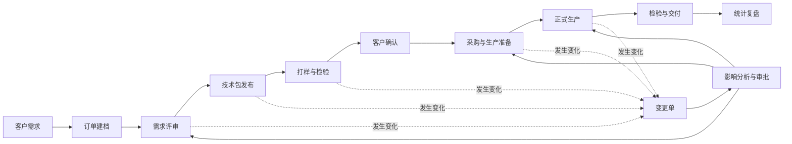
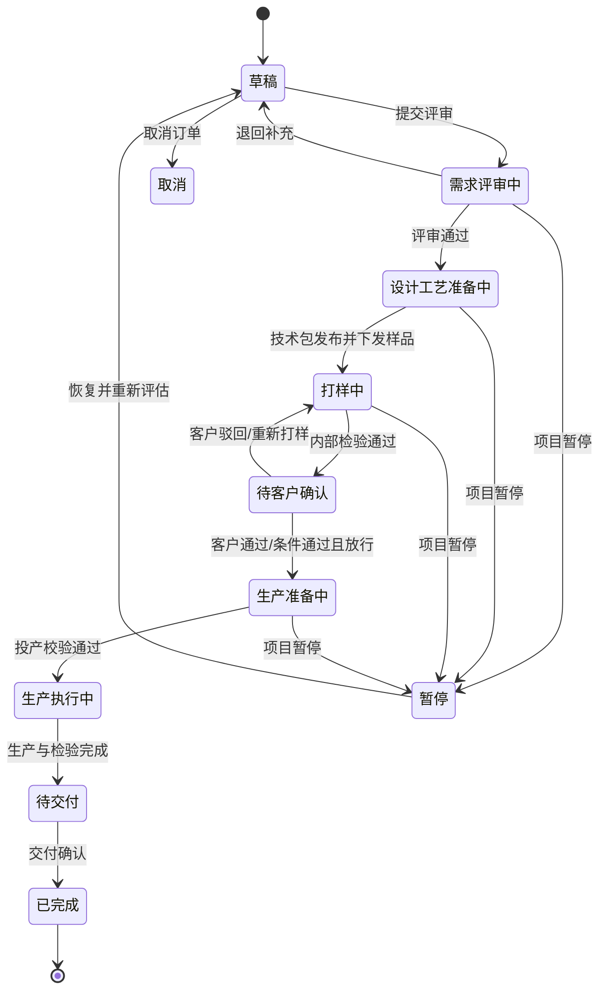
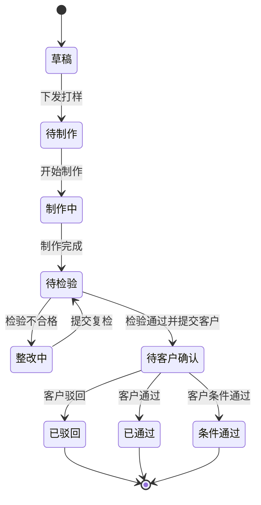
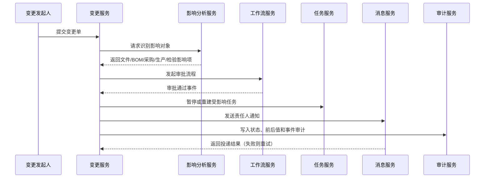
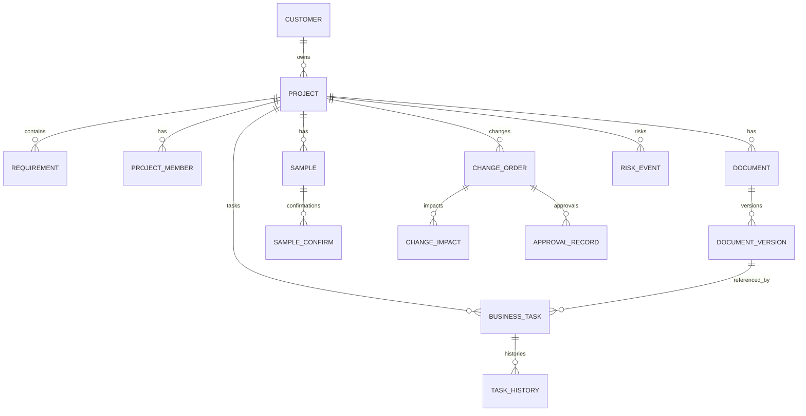
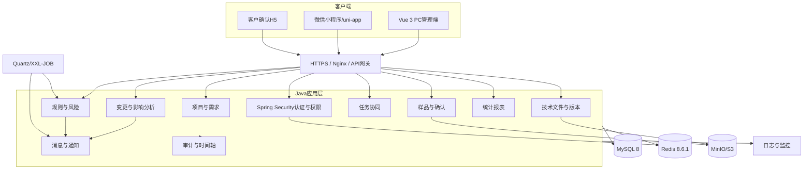
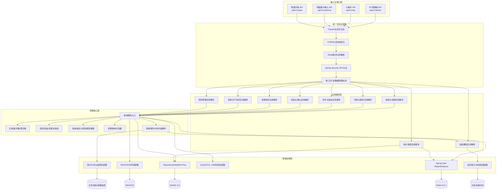
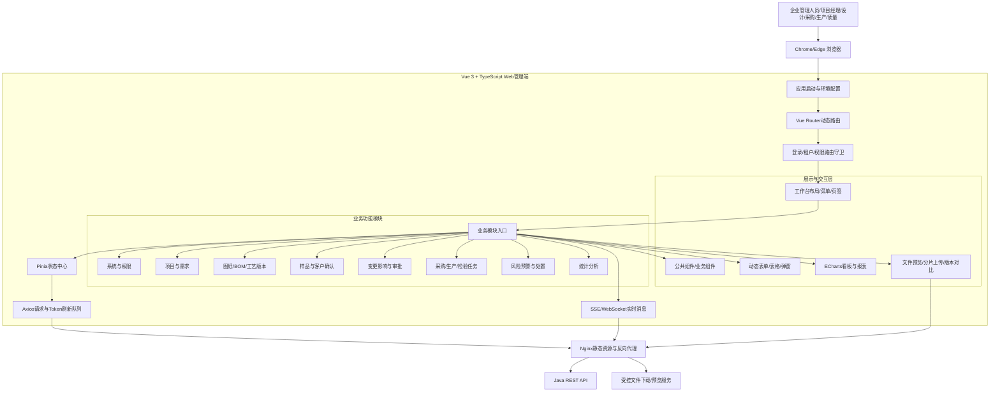
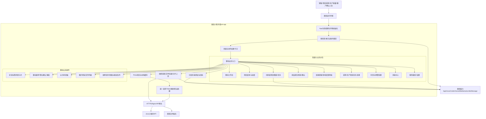

# 智慧非标订单打样与变更协同平台 V1.0

> 需求规格说明书（完善版，含业务需求与技术要求）

> **产品定位**
>
> 面向非标制造企业，从客户需求、设计图纸、工艺/BOM、样品确认、采购与生产任务到变更同步和交付风险，形成可追溯的订单协同闭环。系统通过规则校验、自动通知、临期预警和统计分析，降低图纸错版、样品漏确认、变更未同步和交期延误。


| **项目**     | **内容**                                                 |
|--------------|----------------------------------------------------------|
| 文档名称     | 智慧非标订单打样与变更协同平台 V1.0 需求规格说明书       |
| 文档版本     | V1.3（Redis 8.6.1 + Spring Security + 三端总体架构版）             |
| 适用阶段     | 产品立项、需求评审、系统设计、开发测试、软著说明材料整理 |
| 建议建设形态 | 微信小程序/移动端 + PC 管理端 + Java 后端服务            |
| 编制日期     | 2026年7月                                                |

# 文档修订记录

| **版本** | **日期** | **修订内容**                                                                                   | **状态** |
|----------|----------|------------------------------------------------------------------------------------------------|----------|
| V1.0     | 2026-07  | 首次形成完整需求与技术要求，覆盖订单、图纸版本、样品确认、变更协同、风险预警、统计分析等模块。 | 初稿     |
| V1.1     | 2026-07-24 | 补充范围边界、状态迁移、异常补偿、变更影响算法、通知事件、数据库约束、错误码、部署运维、需求追踪与软著交付清单。 | 评审稿   |
| V1.2     | 2026-07-24 | 技术栈调整为 Redis 8.6.1，并引入 Spring Security，补充 JWT/刷新令牌、Redis 登录态、验证码、限流、幂等、分布式锁、权限注解和安全验收要求。 | 评审稿   |
| V1.3     | 2026-07-24 | 补充 Java 后端、Vue 3 Web 管理端和微信小程序三套总体架构图、分层职责、推荐工程目录、端侧权限控制、状态管理、通信与构建要求。 | 评审稿   |

# 目录

1. [文档概述](#1-文档概述)
2. [项目背景与建设目标](#2-项目背景与建设目标)
3. [用户角色与权限边界](#3-用户角色与权限边界)
4. [核心业务对象与状态模型](#4-核心业务对象与状态模型)
5. [总体业务流程](#5-总体业务流程)
6. [功能需求](#6-功能需求)
7. [智慧规则与自动化要求](#7-智慧规则与自动化要求)
8. [数据需求与数据模型](#8-数据需求与数据模型)
9. [技术架构与开发要求](#9-技术架构与开发要求)
10. [接口与集成要求](#10-接口与集成要求)
11. [非功能需求](#11-非功能需求)
12. [安全与审计要求](#12-安全与审计要求)
13. [测试与验收标准](#13-测试与验收标准)
14. [实施范围与版本规划](#14-实施范围与版本规划)
15. [软著材料展示建议](#15-软著材料展示建议)
16. [交互与页面要求](#16-交互与页面要求)
17. [部署、运维与灾备要求](#17-部署运维与灾备要求)
18. [需求追踪与交付物](#18-需求追踪与交付物)
19. [风险、假设与约束](#19-风险假设与约束)
20. [产品验收指标](#20-产品验收指标)
21. [附录A：关键业务规则清单](#附录a-关键业务规则清单)
22. [附录B：核心接口示例](#附录b-核心接口示例)
23. [附录C：统一错误码建议](#附录c-统一错误码建议)
24. [附录D：软著源代码模块建议](#附录d-软著源代码模块建议)
25. [附录E：Redis 键规范与有效期建议](#附录e-redis-键规范与有效期建议)

# 1. 文档概述

## 1.1 编制目的

本文档用于明确“智慧非标订单打样与变更协同平台 V1.0”的业务范围、用户角色、业务流程、功能边界、数据模型、技术实现要求、性能安全要求和验收标准，为产品设计、系统开发、测试验收、部署运维及软件著作权材料编制提供统一依据。

## 1.2 产品范围

平台面向机械加工、钣金、模具、自动化设备、包装设备、家具定制、电子装配等存在“多品种、小批量、频繁变更、图纸驱动、样品确认”特点的制造企业。V1.0 重点解决订单执行过程中信息分散、版本混乱、确认遗漏和变更不同步问题，不替代完整 ERP、MES 或 PLM，而是通过协同和规则控制连接销售、技术、采购、计划、生产和质量岗位。

## 1.3 术语说明

| **术语**   | **说明**                                                                                        |
|------------|-------------------------------------------------------------------------------------------------|
| 非标订单   | 客户对尺寸、材料、结构、工艺、功能或交付方式提出定制要求，不能完全按照标准产品直接生产的订单。  |
| 打样       | 为验证设计、材料、工艺或客户要求而进行的小批量或单件试制。                                      |
| 图纸版本   | 图纸或技术文件每次受控修改形成的可识别版本，如 A、B、C 或 V1.0、V1.1。                          |
| 变更单     | 记录变更原因、内容、影响范围、审批意见、执行状态和相关附件的业务单据。                          |
| 受影响任务 | 因需求、图纸、BOM、工艺或交期变化而需要暂停、重排、返工、补料或重新确认的采购、生产、检验任务。 |
| 交期风险   | 根据关键确认、物料、生产任务、计划日期和延期情况计算的风险等级。                                |


## 1.4 适用读者

| 读者 | 使用目的 |
|---|---|
| 项目负责人/产品经理 | 确认建设范围、优先级、流程边界和验收口径 |
| UI/UX 设计人员 | 设计 PC 管理端、小程序端页面、状态和交互反馈 |
| Java 后端开发人员 | 实现领域对象、状态机、规则校验、接口、定时任务和审计 |
| Web/小程序开发人员 | 实现工作台、表单、扫码、确认、消息、看板和异常处理 |
| 测试人员 | 编制功能、接口、权限、性能、安全和异常场景测试用例 |
| 实施运维人员 | 完成部署、参数初始化、数据导入、备份和运行监控 |
| 软著材料编制人员 | 提取软件功能说明、界面截图、模块说明和源代码结构 |

## 1.5 系统范围边界

### 1.5.1 V1.0 范围内

- 客户、非标订单、需求项、项目成员和目标交期管理。
- 图纸、BOM、工艺卡、检验规范等技术资料的版本化、审批发布、生效和失效。
- 多轮打样、内部检验、客户确认、驳回整改和特殊放行。
- 变更发起、影响分析、动态审批、任务同步、执行反馈、验证和关闭。
- 采购、生产、检验、交付等协同任务及关键节点状态反馈。
- 规则阻断、风险评分、临期预警、超时升级、站内消息和小程序消息。
- 延期、返工、变更、样品效率、任务负载等统计分析。
- 组织权限、流程参数、业务字典、日志、归档、导入导出和基础运维功能。

### 1.5.2 V1.0 范围外

- 不直接承担财务核算、成本会计、工资、发票和资金结算。
- 不替代完整 ERP 的采购合同、库存账、应收应付和供应链结算。
- 不替代完整 MES 的设备采集、工位报工、安灯、OEE 和产线控制。
- 不承担 CAD 三维模型设计、专业图纸编辑和自动生成工艺路线。
- 不在 V1.0 强制建设 AI 图纸识别、智能预测或硬件传感器接入。

## 1.6 需求优先级定义

| 优先级 | 定义 | 发布要求 |
|---|---|---|
| P0/高 | 缺失将导致核心流程不可闭环、数据不可信或发生错版投产风险 | V1.0 必须上线并通过验收 |
| P1/中 | 显著提升效率、可用性、协同和管理能力 | V1.0 原则上完成，可按工期分批启用 |
| P2/低 | 锦上添花或依赖外部条件 | 可进入后续迭代，不阻塞 V1.0 验收 |

## 1.7 需求表达约定

- “必须”表示强制验收项；“应”表示原则上实现；“可”表示选配或后续增强。
- 所有业务状态均由后端状态机控制，前端不得直接写入任意状态值。
- 所有规则阻断均必须返回规则编号、原因、当前值、期望值和可执行的处理入口。
- 所有关键数据对象均应拥有唯一业务编号，并支持按编号全局检索。

# 2. 项目背景与建设目标

## 2.1 典型业务痛点

- 图纸通过微信、邮箱或共享文件夹传递，旧版图纸仍可能被采购、生产或检验继续使用。

- 样品已制作但客户确认结论没有进入统一系统，生产计划临近时仍无法判断是否可投产。

- 客户需求变更只通知了销售或技术人员，采购下单、生产排程、外协加工和质检标准未同步调整。

- 项目状态依靠人工询问，管理人员难以及时发现“等待确认、关键物料未到、生产未启动”等交期风险。

- 变更造成的延期、返工、报废和追加成本缺少结构化记录，无法判断问题主要来自客户、设计、工艺还是执行环节。

## 2.2 建设目标

| **目标编号** | **建设目标**                 | **可衡量结果**                                                         |
|--------------|------------------------------|------------------------------------------------------------------------|
| G-01         | 实现订单全过程单一信息源     | 订单、需求、图纸、样品、变更、任务和风险均可按项目追溯。               |
| G-02         | 阻断错版和未经确认的关键操作 | 存在版本不一致、文件失效或样品未确认时，系统阻止提交或投产。           |
| G-03         | 实现变更影响自动传播         | 变更审批通过后，自动识别并通知相关采购、计划、生产和检验责任人。       |
| G-04         | 提前识别交期风险             | 按规则形成低、中、高、严重四级风险，并给出风险原因和处理建议。         |
| G-05         | 沉淀质量与经营数据           | 统计变更类型、来源、延期天数、返工次数和责任环节，为流程改善提供依据。 |

## 2.3 产品成功标准

- 普通业务人员在小程序端能够完成查询、确认、拍照上传、变更提报和异常反馈。

- 管理人员在 PC 端能够完成项目建档、技术文件管理、流程配置、任务分派、风险处置和统计分析。

- 任何关键状态变化均留下操作者、时间、前后值、审批意见和附件证据。

- 系统支持至少一个企业组织下的多部门、多角色、多项目并行运行。


## 2.4 建议管理指标

以下指标为系统建设和试点验收建议值，不代表企业上线前已经达到的经营结果。

| 指标编号 | 指标名称 | 建议口径 | 建议目标 |
|---|---|---|---|
| KPI-01 | 关键任务版本校验覆盖率 | 采购提交、任务开工、检验提交、交付确认中执行版本校验的次数/应校验次数 | 100% |
| KPI-02 | 错版提交阻断记录完整率 | 具备规则编号、任务版本、当前版本、操作者、时间和处理结果的阻断记录占比 | 100% |
| KPI-03 | 样品确认可追溯率 | 绑定样品批次、技术版本、确认人、时间、结论和凭证的确认记录占比 | 100% |
| KPI-04 | 变更影响项反馈完成率 | 已关闭变更中已完成反馈的影响项/全部影响项 | 100% |
| KPI-05 | 高风险项目处置及时率 | 在配置时限内形成处置计划的高/严重风险项目占比 | ≥95% |
| KPI-06 | 内部消息投递成功率 | 发送成功消息数/计划发送消息数 | ≥99% |
| KPI-07 | 审计覆盖率 | 关键操作已形成审计记录的次数/关键操作总次数 | 100% |

## 2.5 核心价值链



# 3. 用户角色与权限边界

| **角色**                   | **主要权限**                                                     | **权限限制**                                             |
|----------------------------|------------------------------------------------------------------|----------------------------------------------------------|
| 系统管理员                 | 用户、部门、角色、字典、流程、消息模板、系统参数、日志与备份配置 | 不得直接修改已归档业务数据，只能按授权更正并记录审计日志 |
| 销售/项目经理              | 客户、订单、需求、交期、项目成员、客户确认、变更发起、进度跟踪   | 不能替代技术人员发布受控图纸，不能直接关闭未完成技术任务 |
| 技术/设计人员              | 需求评审、图纸上传、版本发布、BOM/工艺维护、技术变更分析         | 不能直接确认客户结论，不能绕过版本校验                   |
| 工艺人员                   | 工艺路线、工序要求、检验要求、工时与外协说明                     | 只能修改授权项目和当前生效版本                           |
| 采购人员                   | 采购任务接收、供应商反馈、到料日期、受变更物料处置               | 不能修改技术版本，只能基于生效版本执行                   |
| 计划/生产人员              | 生产任务、排程、开工、完工、暂停、变更执行反馈                   | 样品未确认或版本失效时不得强制投产，例外需审批           |
| 质量人员                   | 样品检验、首件确认、检验结果、不合格与返工记录                   | 检验标准必须关联当前生效图纸/工艺版本                    |
| 客户确认人（可选外部账号） | 查看授权项目的样品资料、确认/驳回、填写意见                      | 只能访问被邀请项目和脱敏内容                             |
| 管理层                     | 项目看板、交期风险、变更统计、延期与返工分析                     | 默认只读，不参与具体业务编辑                             |

> **权限设计原则**
>
> 采用“数据权限 + 功能权限 + 字段权限 + 操作状态权限”四层控制。即使用户拥有某菜单权限，也必须同时满足所属企业、部门/项目范围和当前业务状态，才能执行修改、审批、发布、作废等操作。


## 3.1 权限控制维度

| 维度 | 控制内容 | 示例 |
|---|---|---|
| 租户维度 | 企业间数据隔离 | A 企业用户不得读取 B 企业项目 |
| 组织维度 | 部门、岗位和下属范围 | 部门负责人可查看本部门任务 |
| 项目维度 | 项目成员和项目内角色 | 非项目成员不可下载受控图纸 |
| 功能维度 | 菜单、按钮和接口权限 | 仅技术负责人可执行“发布版本” |
| 字段维度 | 敏感字段查看和编辑 | 普通生产人员不显示客户联系方式和金额 |
| 状态维度 | 当前状态下允许的动作 | 已关闭变更不可继续编辑，只能补充变更 |

## 3.2 关键职责分离

- 图纸上传人与最终发布审批人原则上不得为同一人，确需同人时必须由流程参数明确允许并记录原因。
- 样品制作人员不能替代质量人员填写检验结论。
- 内部人员不得伪造外部客户确认身份；销售代录客户结论时必须上传凭证并标记“代录”。
- 变更申请人不得单独完成高风险变更的全部审批。
- 特殊放行必须记录申请人、批准人、放行范围、有效期和风险承担说明。

## 3.3 高风险操作二次确认

以下操作应弹出二次确认，并要求填写原因或验证码：发布技术版本、作废生效版本、特殊放行投产、撤销已批准变更、修改目标交期、归档恢复、批量导出、删除未归档附件。

# 4. 核心业务对象与状态模型

## 4.1 核心业务对象

| **对象**      | **主要内容**                                                         |
|---------------|----------------------------------------------------------------------|
| 客户          | 客户基础信息、联系人、沟通偏好、历史项目                             |
| 非标订单/项目 | 项目编号、客户、产品、数量、目标交期、负责人、成员、优先级、当前阶段 |
| 需求项        | 结构化记录尺寸、材料、性能、外观、包装、检验、交付等要求及确认状态   |
| 技术文件      | 图纸、3D 文件、工艺卡、BOM、检验规范、附件及其版本                   |
| 样品单        | 打样目的、样品批次、制作状态、检验结论、客户确认结论                 |
| 变更单        | 变更来源、原因、内容、前后对比、影响分析、审批、执行与关闭           |
| 业务任务      | 需求评审、设计、采购、生产、检验、客户确认、交付等待办任务           |
| 风险事件      | 风险等级、触发规则、影响对象、责任人、处理措施、关闭结果             |
| 延期/返工记录 | 原因分类、发生环节、影响天数、返工数量、损失说明                     |

## 4.2 项目主状态

| **状态**        | **说明**                              | **主要迁移动作**          |
|-----------------|---------------------------------------|---------------------------|
| 草稿            | 项目已建立但未提交评审                | 销售/项目经理提交需求评审 |
| 需求评审中      | 技术、工艺等角色评审需求完整性        | 评审通过或退回补充        |
| 设计/工艺准备中 | 制作图纸、BOM、工艺和检验要求         | 受控技术版本发布          |
| 打样中          | 样品任务已下发并执行                  | 样品完成并提交检验/确认   |
| 待客户确认      | 等待客户确认样品或关键技术信息        | 客户确认、驳回或提出变更  |
| 生产准备中      | 采购、排程和生产资源准备              | 满足投产条件              |
| 生产执行中      | 正式生产、检验和异常处理              | 生产完成                  |
| 待交付          | 包装、出货资料、交付确认              | 完成交付                  |
| 已完成          | 订单业务闭环                          | 归档                      |
| 暂停/取消       | 因客户、技术、物料或经营原因暂停/取消 | 恢复或终止                |

## 4.3 变更单状态

草稿 → 待影响分析 → 待审批 → 已批准待执行 → 执行中 → 待验证 → 已关闭；审批驳回后回到“草稿/已驳回”，撤销后进入“已撤销”。已关闭变更不得直接编辑，必须新建补充变更。


## 4.4 状态迁移通用约束

1. 每次状态迁移必须通过明确的业务动作，例如 `submitReview`、`publishVersion`、`approveChange`，不得使用通用“修改状态”接口。
2. 状态迁移前必须校验当前状态、操作者权限、必填资料、关联对象状态和乐观锁版本。
3. 状态迁移成功后，在同一事务内写入状态历史、业务时间轴和待发送事件。
4. 外部消息发送失败不得回滚核心业务事务，应进入消息重试队列并产生运维告警。
5. 状态历史不可物理删除；作废数据保留作废人、作废时间、原因和原状态。

## 4.5 项目状态机



## 4.6 样品状态机



## 4.7 业务对象编号规则

| 对象 | 编号示例 | 规则建议 |
|---|---|---|
| 项目 | NSO-2026-000123 | 固定前缀 + 年份 + 六位流水号 |
| 技术版本 | DOC-000123-V1.3 | 文件业务号 + 版本号 |
| 样品单 | SMP-2026-000086 | 前缀 + 年份 + 流水号 |
| 变更单 | ECN-2026-000045 | 工程变更前缀 + 年份 + 流水号 |
| 任务 | TSK-20260724-0012 | 日期 + 流水号 |
| 风险事件 | RSK-20260724-0008 | 日期 + 流水号 |

# 5. 总体业务流程

## 5.1 主流程

| **步骤** | **阶段** | **关键活动**                                       | **输出**          |
|----------|----------|----------------------------------------------------|-------------------|
| 1        | 销售建档 | 创建客户和非标订单，录入目标交期、数量、需求与附件 | 订单草稿          |
| 2        | 需求评审 | 技术、工艺、质量等确认需求完整性和可制造性         | 评审结论/问题清单 |
| 3        | 设计发布 | 上传图纸、BOM、工艺和检验要求，校验后发布生效版本  | 受控技术版本      |
| 4        | 打样执行 | 生成样品任务，记录物料、制作、检验和问题           | 样品批次          |
| 5        | 样品确认 | 内部检验后提交客户确认，记录确认/驳回/条件通过     | 确认结论          |
| 6        | 生产准备 | 采购和计划根据生效版本建立任务，检查投产条件       | 采购/生产任务     |
| 7        | 生产交付 | 执行生产、检验、包装和出货，处理异常与变更         | 完工与交付记录    |
| 8        | 项目复盘 | 统计延期、变更、返工和风险处理效果                 | 复盘数据          |

## 5.2 变更协同流程

1.  变更发起：客户、销售、技术、工艺、采购或生产人员发起，必须填写变更原因、变更前后内容和紧急程度。

2.  影响分析：系统根据关联关系自动列出可能受影响的图纸、BOM、采购任务、生产任务、样品和检验标准，责任人补充处理意见。

3.  审批决策：根据变更类型、影响金额、是否已投产等条件选择审批链。

4.  版本发布：涉及技术文件时生成新版本，旧版本自动标记失效，未完成任务重新绑定或暂停。

5.  执行同步：向采购、计划、生产、质量等受影响岗位发送任务和通知，要求反馈执行结果。

6.  验证关闭：确认受影响任务全部完成或已处置，填写延期、返工、追加成本等结果后关闭变更。


## 5.3 异常与补偿流程

| 异常场景 | 系统处理 | 人工处理要求 |
|---|---|---|
| 技术版本发布后发现文件上传错误 | 禁止覆盖原文件；创建更正版本并将错误版本标记撤销/失效 | 填写错误原因并重新审批 |
| 变更审批通过但消息发送失败 | 核心变更保持已批准；消息进入重试队列 | 超过重试上限后运维告警，项目经理可人工催办 |
| 变更影响分析漏项 | 允许在未关闭前追加影响项，追加行为记录审计 | 追加项重新分派并确认是否需要补充审批 |
| 生产任务已开工后版本失效 | 任务自动进入“待变更处理/暂停建议”，禁止完工提交 | 技术、生产、质量共同决定返工、继续、报废或特殊放行 |
| 客户确认链接过期 | 原令牌失效，生成新令牌 | 销售重新发送；旧链接访问记录保留 |
| 定时风险计算失败 | 保留上次成功风险结果并标记“计算待更新” | 运维修复后补算，严重失败通知管理员 |
| 并发编辑冲突 | 返回 `DATA_VERSION_CONFLICT`，不覆盖他人修改 | 用户刷新后比较差异再提交 |
| 文件存储成功但数据库写入失败 | 清理孤立文件或进入定时清理清单 | 运维可查看清理结果 |

## 5.4 事件驱动协同过程



## 5.5 业务时间轴要求

项目详情必须按统一时间轴展示需求评审、文件发布、样品、客户确认、变更、任务、风险、异常、审批和交付事件。每条事件至少包含事件类型、标题、发生时间、操作者、业务对象、状态变化、摘要和详情跳转地址。

# 6. 功能需求

## 6.1 工作台与项目看板

| **编号**    | **功能**   | **需求说明**                                                                 | **优先级** |
|-------------|------------|------------------------------------------------------------------------------|------------|
| FR-DASH-001 | 个人工作台 | 显示本人待办、临期任务、未读通知、关注项目和最近操作。                       | 高         |
| FR-DASH-002 | 项目总览   | 按项目显示当前阶段、目标交期、剩余天数、责任人、样品状态、变更数和风险等级。 | 高         |
| FR-DASH-003 | 风险卡片   | 支持按严重、高、中、低筛选风险，并展示触发原因和建议动作。                   | 高         |
| FR-DASH-004 | 管理看板   | 统计进行中项目、延期项目、待客户确认、待发布图纸、未完成变更和本月返工。     | 中         |
| FR-DASH-005 | 快捷操作   | 根据角色提供新建订单、上传图纸、提交样品确认、发起变更等入口。               | 中         |

## 6.2 客户与非标订单管理

| **编号**   | **功能**   | **需求说明**                                                                   | **优先级** |
|------------|------------|--------------------------------------------------------------------------------|------------|
| FR-ORD-001 | 客户档案   | 维护客户名称、行业、联系人、联系方式、结算与交付说明；支持启用/停用。          | 高         |
| FR-ORD-002 | 订单建档   | 自动生成项目编号，录入客户、产品、数量、目标交期、优先级、负责人和成员。       | 高         |
| FR-ORD-003 | 需求结构化 | 需求按尺寸、材料、性能、外观、工艺、检验、包装、交付等分类录入。               | 高         |
| FR-ORD-004 | 需求确认   | 每条需求支持未确认、内部确认、客户确认、存在异议等状态。                       | 高         |
| FR-ORD-005 | 项目成员   | 支持跨部门选择成员，指定项目经理、技术负责人、采购负责人等。                   | 中         |
| FR-ORD-006 | 项目时间轴 | 按时间展示创建、评审、文件发布、样品、变更、风险和任务状态变化。               | 高         |
| FR-ORD-007 | 项目复制   | 可复制历史订单的需求结构、成员、BOM/工艺模板，但不得复制生效版本号和确认结论。 | 低         |

## 6.3 图纸与技术文件版本管理

| **编号**   | **功能**   | **需求说明**                                                                 | **优先级** |
|------------|------------|------------------------------------------------------------------------------|------------|
| FR-DOC-001 | 文件分类   | 支持图纸、3D 模型、BOM、工艺卡、检验规范、客户附件等分类。                   | 高         |
| FR-DOC-002 | 版本上传   | 上传时填写版本号、变更说明、生效日期、适用物料/部件和来源。                  | 高         |
| FR-DOC-003 | 版本唯一性 | 同一项目、同一文件类型和对象下，版本号不得重复；同一时刻只能有一个生效版本。 | 高         |
| FR-DOC-004 | 发布审批   | 关键技术文件需经技术负责人审核后发布，草稿文件不得被生产任务引用。           | 高         |
| FR-DOC-005 | 版本对比   | 展示前后版本的基础信息、变更说明、关联对象和附件；支持人工上传对比图。       | 中         |
| FR-DOC-006 | 失效控制   | 新版本生效后旧版本自动失效，并通知仍引用旧版本的未完成任务。                 | 高         |
| FR-DOC-007 | 下载水印   | 下载受控文件时叠加项目编号、版本、下载人和时间水印（可配置）。               | 中         |
| FR-DOC-008 | 二维码识别 | 为生效技术文件生成二维码，现场扫码查看当前版本和有效状态。                   | 中         |
| FR-DOC-009 | 版本阻断   | 采购、投产、检验提交前校验引用版本；版本不一致、失效或缺失时禁止提交。       | 高         |

## 6.4 BOM、工艺与检验要求

| **编号**   | **功能** | **需求说明**                                                              | **优先级** |
|------------|----------|---------------------------------------------------------------------------|------------|
| FR-TEC-001 | BOM 维护 | 按项目和版本维护物料编码、名称、规格、数量、单位、采购/自制属性和替代料。 | 高         |
| FR-TEC-002 | BOM 导入 | 支持 Excel 模板导入并校验必填项、重复物料和数量格式。                     | 中         |
| FR-TEC-003 | 工艺路线 | 维护工序顺序、作业说明、设备/工装、标准工时、外协标识和质检点。           | 高         |
| FR-TEC-004 | 检验要求 | 维护样品、首件、过程和成品检验项目、标准、抽样规则和附件。                | 高         |
| FR-TEC-005 | 版本绑定 | BOM、工艺、检验规范必须绑定图纸或技术版本，变更时自动进入影响分析。       | 高         |
| FR-TEC-006 | 发布校验 | 缺少关键物料、工艺或检验要求时禁止发布完整技术包，可按配置允许例外审批。  | 中         |

## 6.5 样品与客户确认管理

| **编号**   | **功能**     | **需求说明**                                                             | **优先级** |
|------------|--------------|--------------------------------------------------------------------------|------------|
| FR-SMP-001 | 样品申请     | 创建样品单，填写打样目的、数量、计划完成时间、引用版本和责任人。         | 高         |
| FR-SMP-002 | 样品任务     | 自动生成备料、制作、检验、提交确认等任务，支持拍照和附件上传。           | 高         |
| FR-SMP-003 | 样品检验     | 记录检验项目、实测值、合格结论、问题和整改结果。                         | 高         |
| FR-SMP-004 | 提交客户确认 | 生成确认链接/二维码或由销售代录，记录提交时间、资料和截止时间。          | 高         |
| FR-SMP-005 | 确认结论     | 支持通过、条件通过、驳回、待补充；必须填写意见，保留确认人、时间和凭证。 | 高         |
| FR-SMP-006 | 确认阻断     | 样品未通过时，不允许项目进入正式生产；特殊放行需指定审批人和原因。       | 高         |
| FR-SMP-007 | 临期预警     | 距离计划投产日期达到阈值且样品未确认时，自动产生预警和催办。             | 高         |
| FR-SMP-008 | 多轮样品     | 支持样品批次迭代，每轮绑定对应技术版本并关联上一轮问题。                 | 中         |

## 6.6 变更管理与影响同步

| **编号**   | **功能**     | **需求说明**                                                               | **优先级** |
|------------|--------------|----------------------------------------------------------------------------|------------|
| FR-CHG-001 | 变更发起     | 支持客户需求、设计、BOM、工艺、材料、数量、交期、包装等变更类型。          | 高         |
| FR-CHG-002 | 前后对比     | 必须记录变更前内容、变更后内容、原因、紧急程度和附件。                     | 高         |
| FR-CHG-003 | 影响对象识别 | 根据项目关联自动列出相关文件、物料、采购任务、生产任务、样品和检验要求。   | 高         |
| FR-CHG-004 | 影响分析协同 | 受影响部门填写是否受影响、处理方案、预计延期、追加成本和责任人。           | 高         |
| FR-CHG-005 | 动态审批     | 根据是否已采购、已投产、影响金额、延期天数等条件选择审批人。               | 高         |
| FR-CHG-006 | 自动暂停     | 高风险变更批准后，可自动暂停引用旧版本且未完成的生产/采购任务。            | 高         |
| FR-CHG-007 | 自动通知     | 变更批准或撤销后向受影响任务责任人发送站内、小程序订阅消息或企业微信通知。 | 高         |
| FR-CHG-008 | 执行反馈     | 责任人逐项反馈已重排、已改单、已退料、已返工、无需处理等结果。             | 高         |
| FR-CHG-009 | 关闭校验     | 受影响项未全部处理或验证不通过时，禁止关闭变更。                           | 高         |
| FR-CHG-010 | 结果归因     | 关闭时记录延期天数、返工数量、报废数量、追加成本和原因分类。               | 高         |

## 6.7 采购、生产与交付协同

| **编号**   | **功能** | **需求说明**                                                        | **优先级** |
|------------|----------|---------------------------------------------------------------------|------------|
| FR-EXE-001 | 采购任务 | 从 BOM 或手工生成采购任务，记录供应商、计划到料、实际到料和异常。   | 中         |
| FR-EXE-002 | 生产任务 | 按项目、部件、工序生成任务，记录计划开始/完成、实际状态和责任班组。 | 高         |
| FR-EXE-003 | 投产校验 | 校验图纸版本、生效技术包、样品确认、关键物料和未关闭高风险变更。    | 高         |
| FR-EXE-004 | 扫码查看 | 现场扫码查看项目、任务、当前图纸版本、工艺和变更提醒。              | 中         |
| FR-EXE-005 | 异常上报 | 支持缺料、设备、质量、技术、外协和进度异常，上传图片并创建风险。    | 高         |
| FR-EXE-006 | 交付检查 | 交付前检查任务完成、检验通过、资料齐套和未关闭严重风险。            | 高         |
| FR-EXE-007 | 交付记录 | 记录出货时间、数量、物流、签收和客户反馈。                          | 中         |

## 6.8 风险预警与消息中心

| **编号**   | **功能** | **需求说明**                                                       | **优先级** |
|------------|----------|--------------------------------------------------------------------|------------|
| FR-RSK-001 | 规则预警 | 按样品确认、图纸发布、物料到货、任务进度、变更状态和交期计算风险。 | 高         |
| FR-RSK-002 | 风险等级 | 支持低、中、高、严重四级，等级变化时记录原因并通知责任人。         | 高         |
| FR-RSK-003 | 风险处置 | 风险需填写处理措施、计划完成时间、责任人和关闭说明。               | 高         |
| FR-RSK-004 | 催办升级 | 待办超时后提醒本人，继续超时可升级至项目经理和部门负责人。         | 中         |
| FR-RSK-005 | 消息模板 | 按事件配置站内信、小程序订阅消息、邮件或企业微信模板。             | 中         |
| FR-RSK-006 | 消息回执 | 记录发送渠道、发送时间、接收人、发送结果和已读状态。               | 中         |

## 6.9 统计分析

| **编号**   | **功能** | **需求说明**                                                   | **优先级** |
|------------|----------|----------------------------------------------------------------|------------|
| FR-ANA-001 | 交期统计 | 按客户、项目经理、产品类型和月份统计按期、延期、平均延期天数。 | 高         |
| FR-ANA-002 | 变更统计 | 统计变更数量、来源、类型、发生阶段、审批时长和关闭时长。       | 高         |
| FR-ANA-003 | 延期归因 | 统计各类变更和异常导致的延期天数，支持主因/次因分类。          | 高         |
| FR-ANA-004 | 返工统计 | 统计返工次数、数量、工序、原因、关联变更和责任环节。           | 高         |
| FR-ANA-005 | 样品效率 | 统计打样轮次、首次通过率、平均确认时长和驳回原因。             | 中         |
| FR-ANA-006 | 部门负载 | 统计各部门待办、超时任务和受影响任务数量。                     | 中         |
| FR-ANA-007 | 数据导出 | 支持按权限导出 Excel；导出文件记录操作日志并可加水印。         | 中         |

## 6.10 系统管理与审计

| **编号**   | **功能**   | **需求说明**                                                 | **优先级** |
|------------|------------|--------------------------------------------------------------|------------|
| FR-SYS-001 | 组织与用户 | 维护企业、部门、岗位、用户、角色和项目成员。                 | 高         |
| FR-SYS-002 | 数据字典   | 维护订单类型、变更类型、风险原因、返工原因、文件类型等字典。 | 高         |
| FR-SYS-003 | 流程配置   | 配置需求评审、文件发布、样品放行、变更审批等流程和条件。     | 中         |
| FR-SYS-004 | 规则参数   | 配置预警阈值、风险权重、催办周期、允许上传格式和文件大小。   | 高         |
| FR-SYS-005 | 操作日志   | 记录登录、查询、导出、上传、发布、审批、作废和关键数据修改。 | 高         |
| FR-SYS-006 | 数据归档   | 已完成项目可归档为只读；恢复需管理员授权并记录原因。         | 中         |


## 6.11 全局检索、筛选与导出

| 编号 | 功能 | 需求说明 | 优先级 |
|---|---|---|---|
| FR-COM-001 | 全局检索 | 按项目编号、客户、产品、变更单号、样品单号、任务号、图纸名称进行权限过滤后的全局检索。 | 高 |
| FR-COM-002 | 组合筛选 | 列表支持状态、负责人、部门、日期范围、风险等级、是否超期等组合筛选并保存个人视图。 | 中 |
| FR-COM-003 | 批量操作 | 支持批量分派责任人、批量催办、批量导出；批量操作必须逐条校验权限和状态。 | 中 |
| FR-COM-004 | 异步导出 | 大数据量导出生成后台任务，完成后通过消息中心提供限时下载。 | 中 |
| FR-COM-005 | 导出审计 | 记录导出人、查询条件、字段范围、文件名、时间、结果和下载次数。 | 高 |

## 6.12 外部客户确认门户

| 编号 | 功能 | 需求说明 | 优先级 |
|---|---|---|---|
| FR-EXT-001 | 短期访问令牌 | 客户通过短期、一次性或可配置次数的令牌访问指定样品确认页面。 | 中 |
| FR-EXT-002 | 内容脱敏 | 页面仅展示授权样品、图片、必要技术说明和确认项，不暴露内部成本、责任人和其他项目。 | 高 |
| FR-EXT-003 | 身份核验 | 可通过手机号验证码、邮箱验证码或确认口令核验身份。 | 中 |
| FR-EXT-004 | 确认签署 | 记录客户姓名、单位、联系方式、结论、意见、时间、IP/设备摘要和电子签名图片（选配）。 | 高 |
| FR-EXT-005 | 防重复提交 | 已完成确认的令牌禁止重复修改；重新确认必须由内部人员发起新轮次。 | 高 |

## 6.13 配置中心

- 项目编号规则、版本编号规则、审批条件、风险权重、预警阈值、超时升级周期可配置。
- 文件类别、变更类型、延期原因、返工原因、任务类型采用业务字典管理。
- 规则参数修改后生成新规则版本；历史风险继续引用原规则版本，不得被新参数覆盖。
- 参数发布前应进行格式、范围、依赖和冲突校验；高风险参数修改应经过审批。

## 6.14 数据导入与初始化

- 提供客户、联系人、项目、物料、BOM 基础数据模板。
- 导入过程分为上传、解析、预校验、错误下载、确认导入和结果汇总。
- 导入必须采用业务唯一键去重，并支持“仅新增”“新增并更新”两种模式。
- 单次导入失败不得产生半成品数据；大批量导入可采用分批事务，但必须输出成功和失败清单。

# 7. 智慧规则与自动化要求

本平台中的“智慧”主要由规则引擎、状态机、关联关系和定时任务实现，不依赖 AI 算法或现场硬件。规则必须可配置、可解释、可追溯，任何自动阻断或风险判定都应向用户显示具体原因。

| **规则编号** | **规则名称**       | **触发条件**                                                             | **系统动作**                                       |
|--------------|--------------------|--------------------------------------------------------------------------|----------------------------------------------------|
| BR-001       | 技术版本一致性阻断 | 提交采购、投产、检验或交付时，校验任务引用版本与当前生效版本。           | 不一致、失效、缺失时阻断；显示正确版本和处理入口。 |
| BR-002       | 样品确认阻断       | 项目进入正式生产前校验样品结论。                                         | 未确认、驳回或确认已过期时阻断；特殊放行需审批。   |
| BR-003       | 变更影响传播       | 变更批准后按关联关系查找受影响任务。                                     | 生成影响项、自动通知、必要时暂停旧版本任务。       |
| BR-004       | 样品临期预警       | 计划投产日期减去当前日期小于阈值且样品未确认。                           | 产生高风险，通知销售、项目经理和计划人员。         |
| BR-005       | 交期风险计算       | 综合剩余天数、关键任务完成率、样品状态、物料状态、未关闭变更和历史延期。 | 输出风险等级、主要原因、建议动作。                 |
| BR-006       | 文件发布完整性校验 | 发布技术包前检查图纸、BOM、工艺、检验要求和版本说明。                    | 缺少必需项时阻断或进入例外审批。                   |
| BR-007       | 变更关闭校验       | 关闭变更前检查所有影响项和验证任务。                                     | 存在未完成、未反馈、验证失败项时禁止关闭。         |
| BR-008       | 超时升级           | 待办超过计划完成时间。                                                   | 按配置通知本人、项目经理、部门负责人。             |
| BR-009       | 交付完整性校验     | 出货前检查生产、检验、资料和严重风险。                                   | 不满足时阻断交付确认。                             |
| BR-010       | 统计自动归因       | 变更或异常关闭时读取原因分类、延期和返工数据。                           | 自动进入对应统计维度，允许管理人员复核。           |

## 7.1 交期风险等级建议算法

V1.0 可采用规则加权而非机器学习。系统对每个项目计算风险分值 RiskScore（0～100），并保留每项加分依据。以下为建议初始规则，企业可在系统参数中调整。

| **风险因素**                 | **建议分值**     |
|------------------------------|------------------|
| 样品未确认且距投产≤3天       | +30              |
| 存在未关闭严重/高风险变更    | +25              |
| 关键物料预计到货晚于计划开工 | +25              |
| 生效技术包未发布且距开工≤2天 | +20              |
| 关键任务超期                 | 每项+10，最多+30 |
| 剩余工期小于计划工时         | +20              |
| 项目已延期                   | +40              |
| 所有关键条件满足且进度正常   | -10，最低为0     |

建议等级：0～19 为低风险，20～39 为中风险，40～69 为高风险，70～100 为严重风险。风险等级变化必须记录触发时间、分值明细和规则版本，便于后续复盘。


## 7.2 规则执行生命周期

1. **触发**：业务动作、领域事件或定时任务触发规则。
2. **取数**：按项目、业务对象和规则版本读取一致性数据。
3. **匹配**：判断规则适用阶段、对象类型、企业参数和启停状态。
4. **决策**：输出通过、警告、阻断、创建风险、创建任务、暂停任务或发送消息。
5. **落库**：保存规则编号、规则版本、输入摘要、决策结果、耗时和追踪号。
6. **通知**：根据事件矩阵通知责任人；失败进入重试。
7. **解除**：触发条件消失后自动解除风险，或由授权人员验证关闭。

## 7.3 变更影响识别逻辑

影响分析不依赖 AI，可基于“业务关联表 + 当前状态 + 版本引用”完成：

1. 根据变更对象获取直接关联对象，例如需求项关联图纸，图纸关联 BOM、工艺和检验规范。
2. 根据技术版本引用关系查找使用该版本的样品、采购、生产和检验任务。
3. 根据物料编码、部件编码、工序编码和项目 ID 查找间接影响对象。
4. 过滤已完成且无需追溯处理的对象；已完成但可能产生返工、报废或客户风险的对象仍应保留。
5. 按对象状态计算建议动作：重新绑定、暂停、改单、退料、补料、返工、复检、重新确认或无需处理。
6. 每项自动识别结果允许责任人确认、调整或补充，但删除系统识别项必须填写原因。

### 7.3.1 建议影响判定矩阵

| 变更类型 | 直接影响 | 可能间接影响 | 默认建议动作 |
|---|---|---|---|
| 尺寸/结构 | 图纸、检验规范 | BOM、工艺、样品、生产任务 | 新建版本、暂停旧任务、复核样品 |
| 材料/规格 | BOM、采购任务 | 工艺、生产、检验、成本 | 改单/退料/补料、重新评估交期 |
| 工艺路线 | 工艺版本、生产任务 | 工装、外协、检验点 | 重排任务、确认已制品处理 |
| 数量 | 订单、采购、生产任务 | 包装、交付、成本 | 调整数量并记录差额 |
| 交期 | 项目计划 | 采购到货、生产排程、外协 | 重算风险、通知计划和采购 |
| 包装/标签 | 包装规范、交付资料 | 采购物料、成品返工 | 修改包装任务、检查已完成品 |

## 7.4 消息事件矩阵

| 事件 | 接收人 | 默认渠道 | 发送时机 | 升级规则 |
|---|---|---|---|---|
| 技术版本发布 | 项目经理、采购、计划、生产、质量 | 站内信/小程序 | 事务提交后 | 无 |
| 旧版本失效且存在未完成任务 | 任务责任人、项目经理 | 站内信/小程序 | 立即 | 2小时未处理升级部门负责人 |
| 样品待客户确认 | 销售、客户确认人 | 小程序/短信/邮件（选配） | 提交确认后 | 距截止24小时催办 |
| 样品临近投产仍未确认 | 项目经理、销售、计划 | 站内信/小程序 | 定时扫描 | 每日升级一次 |
| 高/严重风险生成 | 项目经理、对应责任人、管理层（可配） | 站内信/小程序 | 风险计算后 | 超时未建处置计划升级 |
| 变更批准 | 全部影响项责任人 | 站内信/小程序 | 批准后 | 未读或未反馈按时限催办 |
| 任务超期 | 责任人 | 站内信 | 超期时 | 继续超期升级项目经理/部门负责人 |

## 7.5 风险分数计算约束

- 风险分数限定为 0～100，计算后使用 `min(100, max(0, score))` 截断。
- 同一风险因素不得因多个重复数据被无限累加，必须设置单项上限。
- 严重风险可由“分数达到阈值”或“命中一票严重规则”产生，例如目标交期已过且未完成。
- 项目手工调整风险等级只能作为临时覆盖，必须填写原因和有效期；到期后恢复自动计算。
- 风险页面必须展示原始指标、加减分明细、规则版本、计算时间和建议动作。

### 7.5.1 风险计算伪代码

```text
score = 0
reasons = []

for rule in enabledRules(project.stage, tenantId):
    result = rule.evaluate(projectSnapshot)
    if result.matched:
        score += result.score
        reasons.append(result.reason)

score = clamp(score, 0, 100)
level = mapLevel(score, fatalRuleMatched)
saveRiskSnapshot(projectId, score, level, reasons, ruleVersion)
```

## 7.6 规则幂等与重复处理

- 同一规则、同一业务对象、同一触发批次只允许生成一条有效风险或待办。
- 定时任务采用分布式锁或任务分片，避免多实例重复扫描。
- 消息表使用业务事件 ID + 接收人 + 模板编号作为幂等键。
- 规则执行失败应记录失败原因和重试次数，不得静默跳过。

# 8. 数据需求与数据模型

## 8.1 数据设计原则

- 所有核心业务表包含企业标识、创建人、创建时间、修改人、修改时间、逻辑删除和乐观锁版本字段。

- 文件本体存储在对象存储中，数据库保存文件元数据、哈希值、业务关联、版本和权限信息。

- 状态变化采用业务流水或事件表记录，不仅保存最终状态。

- 变更前后值、审批意见和关键确认结论应采用不可覆盖的历史记录，禁止直接更新覆盖。

- 统计字段优先来源于业务数据自动汇总，不允许仅手工填报。

## 8.2 建议核心数据表

| **表/表组**                                          | **用途**                   |
|------------------------------------------------------|----------------------------|
| sys_user / sys_dept / sys_role                       | 用户、部门、角色与权限     |
| crm_customer / crm_contact                           | 客户及联系人               |
| nso_project                                          | 非标订单/项目主表          |
| nso_project_member                                   | 项目成员与项目内角色       |
| nso_requirement / nso_requirement_history            | 需求项及变更历史           |
| nso_document / nso_document_version                  | 技术文件及版本             |
| nso_bom / nso_bom_item                               | BOM 版本及明细             |
| nso_process_route / nso_process_step                 | 工艺路线及工序             |
| nso_inspection_spec / nso_inspection_item            | 检验规范及项目             |
| nso_sample / nso_sample_check / nso_sample_confirm   | 样品、检验与客户确认       |
| nso_change / nso_change_impact / nso_change_approval | 变更、影响项和审批记录     |
| nso_task / nso_task_log                              | 业务任务和状态流水         |
| nso_risk / nso_risk_action                           | 风险事件与处置记录         |
| nso_delay_rework                                     | 延期、返工、报废和成本记录 |
| nso_message / nso_message_receipt                    | 消息和回执                 |
| sys_operation_log / sys_login_log                    | 审计与登录日志             |

## 8.3 关键字段示例：项目主表 nso_project

| **字段**               | **类型**      | **说明**           |
|------------------------|---------------|--------------------|
| id                     | bigint        | 主键               |
| tenant_id              | bigint        | 企业/租户标识      |
| project_no             | varchar(32)   | 项目编号，唯一     |
| customer_id            | bigint        | 客户ID             |
| project_name           | varchar(128)  | 项目名称           |
| product_name           | varchar(128)  | 产品/设备名称      |
| quantity               | decimal(12,3) | 订单数量           |
| target_delivery_date   | date          | 目标交期           |
| plan_start_date        | date          | 计划开工日期       |
| owner_id               | bigint        | 项目经理           |
| stage                  | varchar(32)   | 当前阶段           |
| status                 | varchar(32)   | 业务状态           |
| risk_level             | varchar(16)   | 当前风险等级       |
| risk_score             | int           | 风险分值           |
| current_doc_version_id | bigint        | 当前生效技术包版本 |
| sample_confirm_status  | varchar(24)   | 样品确认状态       |
| version                | int           | 乐观锁版本         |
| created_at             | datetime      | 创建时间           |

## 8.4 数据关系要求

- 一个项目可包含多条需求、多份技术文件、多轮样品、多张变更单和多项采购/生产任务。

- 每个样品批次必须绑定其使用的图纸、BOM、工艺和检验版本。

- 每个采购、生产和检验任务必须保存创建时引用的版本，并在执行前与当前生效版本比对。

- 变更影响项必须指向具体业务对象及原状态，不能只保存文字描述。

- 风险事件既可由规则自动生成，也可人工创建；自动风险需保存规则编号和规则版本。


## 8.5 领域关系示意



## 8.6 数据库约束与索引

- `tenant_id + project_no`、`tenant_id + change_no`、`tenant_id + sample_no` 建立唯一索引。
- 文件版本表对“企业 + 项目 + 技术对象 + 版本号”建立唯一索引。
- 同一技术对象仅允许一个 `effective_status = EFFECTIVE` 的版本；MySQL 可通过事务锁和业务校验实现。
- 高频列表索引建议覆盖 `tenant_id`、状态、负责人、目标交期、更新时间、项目 ID。
- 任务表建立 `(tenant_id, assignee_id, status, plan_end_time)` 组合索引，用于工作台和超期扫描。
- 风险表建立 `(tenant_id, project_id, status, risk_level)` 索引。
- 关联表必须建立双向查询索引，避免影响分析产生全表扫描。

## 8.7 数据一致性与事务边界

| 业务动作 | 必须处于同一事务的数据 | 异步处理 |
|---|---|---|
| 发布技术版本 | 新版本生效、旧版本失效、发布记录、状态历史、业务事件落库 | 通知、二维码/水印预生成 |
| 审批变更 | 审批记录、变更状态、影响项状态、业务事件落库 | 消息发送、非关键统计汇总 |
| 任务开工 | 投产校验结果、任务状态、任务历史、引用版本快照 | 现场通知 |
| 样品确认 | 确认记录、样品状态、项目状态候选迁移、业务事件 | 通知和风险重算 |

## 8.8 数据保留与归档

- 核心业务数据、审批记录、确认记录、版本历史和审计日志默认保留不少于 3 年，可按企业制度延长。
- 已完成项目归档后，业务表保持可查询，附件可迁移至低频对象存储。
- 归档数据仍须支持按项目编号、客户、年份和变更单号检索。
- 删除仅适用于未提交草稿或无业务引用的临时文件；其他数据采用逻辑删除、作废或归档。

## 8.9 数据字典治理

字典项需包含编码、名称、所属字典、排序、启用状态、是否系统内置、创建人和停用时间。已被业务数据引用的字典编码不得修改或物理删除，只能停用并保留历史显示名称。

# 9. 技术架构与开发要求

## 9.1 推荐总体架构

| **层次**  | **建议技术**                        | **要求/用途**                                                  |
|-----------|-------------------------------------|----------------------------------------------------------------|
| 移动端    | 微信小程序或 uni-app                | 适用于现场查询、扫码、拍照上传、任务处理、样品确认和消息提醒。 |
| PC 管理端 | Vue 3 + TypeScript + Element Plus   | 适用于复杂表格、技术文件、流程配置、看板和统计分析。           |
| 后端服务  | Java 17/21 + Spring Boot 3.x        | 提供 REST API、业务规则、事务、定时任务、消息服务和统一异常处理。 |
| 认证授权  | Spring Security 6.x                 | 统一处理登录认证、JWT/刷新令牌、接口鉴权、方法鉴权、登录风险控制和安全异常。版本由 Spring Boot BOM 统一管理。 |
| 基础框架  | RuoYi-Vue-Plus 或同类前后端分离框架 | 复用组织权限、字典、日志、代码生成和系统管理能力。             |
| 数据访问  | MyBatis-Plus + MySQL 8.0            | 支持事务、分页、乐观锁、逻辑删除和多租户字段隔离。             |
| 缓存/锁   | Redis 8.6.1 + Spring Data Redis + Redisson | 保存权限缓存、登录状态、刷新令牌、验证码、限流计数、幂等标识和分布式锁；核心业务数据仍以 MySQL 为准。 |
| 文件存储  | MinIO/兼容 S3 对象存储              | 保存图纸、照片、确认凭证和导出文件；数据库仅保存元数据。       |
| 任务调度  | Spring Scheduler/Quartz/XXL-JOB     | 执行风险计算、临期预警、超时催办和统计汇总。                   |
| 实时通知  | WebSocket 或 SSE + 小程序订阅消息   | 实现 PC 实时提醒和移动端关键通知。                             |
| 部署      | Nginx + Docker Compose              | 适合中小制造企业私有化部署，后续可演进 Kubernetes。            |

## 9.2 后端模块划分

| **模块**  | **职责**                                 |
|-----------|------------------------------------------|
| system    | 用户、组织、角色、菜单、字典、参数、日志 |
| security  | Spring Security 配置、登录认证、JWT、刷新令牌、验证码、登录失败限制、接口和方法权限 |
| customer  | 客户与联系人                             |
| project   | 订单、需求、成员、时间轴                 |
| document  | 文件、版本、发布、下载水印、二维码       |
| technical | BOM、工艺、检验规范                      |
| sample    | 样品、检验、客户确认                     |
| change    | 变更、影响分析、审批、执行与关闭         |
| task      | 采购/生产/检验/协同任务                  |
| risk      | 规则、风险计算、预警与处置               |
| message   | 站内消息、订阅消息、回执                 |
| report    | 统计、看板、Excel 导出                   |
| file      | 分片上传、对象存储、病毒/格式校验接口    |

## 9.3 开发规范

- 后端采用分层或领域模块化结构：Controller 仅负责参数与权限，Service 负责业务事务，Domain/Manager 负责复杂规则，Mapper 负责数据访问。

- 接口统一返回码、消息、数据和追踪号；异常分为参数错误、权限错误、业务规则错误、系统错误。

- 关键提交接口必须支持幂等：前端生成 requestId 或后端使用业务唯一键，防止重复创建变更、确认和任务。

- 状态迁移不得由前端直接传任意状态，必须调用明确动作接口并由后端校验前置条件。

- 所有枚举、字典值和规则编号集中管理，禁止在多个模块硬编码中文状态。

- 代码应覆盖单元测试和集成测试，核心规则、状态机和权限判断为重点测试对象。

- 建议使用 OpenAPI 3/Swagger 生成接口文档，使用数据库迁移工具 Flyway 或 Liquibase 管理结构变更。

## 9.4 文件版本技术要求

- 文件上传后计算 SHA-256 哈希，避免相同内容重复存储，并用于完整性校验。

- 文件元数据至少包含原文件名、存储路径、大小、MIME、哈希、业务对象、版本、上传人和上传时间。

- 受控文件发布后不得覆盖原文件；修改必须生成新版本记录和新对象存储文件。

- 下载接口必须经过权限校验并记录日志，不允许前端直接暴露永久对象存储地址。

- 大文件建议支持分片上传、断点续传和上传后合并；V1.0 可设单文件上限 200MB，并由参数配置。

- 二维图纸建议支持 PDF/图片在线预览；DWG、STEP 等格式 V1.0 可先提供受控下载，后续增加转换预览服务。

## 9.5 规则引擎实现要求

V1.0 不必引入复杂商业规则引擎，可采用“规则配置表 + Java 策略类 + 定时扫描/事件触发”的方式。每条规则应包含规则编号、名称、启停状态、适用阶段、触发事件、参数 JSON、执行动作和版本号。高频实时校验采用事件触发，临期与超时类规则采用定时任务。


## 9.6 总体技术架构图



## 9.7 分端总体架构与推荐工程结构

本平台采用“**统一后端业务中台 + PC 管理端 + 微信小程序**”的建设方式。后端以模块化单体作为 V1.0 的默认落地形态，各业务模块在代码、数据访问、权限和领域对象上保持边界清晰；Web 端和小程序端分别面向管理协同与现场处理场景，但共用统一的接口规范、权限编码、业务字典、错误码、文件协议和消息事件。客户确认能力在 V1.0 优先由小程序承接，后端保留受限确认接口的扩展空间。

### 9.7.1 Java 后端总体架构图



### 9.7.2 后端分层职责与调用约束

| 层次 | 主要职责 | 强制约束 |
|---|---|---|
| 接口层 | 接收 PC、小程序、H5 和开放接口请求；完成参数校验、DTO 转换和结果封装 | Controller 不得直接操作 Mapper，不得编写审批、版本判断和状态迁移逻辑 |
| 安全层 | Spring Security 认证、JWT 解析、Redis 会话、限流、接口权限、方法权限和数据权限 | 身份认证通过后仍须校验租户、项目成员、部门数据范围和业务状态权限 |
| 应用层 | 编排一个完整用例，控制事务边界，调用领域服务、仓储和外部适配器 | 一个应用服务方法对应一个明确业务动作，如“发布版本”“批准变更”“确认样品” |
| 领域层 | 保存实体、聚合、状态机、规则策略、影响识别和领域事件 | 不依赖 Controller、Servlet、Vue、小程序或具体数据库实现 |
| 基础设施层 | 数据持久化、Redis、对象存储、消息、调度、第三方接口和监控 | 通过接口适配领域需求；外部失败必须返回可识别异常并支持重试或补偿 |
| 数据层 | MySQL 最终事实数据、Redis 临时数据、MinIO 文件对象 | 审批结果、业务状态、版本关系和审计记录不得只存 Redis |

后端业务调用链统一为：

```text
Controller/Endpoint
    → ApplicationService（用例编排、事务）
        → DomainService/Aggregate（规则、状态机、影响分析）
            → Repository/Infrastructure Adapter
                → MySQL / Redis / MinIO / 消息渠道
```

关键开发约束如下：

- 统一使用动作型接口推进状态，例如 `/publish`、`/approve`、`/confirm`、`/start`，禁止前端直接提交任意目标状态。
- 数据库事务只覆盖本地核心数据修改；消息、文件转换和外部通知通过“事务提交后事件”执行。
- 变更批准、技术版本发布、样品确认等关键动作必须同时生成业务日志、时间轴事件和消息事件。
- 对文件发布、变更审批、任务开工等并发动作使用“数据库唯一约束/乐观锁 + Redisson 锁”双重保护。
- 公共能力不得反向依赖具体业务模块；业务模块之间优先通过应用接口或领域事件协作，禁止跨模块直接修改对方数据表。

### 9.7.3 Java 后端推荐工程结构

V1.0 推荐采用“4 个 Maven 模块 + 2 个前端”的简化模块化单体架构，保持一次部署、统一事务和较低运维成本。客户、项目、图纸、打样、变更、任务、风险、消息、报表等业务功能不再分别创建 Maven 模块，而是在 `nso-server` 中按包划分边界。

```text
nso-platform/
├─ pom.xml                         # 父工程、版本与依赖管理
├─ nso-common/                     # 注解、枚举、异常、基础类、工具类
├─ nso-system/                     # 用户、角色、菜单、部门、字典 Domain/Mapper/Service
├─ nso-framework/                  # Security、JWT/微信认证、AOP、全局异常、配置
├─ nso-server/                     # Spring Boot 启动、Controller、业务包、小程序接口
├─ nso-web/                        # Vue 3 + TypeScript PC 管理端
├─ nso-miniapp/                    # uni-app + Vue 3 微信小程序
├─ db/
│  ├─ migration/                   # Flyway 版本迁移脚本整理区
│  ├─ init/                        # 初始化字典、菜单、角色和规则
│  └─ demo/                        # 演示数据，生产环境不执行
└─ docs/
   ├─ api/                          # OpenAPI 与接口约定
   ├─ database/                     # 数据字典与 ER 图
   ├─ development-plan/             # 开发计划与框架总结
   └─ deployment/                   # Docker/Nginx/Redis 部署说明
```

后端 Maven 依赖链固定为：

```text
nso-common
  ↑
nso-system
  ↑
nso-framework
  ↑
nso-server
```

`nso-server` 内部推荐结构如下：

```text
nso-server/src/main/java/com/nso/
├─ NsoServerApplication.java        # 启动类
├─ config/                          # 应用配置
├─ modules/                         # PC 管理端业务模块
│  ├─ customer/                     # 客户、联系人
│  ├─ project/                      # 非标项目、需求、里程碑
│  ├─ document/                     # 图纸、技术文件、版本
│  ├─ sample/                       # 打样、检验、客户确认
│  ├─ change/                       # 变更单、影响分析、审批
│  ├─ task/                         # 采购、生产、检验、交付任务
│  ├─ risk/                         # 风险规则、预警、处置
│  ├─ message/                      # 站内信、订阅消息
│  └─ report/                       # 看板、统计、导出
├─ mp/                              # 微信小程序接口
│  ├─ auth/
│  ├─ project/
│  ├─ document/
│  ├─ sample/
│  ├─ change/
│  ├─ task/
│  └─ message/
└─ web/controller/system/           # PC 管理端系统控制器
```

每个业务包内部统一采用以下四层结构：

```text
modules/<name>/
├─ controller/                      # @RestController
├─ domain/                          # Entity、DTO、VO、枚举
├─ mapper/                          # MyBatis-Plus Mapper 接口
└─ service/
   ├─ I*Service.java
   └─ impl/*ServiceImpl.java
```

配置文件结构：

```text
nso-server/src/main/resources/
├─ application.yml
├─ application-dev.yml
├─ application-prod.yml
├─ db/migration/                    # 打包进后端服务的 Flyway 脚本
└─ logback-spring.xml
```

该简化方案的原则是：少模块、统一四层、Controller 集中、管理端和小程序共用一个后端。客户确认入口在 V1.0 不单独建设前端，优先通过小程序承接，后端接口保留后续扩展空间。若依仅作为分层、权限和代码组织风格参考，不直接复制其代码。

### 9.7.4 Web 管理端总体架构图



### 9.7.5 Web 管理端推荐工程结构

```text
nso-web/
├─ package.json
├─ vite.config.ts
├─ tsconfig.json
├─ .env.development
├─ .env.production
├─ public/
└─ src/
   ├─ api/                          # 按后端模块划分的请求接口
   │  ├─ auth/
   │  ├─ system/
   │  ├─ project/
   │  ├─ document/
   │  ├─ sample/
   │  ├─ change/
   │  ├─ task/
   │  ├─ risk/
   │  └─ report/
   ├─ assets/                       # 图标、样式和静态资源
   ├─ components/
   │  ├─ common/                    # 通用表格、搜索、弹窗、状态标签
   │  ├─ business/                  # 版本选择器、风险卡、时间轴等
   │  ├─ file/                      # 上传、预览、下载和版本对比
   │  └─ permission/                # 权限容器与受控按钮
   ├─ composables/                  # useTable、usePermission、useUpload 等
   ├─ directives/                   # v-hasPermi、v-hasRole、防重复点击
   ├─ layout/                       # 顶栏、侧栏、面包屑、页签和内容区
   ├─ router/
   │  ├─ routes.ts                  # 常量路由
   │  ├─ dynamic.ts                 # 后端菜单转动态路由
   │  └─ guard.ts                   # 登录、权限和租户守卫
   ├─ stores/
   │  ├─ auth.ts
   │  ├─ permission.ts
   │  ├─ dictionary.ts
   │  ├─ notification.ts
   │  └─ app.ts
   ├─ types/                        # API、实体、字典和公共类型
   ├─ utils/
   │  ├─ request.ts                 # Axios、错误码、刷新令牌、请求ID
   │  ├─ auth.ts
   │  ├─ download.ts
   │  ├─ websocket.ts
   │  └─ formatter.ts
   ├─ views/
   │  ├─ dashboard/                 # 工作台与管理驾驶舱
   │  ├─ system/                    # 用户、角色、菜单、字典、日志
   │  ├─ customer/                  # 客户与联系人
   │  ├─ project/                   # 项目台账、详情、需求和时间轴
   │  ├─ document/                  # 图纸、BOM、工艺和版本发布
   │  ├─ sample/                    # 打样、检验和客户确认跟踪
   │  ├─ change/                    # 变更、影响矩阵、审批和验证
   │  ├─ task/                      # 采购、生产、检验、交付任务
   │  ├─ risk/                      # 风险列表、处置和规则配置
   │  ├─ message/                   # 消息中心
   │  └─ report/                    # 统计分析与导出
   ├─ permission.ts                 # 全局权限初始化
   ├─ App.vue
   └─ main.ts
```

Web 端技术与交互要求：

- 使用 Vue 3 Composition API 和 TypeScript，新增页面不得继续使用 Options API 混写核心业务逻辑。
- 路由菜单可由后端权限菜单动态生成；页面访问、按钮显示和后端权限必须三层一致，前端隐藏按钮不能替代后端鉴权。
- Pinia 仅保存登录用户摘要、字典、页面偏好和短期交互状态；项目、版本、审批结果等事实数据以服务端为准。
- Axios 统一处理 `401/403/409/422/429/500` 等响应；并发遇到 Access Token 过期时只能发起一次刷新，其余请求进入等待队列。
- 复杂列表统一支持条件筛选、列配置、分页、导出权限和查询条件回显；导出大数据量时使用异步任务。
- 图纸、样品照片和确认凭证通过受控地址预览；文件上传组件支持哈希校验、进度、失败重试和大文件分片。
- 风险、消息和任务状态可通过 SSE 或 WebSocket 更新；连接断开后自动重连并回查未读数据，不能只依赖实时连接。
- 生产构建启用路由懒加载、代码分包、静态资源压缩和缓存指纹；禁止在前端环境变量中放置数据库、Redis 或对象存储密钥。

### 9.7.6 微信小程序总体架构图



### 9.7.7 微信小程序推荐工程结构

以下目录以 uni-app + Vue 3 + TypeScript 为例；若采用原生微信小程序，业务模块和分包边界保持一致。

```text
nso-miniapp/
├─ package.json
├─ vite.config.ts
├─ tsconfig.json
├─ src/
│  ├─ api/
│  │  ├─ auth.ts                    # 微信登录、绑定、刷新和退出
│  │  ├─ project.ts
│  │  ├─ document.ts
│  │  ├─ sample.ts
│  │  ├─ change.ts
│  │  ├─ task.ts
│  │  ├─ risk.ts
│  │  └─ message.ts
│  ├─ components/
│  │  ├─ status-tag/
│  │  ├─ risk-card/
│  │  ├─ biz-timeline/
│  │  ├─ file-uploader/
│  │  ├─ confirm-dialog/
│  │  └─ empty-state/
│  ├─ composables/
│  │  ├─ useAuth.ts
│  │  ├─ usePermission.ts
│  │  ├─ useUpload.ts
│  │  ├─ useSubscribeMessage.ts
│  │  └─ useOfflineQueue.ts
│  ├─ pages/                        # 主包：登录、工作台、消息、我的
│  │  ├─ login/
│  │  ├─ home/
│  │  ├─ message/
│  │  └─ mine/
│  ├─ pages-project/                # 项目分包
│  │  ├─ list/
│  │  ├─ detail/
│  │  ├─ progress/
│  │  └─ timeline/
│  ├─ pages-sample/                 # 样品分包
│  │  ├─ list/
│  │  ├─ submit/
│  │  ├─ inspect/
│  │  └─ confirm/
│  ├─ pages-change/                 # 变更分包
│  │  ├─ list/
│  │  ├─ create/
│  │  ├─ impact-feedback/
│  │  ├─ approve/
│  │  └─ verify/
│  ├─ pages-task/                   # 任务与风险分包
│  │  ├─ task-list/
│  │  ├─ task-detail/
│  │  ├─ feedback/
│  │  └─ risk-handle/
│  ├─ stores/
│  │  ├─ auth.ts
│  │  ├─ user.ts
│  │  ├─ dictionary.ts
│  │  ├─ message.ts
│  │  └─ offline.ts
│  ├─ utils/
│  │  ├─ request.ts                 # HTTPS、Token刷新、错误映射
│  │  ├─ storage.ts                 # 带版本的本地缓存
│  │  ├─ permission.ts
│  │  ├─ upload.ts
│  │  ├─ scanner.ts
│  │  └─ validator.ts
│  ├─ static/
│  ├─ App.vue
│  ├─ main.ts
│  ├─ pages.json                    # 页面、分包、导航栏配置
│  ├─ manifest.json                 # 微信 AppID 与构建配置
│  └─ uni.scss
└─ scripts/                         # 构建、版本和环境检查脚本
```

小程序端技术与交互要求：

- 主包只保留登录、工作台、消息和“我的”等高频入口，项目、样品、变更和任务使用分包，控制首次加载体积。
- 微信 `code` 只能用于换取服务端登录结果，不得由前端自行拼接 openId 作为可信身份；企业账号绑定和权限由后端确认。
- 小程序使用独立 `clientId=miniapp`，Access Token、Refresh Token 和设备摘要与 PC 端隔离；退出、禁用或换绑后应立即撤销 Redis 会话。
- 页面进入时校验登录状态和权限，提交关键动作前再次拉取业务详情；不得使用本地缓存中的旧状态直接判断可审批、可开工或可确认。
- 拍照上传应支持图片压缩、数量和大小限制、失败重试、进度提示和业务对象绑定；上传成功不等于业务提交成功。
- 扫码内容只能保存系统生成的短标识或受签名 URL，后端必须校验租户、对象、有效期和访问权限。
- 对弱网场景可保存未提交表单草稿；审批、确认、版本发布和任务完工不得离线直接生效，网络恢复后必须重新校验状态再提交。
- 订阅消息在明确业务动作附近申请授权，记录模板、接收人、授权和发送结果；拒绝订阅不影响站内消息和业务办理。
- 所有阻断提示应显示原因、当前版本/目标版本、缺失前置条件和可执行下一步，不能只提示“操作失败”。

### 9.7.8 PC Web、小程序与后端协同约定

| 协同项 | 统一要求 |
|---|---|
| API 版本 | 三端统一使用 `/api/v1`，按 `/admin`、`/mp`、`/external` 区分客户端入口 |
| 身份标识 | Token 包含租户、用户、客户端、会话和 `jti`，后端不得信任前端传入的用户或租户字段 |
| 权限编码 | 菜单、按钮和方法权限使用同一权限码，如 `change:approve`、`document:publish` |
| DTO 与枚举 | OpenAPI 作为接口契约来源；状态、类型和错误码不得由各端自行定义不同中文值 |
| 幂等 | 客户端生成 `requestId`，后端结合 Redis 和数据库约束防止重复审批、确认、发布和提交 |
| 并发冲突 | 更新请求携带版本号；发生乐观锁冲突返回 `409`，客户端刷新数据后重新确认 |
| 文件协议 | 统一采用初始化上传、分片上传、完成合并、绑定业务对象、受控预览/下载流程 |
| 消息同步 | 服务端为未读数和发送结果的事实来源；Web 实时连接与小程序订阅消息均为提醒渠道 |
| 时间格式 | API 使用 ISO 8601 或统一约定格式；服务端统一存储，端侧按企业配置展示 |
| 错误处理 | 返回 HTTP 状态、业务错误码、提示、字段错误和 `traceId`，端侧按统一映射展示 |
## 9.8 编码与质量要求

- Java 使用统一代码规范、静态检查和格式化工具；禁止在 Controller 编写复杂业务逻辑。
- 核心状态机、规则策略、影响识别和权限判断应具有单元测试。
- 重要接口应具有集成测试；数据库脚本需能从空库自动初始化。
- 日志使用结构化字段，至少包含 `traceId`、`tenantId`、`userId`、`module`、`bizId` 和错误码。
- 禁止在日志中打印密码、Token、完整身份证号、完整手机号和文件临时签名地址。
- 所有时间在后端采用统一时区和格式存储，前端按用户时区显示；V1.0 可默认中国标准时间。

## 9.9 Redis 8.6.1 缓存、登录态与分布式锁要求

### 9.9.1 组件与连接要求

- Redis 服务端版本固定为 **8.6.1**，生产部署禁止使用 `latest` 镜像标签，应使用明确版本号并记录镜像摘要。
- Spring Boot 通过 **Spring Data Redis** 接入 Redis，默认客户端采用 Lettuce；分布式锁、看门狗续期和可重入锁采用 **Redisson**。
- Redis 连接池、命令超时、连接超时、重试次数和健康检查均须配置化；请求线程不得无限等待 Redis 响应。
- Redis 数据必须使用明确的序列化方案：键使用 UTF-8 字符串，业务对象建议使用 JSON；禁止直接使用不稳定的 Java 原生序列化。

### 9.9.2 Redis 使用范围

Redis 8.6.1 在本系统中用于以下非最终事实数据：

| 使用场景 | 典型内容 | 实现建议 |
|---|---|---|
| 登录状态 | 用户在线状态、会话版本、客户端标识 | Spring Security 登录成功后写入，退出或封禁时删除 |
| 刷新令牌 | Refresh Token 哈希、用户、设备、过期时间 | 只保存哈希或随机标识，不保存明文令牌 |
| Token 黑名单 | 已退出、被撤销或被强制失效的 Access Token `jti` | TTL 等于令牌剩余有效期 |
| 权限缓存 | 用户角色、菜单、按钮权限和数据范围摘要 | 权限变更后主动失效 |
| 验证码 | 图形验证码、短信/邮箱验证码和尝试次数 | 短 TTL、一次性消费 |
| 限流计数 | 登录、下载、导出、客户确认、开放接口请求次数 | Lua 脚本或 Redisson RateLimiter 保证原子性 |
| 幂等标识 | requestId、业务动作、响应摘要 | `SET NX EX` 或 Lua 脚本 |
| 分布式锁 | 文件发布、变更审批、任务开工、风险扫描 | Redisson 锁，必须设置等待时间和租约策略 |
| 临时缓存 | 字典、低频参数、看板聚合和短期查询结果 | 使用 Spring Cache，必须设置 TTL |
| 消息去重 | 业务事件 ID、通知渠道和接收人组合 | 防止同一事件重复通知 |

### 9.9.3 键名、隔离与有效期

- Redis 键统一采用 `nso:{env}:{tenantId}:{module}:{biz}:{id}` 格式，禁止使用无租户前缀的业务键。
- 所有登录态、验证码、限流、幂等和锁键必须设置 TTL，不允许产生永久临时键。
- 多环境必须使用不同实例、不同集群或不同环境前缀，严禁开发与生产共用同一键空间。
- 核心业务状态、审批结论、文件版本和审计数据不得只存在 Redis 中，MySQL 必须是最终事实来源。

### 9.9.4 缓存一致性和降级

- 缓存更新采用“数据库事务提交成功后删除缓存”的策略；删除失败时写入重试队列或通过短 TTL 兜底。
- 权限、账号状态和租户状态发生变更时，应主动清理相关用户缓存并提升会话版本，使旧登录态失效。
- Redis 不可用时，字典和普通查询缓存允许回源数据库；登录、验证码、分布式锁和限流等关键能力不可静默绕过，应返回明确错误或进入受控降级。
- 禁止使用 Redis 分布式锁替代数据库唯一索引、乐观锁和事务约束；锁是并发控制补充，不是数据一致性的唯一保障。

### 9.9.5 持久化、安全与监控

- 生产环境建议启用 AOF，结合 RDB 快照；持久化目录挂载独立数据卷。
- 使用 Redis ACL 创建最小权限应用账号，禁用或限制高风险管理命令，Redis 不直接暴露公网。
- 高安全环境应启用 TLS；密码、ACL 用户名和证书通过密钥管理或环境变量注入。
- 生产环境默认建议采用 `noeviction`，所有临时键强制 TTL，并通过容量告警提前扩容；若采用专用纯缓存实例，可根据业务评估其他淘汰策略。
- 监控指标至少包括内存使用率、命中率、连接数、阻塞客户端、慢命令、过期键、淘汰键、AOF/RDB 状态和主从/集群状态。

## 9.10 Spring Security 认证与授权要求

### 9.10.1 安全框架基线

- 后端必须使用 Spring Security 的 `SecurityFilterChain` 统一配置安全策略，禁止在 Controller 中自行拼接登录和权限判断。
- 启用方法级鉴权，关键动作使用 `@PreAuthorize` 或统一权限注解校验，例如版本发布、变更审批、特殊放行、批量导出和系统参数修改。
- Spring Security 负责功能权限和身份认证；项目成员、部门、租户、数据范围和业务状态权限由数据权限组件及领域规则再次校验。
- 未认证统一返回 HTTP 401，已认证但无权限统一返回 HTTP 403，并携带业务错误码和 `traceId`。

### 9.10.2 登录方式

| 客户端 | 登录方式 | Spring Security 实现要求 |
|---|---|---|
| PC 管理端 | 用户名/手机号 + 密码 + 验证码 | 自定义认证过滤器或认证接口，调用 `AuthenticationManager` |
| 微信小程序 | 微信临时登录凭证换取 openId，再绑定企业用户 | 自定义 `AuthenticationProvider`，不得仅凭 openId 自动授予业务权限 |
| 客户确认入口（小程序） | 微信身份 + 受限确认权限，必要时叠加短期确认令牌 | 只能访问指定项目、样品和确认动作 |
| 管理员高风险操作 | 已登录基础上的二次验证 | 可要求密码、短信/邮箱验证码或一次性确认口令 |

### 9.10.3 JWT、刷新令牌与退出登录

- 建议采用短时 Access Token + 长时 Refresh Token：Access Token 默认 30 分钟，Refresh Token 默认 7 天，均支持企业参数配置。
- Access Token 至少包含 `sub`、`tenantId`、`clientId`、`jti`、签发时间和过期时间；不在 Token 中放入大量易变权限明细。
- Refresh Token 采用高强度随机值，Redis 中仅保存其哈希、用户、设备、会话版本和有效期。
- 用户退出、密码修改、账号禁用、角色权限变更或管理员强制下线时，必须删除刷新令牌，并将尚未过期的 Access Token `jti` 写入 Redis 黑名单。
- 刷新令牌实行轮换：刷新成功后旧 Refresh Token 立即失效，检测到重复使用时应撤销该会话下全部令牌。
- PC、小程序和客户确认端使用不同 `clientId`、令牌有效期和权限范围，不得混用令牌。

### 9.10.4 密码、验证码和登录风险控制

- 密码通过 Spring Security `PasswordEncoder` 保存，建议使用 `DelegatingPasswordEncoder` 管理算法并默认采用 BCrypt；数据库不得保存明文或可逆密码。
- 登录失败次数使用 Redis 原子计数；达到阈值后按账号和 IP 分别执行短时锁定、验证码升级或管理员告警。
- 验证码一次性使用，校验成功后立即删除；连续校验失败应缩短剩余尝试次数。
- 登录成功后应记录用户、租户、客户端、设备摘要、IP、时间和结果；异常地点或设备可触发提醒。

### 9.10.5 Web 安全策略

- REST API 使用 `Authorization: Bearer <token>`；仅允许白名单中的登录、验证码、健康检查和客户确认入口匿名访问。
- 无状态 Bearer Token 接口可关闭服务器 Session，并根据认证模式正确配置 CSRF；若使用 Cookie 保存认证信息，则必须启用 CSRF 防护。
- CORS 仅允许配置的 PC 域名、小程序网关和客户确认域名，禁止生产环境使用全开放来源。
- 必须配置安全响应头、参数校验、上传白名单、防 XSS、防 SQL 注入、防重放、请求体大小限制和敏感接口限流。

## 9.11 文件预览与二维码要求

- PDF、PNG、JPG 支持在线预览；其他格式按权限受控下载。
- 二维码中不直接包含永久文件地址，仅包含短标识或业务页面地址。
- 扫码页面必须显示项目、文件名称、版本号、生效状态、发布时间和“是否为当前版本”。
- 已失效二维码仍可打开历史记录，但必须以明显方式标识“已失效，禁止使用”。

# 10. 接口与集成要求

## 10.1 API 设计原则

- 接口前缀建议为 /api/v1，使用 HTTPS 和 JSON；文件上传采用 multipart/form-data。

- 鉴权统一采用 Spring Security + Bearer JWT；Access Token 短时有效，Refresh Token 和会话状态保存在 Redis 8.6.1，PC、小程序和客户确认端使用不同 `clientId` 与权限范围。

- 列表接口统一支持分页、排序、关键字和权限过滤；导出接口采用异步任务避免超时。

- 所有写操作返回业务对象 ID、最新状态和版本号，前端据此刷新。

- 关键动作接口需传入乐观锁版本，发现并发修改时返回明确冲突提示。

## 10.2 核心接口清单

| **方法** | **路径**                               | **用途**               |
|----------|----------------------------------------|------------------------|
| POST     | /api/v1/auth/login                     | PC 账号密码登录        |
| POST     | /api/v1/auth/wechat-login              | 小程序登录并绑定账号   |
| POST     | /api/v1/auth/refresh                   | 轮换刷新令牌           |
| POST     | /api/v1/auth/logout                    | 退出并撤销当前会话     |
| GET      | /api/v1/auth/me                        | 查询当前用户与权限     |
| POST     | /api/v1/projects                       | 创建非标订单/项目      |
| POST     | /api/v1/projects/{id}/submit-review    | 提交需求评审           |
| POST     | /api/v1/documents/{id}/versions        | 上传新文件版本         |
| POST     | /api/v1/document-versions/{id}/publish | 审批并发布技术版本     |
| POST     | /api/v1/samples                        | 创建样品单             |
| POST     | /api/v1/samples/{id}/submit-confirm    | 提交样品客户确认       |
| POST     | /api/v1/sample-confirms/{id}/decision  | 记录确认结论           |
| POST     | /api/v1/changes                        | 发起变更               |
| POST     | /api/v1/changes/{id}/analyze-impact    | 执行/刷新影响分析      |
| POST     | /api/v1/changes/{id}/approve           | 审批变更               |
| POST     | /api/v1/changes/{id}/execute           | 提交执行反馈           |
| POST     | /api/v1/tasks/{id}/start               | 任务开工并执行版本校验 |
| GET      | /api/v1/projects/{id}/risk             | 查询风险等级和分值明细 |
| GET      | /api/v1/reports/change-delay           | 查询变更延期统计       |
| POST     | /api/v1/files/upload                   | 上传文件               |
| GET      | /api/v1/files/{id}/download            | 鉴权下载并记录日志     |

## 10.3 可选外部集成

| **系统**      | **集成内容**                                           | **优先级** |
|---------------|--------------------------------------------------------|------------|
| ERP           | 同步客户、销售订单、物料、采购订单、供应商和出入库状态 | 后续       |
| MES           | 同步生产工单、工序进度、报工和质量结果                 | 后续       |
| 企业微信/钉钉 | 统一身份、消息通知、待办链接                           | 可选       |
| 邮件/短信     | 客户确认通知、超时催办、交付通知                       | 可选       |
| CAD/PDM/PLM   | 图纸元数据和版本同步                                   | 后续       |


## 10.4 统一响应结构

```json
{
  "code": "0",
  "message": "success",
  "traceId": "9f7c2e6d2f3a4c55",
  "data": {},
  "timestamp": "2026-07-24T20:00:00+08:00"
}
```

- `code=0` 表示成功，其他值为业务或系统错误码。
- 业务规则错误使用稳定错误码，前端不得仅根据中文消息判断逻辑。
- 列表接口返回 `list`、`total`、`pageNo`、`pageSize`。
- 关键对象返回 `version` 字段，用于乐观锁更新。

## 10.5 接口幂等要求

| 场景 | 幂等策略 |
|---|---|
| 创建项目/变更/样品 | 客户端 `requestId` + 用户 + 接口作为幂等键 |
| 审批动作 | 业务对象 ID + 当前节点 ID + 审批人唯一 |
| 客户确认 | 确认令牌 + 样品轮次唯一，完成后令牌失效 |
| 消息发送 | 业务事件 ID + 接收人 + 渠道 + 模板唯一 |
| 文件上传合并 | uploadId + 分片号唯一，合并动作可重复查询结果 |

## 10.6 Webhook/外部回调（预留）

外部系统回调必须支持签名校验、时间戳、防重放、来源白名单、幂等键和重试。V1.0 未接入外部系统时也应预留集成日志表，记录请求方向、系统名称、业务对象、请求摘要、响应码、重试次数和最终状态。

## 10.7 API 版本兼容

- V1.0 使用 `/api/v1`；破坏性变更必须发布新主版本。
- 新增非必填字段和新增枚举值原则上保持向后兼容。
- 废弃字段至少保留一个小版本，并在接口文档中标注替代字段。

# 11. 非功能需求

| **编号/类别**      | **要求**                                                                       |
|--------------------|--------------------------------------------------------------------------------|
| NFR-001 性能       | 常用列表/详情接口在正常负载下 95% 响应时间≤2秒；复杂统计≤5秒；大文件上传除外。 |
| NFR-002 并发       | V1.0 建议支持单企业 200 在线用户、50 并发写操作；架构可水平扩展。              |
| NFR-003 可用性     | 工作时段月可用性目标≥99.5%；服务异常应有健康检查和重启机制。                   |
| NFR-004 兼容性     | PC 端支持主流 Chrome/Edge 最近两个大版本；小程序支持微信当前主流基础库。       |
| NFR-005 易用性     | 高频移动操作不超过 3 个主要步骤；阻断提示必须说明原因和处理入口。              |
| NFR-006 可维护性   | 业务模块独立、数据库变更可迁移、日志可检索、配置不硬编码。                     |
| NFR-007 可追溯性   | 关键操作和状态变化保留完整历史，默认保存不少于 3 年，可按企业配置。            |
| NFR-008 备份恢复   | 数据库每日全量/增量备份，对象存储定期备份；明确恢复演练流程。                  |
| NFR-009 可观测性   | 提供请求追踪号、应用日志、慢 SQL、任务失败和消息失败监控。                     |
| NFR-010 国际化扩展 | 字段、字典、时间和单位设计应为后续多语言/多时区预留，但 V1.0 以中文为主。      |


## 11.1 补充性能指标

| 场景 | 数据规模建议 | 验收目标 |
|---|---|---|
| 项目列表 | 10万项目记录，单租户权限过滤 | P95 ≤ 2秒 |
| 项目详情 | 含100条任务、30个文件版本、20条时间轴 | P95 ≤ 2秒 |
| 变更影响分析 | 关联对象总数1000以内 | 同步结果 ≤ 5秒；超出转异步 |
| 风险批量计算 | 单租户1万进行中项目 | 计划周期内完成且无重复结果 |
| Excel 导入 | 1万行 BOM | 完成预校验并输出错误清单 |
| 大文件上传 | 200MB | 支持断点/重试，失败不产生脏数据 |

## 11.2 可用性与无障碍

- 表单必填项、错误项和阻断原因应清晰标识，不仅依赖颜色区分。
- PC 端支持键盘焦点、合理 Tab 顺序和常用快捷操作。
- 小程序按钮触控区域应适合现场操作，关键提交必须防止连续点击。
- 表格空状态、加载状态、无权限状态和系统异常状态应分别设计。
- 时间、数量、金额和单位格式保持一致，重要数字避免仅使用缩写。

## 11.3 可配置性

企业差异应优先通过参数、字典、流程和规则配置解决，不应为单个企业大量硬编码。配置必须支持发布、版本、回滚和审计。

# 12. 安全与审计要求

| **安全领域** | **具体要求**                                                                            |
|--------------|-----------------------------------------------------------------------------------------|
| 身份认证     | 使用 Spring Security；密码采用 `PasswordEncoder` 强哈希；支持验证码、登录失败限制、JWT 失效、刷新令牌轮换和外部客户短期令牌。 |
| 访问控制     | Spring Security RBAC + 方法鉴权 + 数据范围；所有后端接口重新校验权限，不能仅依赖前端隐藏按钮。 |
| 数据隔离     | 如支持多企业，所有业务查询必须带 tenant_id 条件；Redis 键必须包含 tenantId，禁止跨租户缓存和会话污染。 |
| 文件安全     | 限制扩展名和 MIME；可接入病毒扫描；对象存储桶不公开；下载使用临时签名或后端流式输出。   |
| 接口安全     | HTTPS、Bearer Token、参数校验、防 SQL 注入、防 XSS、按认证模式配置 CSRF、Redis 限流、幂等和防重放。 |
| Token 安全   | Redis 只保存刷新令牌哈希、会话状态和撤销标识；日志不得记录 Access Token、Refresh Token、密码或完整验证码。 |
| 敏感信息     | 手机号、邮箱等按权限脱敏；日志中不得记录密码、Token 和完整敏感参数。                    |
| 审计日志     | 记录登录、导出、下载、发布、审批、放行、作废、变更关闭和权限变更。                      |
| 数据更正     | 对已确认、已发布、已关闭数据的更正必须通过专用流程并保留前后值。                        |


## 12.1 审计记录字段

审计记录至少包括：租户、用户、角色、客户端类型、IP/设备摘要、模块、操作类型、业务对象类型、业务对象 ID、操作前摘要、操作后摘要、请求追踪号、结果、失败原因和操作时间。

## 12.2 文件与确认凭证防篡改

- 受控文件和确认凭证保存 SHA-256 哈希；下载或归档时可再次校验完整性。
- 已发布文件、客户确认凭证和已关闭变更附件不可覆盖。
- 电子签名图片仅作为业务确认凭证，不宣称具备特定法律效力；正式电子签章需对接合规服务。

## 12.3 安全事件处理

发现越权访问、批量下载异常、重复登录失败、非法文件上传或高频接口请求时，系统应记录安全事件，并按严重程度通过 Spring Security 和 Redis 执行接口限流、Token 黑名单、刷新令牌撤销、账号临时锁定、会话版本提升或管理员告警。

## 12.4 Spring Security 安全验收基线

- 未携带 Token、Token 过期、Token 签名错误和 Token 已撤销时均返回 401，且不得进入业务 Service。
- 用户拥有菜单但没有按钮/接口权限时返回 403；用户拥有功能权限但不属于项目成员时仍应被数据权限拒绝。
- 修改用户角色、禁用账号、修改密码和强制下线后，旧 Refresh Token 必须立即失效，旧 Access Token 在黑名单或会话版本校验后失效。
- 同一 Refresh Token 不得成功使用两次；检测到刷新令牌重放时撤销对应设备会话。
- 登录失败锁定、验证码一次性消费、下载限流、导出限流和重复提交防护必须分别形成接口测试。

# 13. 测试与验收标准

## 13.1 测试范围

- 功能测试：覆盖正常流程、退回、撤销、作废、重复提交、并发修改和异常状态。

- 规则测试：逐条验证版本阻断、样品阻断、影响传播、风险计算、超时升级和关闭校验。

- 权限测试：不同角色、部门、项目成员和外部客户账号的数据隔离。

- 接口测试：参数边界、幂等、错误码、Token 过期、文件上传和大数据分页。

- 性能测试：常用查询、项目看板、风险批量计算、统计导出和高并发写入。

- 安全测试：越权、注入、XSS、非法文件、直接对象引用、重复确认链接等。

- 兼容性与易用性测试：PC 浏览器和小程序端关键流程。

## 13.2 核心验收用例

| **用例** | **场景**       | **前置条件**                                 | **预期结果**                                             |
|----------|----------------|----------------------------------------------|----------------------------------------------------------|
| AC-01    | 旧版图纸阻断   | 任务引用 V1，项目当前生效为 V2               | 点击投产时系统拒绝，并提示 V2 为当前版本及处理入口。     |
| AC-02    | 样品未确认预警 | 距投产 2 天，样品状态为待客户确认            | 自动产生高风险并通知项目经理、销售和计划。               |
| AC-03    | 变更自动影响   | 变更修改某物料规格，该物料已有采购和生产任务 | 影响分析自动列出相关任务；批准后通知责任人并按配置暂停。 |
| AC-04    | 变更关闭校验   | 存在一项采购影响未反馈                       | 系统禁止关闭并显示未完成影响项。                         |
| AC-05    | 交期风险解释   | 多个关键任务超期且物料晚到                   | 风险等级为高/严重，页面显示各项加分和建议处理动作。      |
| AC-06    | 统计追溯       | 关闭变更时记录延期 3 天、返工 20 件          | 统计报表能按变更类型、项目和月份汇总，并可下钻到原单据。 |
| AC-07    | 权限隔离       | 普通生产人员访问非本项目文件                 | 接口返回无权限且记录越权访问日志。                       |
| AC-08    | 审计完整       | 管理员修改流程参数并发布新图纸版本           | 日志中保留操作者、时间、前后值、对象和追踪号。           |

## 13.3 验收通过条件

- 高优先级功能全部实现，关键流程无阻断性缺陷。

- 核心验收用例全部通过；高危安全问题为零，严重性能问题为零。

- 数据库脚本、部署文档、接口文档、用户操作手册和测试报告齐全。

- 试点项目能够完成从建档到交付/关闭的完整业务闭环。


## 13.4 状态迁移测试矩阵要求

每个状态必须至少验证：合法迁移成功、非法迁移被拒、无权限被拒、缺少资料被拒、重复提交幂等、并发版本冲突、事件和审计是否生成。项目、样品、变更、任务、风险五类状态机应分别形成测试矩阵。

## 13.5 数据一致性验收

- 任一生产任务可追溯到其开工时引用的图纸、BOM、工艺和检验版本。
- 任一客户确认可追溯到样品批次和当时技术版本。
- 任一变更可追溯到全部影响项、审批、执行反馈和最终影响结果。
- 任一风险等级可追溯到计算规则、输入指标和分值明细。
- 任一报表汇总值可下钻到业务明细，且汇总口径与明细一致。

## 13.6 缺陷准出标准

| 缺陷级别 | 定义 | 上线要求 |
|---|---|---|
| 阻断/致命 | 核心流程无法完成、数据丢失、错版未阻断、严重越权 | 必须为 0 |
| 严重 | 主要功能错误、重要数据不一致、无可用绕行方案 | 必须为 0 |
| 一般 | 次要功能错误，有明确绕行方案 | 经评审后可带少量上线 |
| 建议 | 文案、样式和低频体验优化 | 可进入后续版本 |

# 14. 实施范围与版本规划

## 14.1 V1.0 建议范围（必须完成）

- 组织用户权限、客户与项目建档、需求管理。

- 图纸/技术文件上传、版本发布、生效失效和提交阻断。

- 样品单、内部检验、客户确认和临期预警。

- 变更发起、影响分析、审批、通知、执行反馈和关闭。

- 采购/生产协同任务、投产校验、异常上报。

- 交期风险等级、消息中心、项目时间轴。

- 变更延期、返工、样品和交期基础统计。

- PC 管理端 + 小程序端关键业务流程。

## 14.2 后续增强版本

- V1.1：企业微信/钉钉集成、外部客户确认门户、二维码批量打印、更多统计看板。

- V1.2：ERP/MES 对接、采购和生产进度自动同步、CAD 文件转换预览。

- V2.0：基于历史数据的交期预测、变更相似案例推荐、图纸差异识别等 AI 增强能力。

## 14.3 建议开发里程碑

| **阶段**              | **主要输出**                               |
|-----------------------|--------------------------------------------|
| 阶段1：基础框架与原型 | 权限、项目、需求、基础字典、PC/小程序原型  |
| 阶段2：技术文件与样品 | 版本管理、发布审批、样品与确认、二维码     |
| 阶段3：变更与任务协同 | 影响分析、动态审批、通知、任务暂停/反馈    |
| 阶段4：风险与统计     | 风险规则、临期预警、交期/变更/返工报表     |
| 阶段5：联调与试点     | 安全、性能、数据初始化、试点项目和验收文档 |


## 14.4 建议团队模块分工

| 角色 | 主要职责 |
|---|---|
| 产品/项目负责人 | 需求拆解、原型、流程规则、评审、里程碑和验收 |
| Java 后端开发A | 系统、客户、项目、需求、权限和基础框架 |
| Java 后端开发B | 文件版本、样品、变更、任务、规则和消息 |
| 前端开发 | Vue 3 PC端、统计看板、流程页面和文件交互 |
| 小程序开发 | 工作台、扫码、拍照、确认、任务反馈和消息 |
| 测试/实施 | 用例、接口测试、数据初始化、部署、培训和试点 |

小型团队可由成员兼任角色，但必须保留需求、开发和验收的职责边界。

## 14.5 上线切换建议

1. 完成组织、用户、字典、项目编号、规则参数和流程初始化。
2. 导入客户、联系人、进行中项目和当前生效技术版本。
3. 选择 3～5 个新项目作为试点，不建议首次上线直接迁移全部历史过程数据。
4. 试运行期间保留原沟通方式作为应急渠道，但系统作为唯一有效版本和确认记录来源。
5. 试点稳定后逐步停用共享文件夹中的“生效图纸”，历史文件夹改为只读。

# 15. 软著材料展示建议

为了使软件功能具有较强完整性和辨识度，建议在软件说明书、操作截图和源代码中重点体现以下内容。该部分是产品材料组织建议，不代替正式申报要求。

| **展示重点**   | **建议截图/说明**                                                    |
|----------------|----------------------------------------------------------------------|
| 版本一致性控制 | 展示当前生效版本、任务引用版本、失效提示和阻断弹窗。                 |
| 多角色协同     | 展示销售、技术、采购、计划、生产、质量、客户确认等不同工作台和权限。 |
| 变更影响矩阵   | 展示变更关联的图纸、BOM、采购、生产、样品和检验影响项。              |
| 样品确认闭环   | 展示多轮样品、检验结果、客户确认、驳回与再次打样。                   |
| 交期风险解释   | 展示风险分、等级、触发规则、责任人和处置记录。                       |
| 统计追溯       | 展示变更导致的延期、返工、报废和追加成本，并能下钻到原单据。         |
| 审计与时间轴   | 展示关键操作、状态变化、审批意见和前后版本。                         |
| 移动现场操作   | 展示扫码查看、拍照上传、任务反馈和异常上报。                         |

> **避免做成“简单待办系统”**
>
> 项目、需求、技术版本、样品、变更、任务、风险和统计之间必须建立真实数据关联。系统的核心价值不是“发通知”，而是根据状态和版本自动判断能否继续执行，并保留完整证据链。


# 16. 交互与页面要求

## 16.1 PC 管理端建议页面

| 一级模块 | 核心页面 |
|---|---|
| 工作台 | 我的待办、风险卡片、项目关注、快捷入口、消息中心 |
| 项目中心 | 项目列表、项目详情、需求清单、时间轴、成员与权限 |
| 技术资料 | 文件目录、版本列表、发布审批、版本对比、二维码 |
| 样品管理 | 样品列表、打样任务、检验记录、客户确认、轮次对比 |
| 变更中心 | 变更列表、前后对比、影响矩阵、审批、执行反馈、验证关闭 |
| 任务中心 | 采购任务、生产任务、检验任务、超时任务、异常上报 |
| 风险中心 | 风险看板、风险详情、处置计划、升级记录、规则明细 |
| 统计分析 | 交期、变更、延期、返工、样品效率、部门负载 |
| 系统管理 | 组织用户、角色权限、流程、规则参数、字典、日志、归档 |

## 16.2 小程序建议页面

- 首页：我的待办、临期提醒、高风险项目、扫码入口。
- 项目：项目概览、当前阶段、目标交期、最新版本、样品和变更摘要。
- 任务：接收、开始、暂停、完成、拍照、异常反馈。
- 扫码：查看文件/任务当前有效状态，失效时突出警告。
- 样品：拍照、检验摘要、提交确认、客户结论查看。
- 变更：发起简版变更、查看影响项、执行反馈。
- 消息：未读、已读、业务跳转、催办记录。
- 我的：个人信息、项目关注、消息设置、登录设备。

## 16.3 阻断弹窗统一规范

阻断弹窗必须包括：标题、规则编号、当前问题、当前值、正确值或缺失项、影响、建议处理方式、可执行按钮和取消按钮。禁止仅显示“提交失败”“系统错误”等无法指导用户的提示。

## 16.4 页面状态规范

每个业务详情页应明确显示业务编号、当前状态、负责人、更新时间、可执行动作、历史记录和关联对象。失效、作废、关闭、归档状态使用明显但不刺眼的视觉标识，并禁止误导用户继续操作。

# 17. 部署、运维与灾备要求

## 17.1 环境划分

至少建立开发、测试、预生产和生产环境。生产数据不得直接复制到开发环境；确需用于排障时必须脱敏并经授权。

## 17.2 推荐部署

- Nginx 提供 HTTPS、静态资源、反向代理和上传限制。
- Java 服务采用 Docker 或标准化服务包部署，可先单体模块化，后续按模块拆分。
- MySQL 使用独立实例；Redis 固定部署 **8.6.1**，MinIO 采用持久化部署。Redis 容器或安装包不得使用浮动版本标签。
- 定时任务在多实例环境下需具备单节点执行或分片能力。
- 配置和密钥通过环境变量或配置中心管理，不写入源代码仓库。

## 17.3 监控告警

| 监控类别 | 监控项 |
|---|---|
| 应用 | 存活、响应时间、错误率、线程池、JVM、接口慢请求 |
| 数据库 | 连接数、慢 SQL、锁等待、磁盘、主从状态（如有） |
| Redis 8.6.1 | 内存、命中率、连接、阻塞客户端、慢命令、持久化、过期键、淘汰键、主从/集群状态、登录态与限流键数量 |
| 文件存储 | 容量、上传失败、下载失败、孤立文件、哈希校验失败 |
| 任务调度 | 风险计算失败、消息重试超限、导入导出失败 |
| 业务 | 严重风险数量异常、消息积压、长时间未迁移状态项目 |

## 17.4 备份与恢复目标

- 数据库至少每日备份，并根据条件配置增量或日志备份。
- Redis 8.6.1 应启用 AOF 并结合 RDB 快照备份；恢复后允许普通缓存重建，但登录态、刷新令牌和幂等键的恢复策略必须经过安全评估。
- 对象存储按日增量备份或启用版本保护。
- 建议恢复点目标 RPO ≤ 24 小时，恢复时间目标 RTO ≤ 4 小时；企业可按成本调整。
- 每季度至少执行一次恢复演练，并记录演练时间、数据范围、耗时和问题。

## 17.5 运维操作审计

生产环境数据库修复、参数修改、批量补偿、数据导入、归档恢复等运维操作必须通过工单或后台专用工具执行，记录操作人、脚本/参数、影响范围、审批人和结果。

## 17.6 Redis 故障与恢复处理

- Redis 连接异常时，应用健康检查应标识为降级或不可用，并产生告警，禁止长期静默重试。
- 普通字典和查询缓存可回源 MySQL；登录、刷新令牌、验证码、幂等、限流和分布式锁依赖不可用时，相关写操作应受控失败。
- Redis 恢复后应校验 AOF/RDB 状态、连接权限、关键键空间、主从状态和时间同步，再解除告警。
- 不得通过临时关闭 Spring Security、跳过 Token 校验或绕过分布式锁的方式处理 Redis 故障。

# 18. 需求追踪与交付物

## 18.1 需求追踪规则

每项功能需求应形成“业务目标 → 功能需求编号 → 页面/接口 → 数据表 → 测试用例 → 验收结果”的追踪链。例如：

| 业务目标 | 功能需求 | 接口/模块 | 测试用例 | 验收证据 |
|---|---|---|---|---|
| G-02 阻断错版 | FR-DOC-009、FR-EXE-003、BR-001 | document/task/rule | AC-01 | 阻断截图、接口响应、审计日志 |
| G-03 变更传播 | FR-CHG-003～009、BR-003 | change/task/message | AC-03、AC-04 | 影响矩阵、消息、执行反馈 |
| G-04 交期风险 | FR-RSK-001～004、BR-004/005/008 | risk/job/message | AC-02、AC-05 | 风险明细、规则版本、处置记录 |
| G-05 数据复盘 | FR-ANA-001～007 | report/export | AC-06 | 报表与下钻明细 |

## 18.2 开发交付物

- 产品需求规格说明书、业务流程图、页面原型和数据字典。
- 系统架构说明、数据库设计、接口文档和部署文档。
- 前端、小程序和 Java 后端源代码及数据库迁移脚本。
- 单元测试、接口测试、系统测试、性能测试和安全测试报告。
- 初始化模板、操作手册、管理员手册和试点培训材料。
- 软著申请所需的软件说明、界面截图和可整理的源代码页。

## 18.3 需求变更管理

需求基线确认后，新增或修改需求应记录变更原因、影响模块、优先级、预计工期、是否影响上线范围和批准人。被延期到后续版本的需求必须保留编号和延期原因，不得直接从文档删除。

# 19. 风险、假设与约束

| 类型 | 内容 | 应对措施 |
|---|---|---|
| 数据基础风险 | 企业物料编码、图纸命名和项目编号不统一 | 上线前制定编码规则和数据清洗模板 |
| 使用习惯风险 | 员工继续通过微信发送图纸 | 明确系统为唯一受控版本来源，现场通过二维码核验 |
| 流程过重风险 | 所有变更都走复杂审批导致效率下降 | 按变更等级配置简易、普通、高风险流程 |
| 客户配合风险 | 外部客户不愿登录系统 | 支持短链接/二维码确认和销售凭证代录 |
| 集成风险 | ERP/MES 接口不稳定或暂不可用 | V1.0 保持独立闭环，外部同步采用可重试和人工补偿 |
| 文件预览风险 | DWG/STEP 在线预览成本较高 | V1.0 优先 PDF/图片预览，其他格式受控下载 |
| 规则误报风险 | 初始风险权重不符合企业实际 | 保留可解释明细，试运行后调整规则版本 |
| 软著材料风险 | 系统仅展示待办，业务辨识度不足 | 突出版本阻断、影响矩阵、状态机、风险算法和统计下钻 |

## 19.1 关键假设

- 企业能够指定项目经理、技术负责人和关键审批人。
- 技术文件可以通过版本号进行受控识别。
- 项目、任务、样品和变更均能够关联到统一项目 ID。
- V1.0 允许采购和生产任务以协同进度为主，不要求完全替代 ERP/MES 单据。

# 20. 产品验收指标

| 编号 | 验收指标 | 验收方法 |
|---|---|---|
| PA-01 | 可完成订单从建档、评审、技术发布、打样、确认、生产到交付归档的全流程 | 使用试点项目完整演示并核对时间轴 |
| PA-02 | 旧版、失效版和缺失版本在关键动作中均被阻断 | 执行 AC-01 及扩展场景 |
| PA-03 | 样品未确认临近投产时自动预警，未放行不得投产 | 调整日期或模拟定时任务验证 |
| PA-04 | 变更可自动识别至少图纸、BOM、采购、生产、样品、检验六类影响对象 | 使用包含关联数据的变更场景验证 |
| PA-05 | 风险等级可解释并保留规则版本和分值明细 | 查看风险快照和历史 |
| PA-06 | 已关闭变更的影响项反馈率为 100% | 尝试在存在未反馈项时关闭 |
| PA-07 | 关键操作审计记录完整且不可被普通用户删除 | 抽查发布、审批、放行、导出和参数变更 |
| PA-08 | 报表汇总可下钻到原始项目、变更、任务和返工记录 | 随机抽样核对汇总与明细 |
| PA-09 | PC 端和小程序端均能完成各自高频业务操作 | 按角色执行端到端用例 |
| PA-10 | 部署、备份、恢复、监控和错误追踪文档齐全 | 检查交付物并执行一次恢复演练 |


# 附录A. 关键业务规则清单

| **编号** | **业务规则**                                                            |
|----------|-------------------------------------------------------------------------|
| A-01     | 项目编号必须唯一，可按年份+客户简称+流水号生成。                        |
| A-02     | 目标交期不得早于项目创建日期；修改目标交期需记录原因。                  |
| A-03     | 关键需求未确认时，不允许技术包正式发布。                                |
| A-04     | 同一技术对象同一时刻只能有一个生效版本。                                |
| A-05     | 旧版本失效后，所有未完成引用任务必须进入待处理状态。                    |
| A-06     | 样品确认必须绑定样品批次和技术版本。                                    |
| A-07     | 客户驳回样品时必须填写原因，并自动创建整改/重新打样任务。               |
| A-08     | 已投产后的技术变更必须执行影响分析和审批，不允许直接替换文件。          |
| A-09     | 高风险变更至少需要项目经理和技术负责人审批；已投产时增加生产/质量审批。 |
| A-10     | 投产前必须通过版本、样品、关键物料和严重风险校验。                      |
| A-11     | 任务开始后若关联版本失效，任务自动提示暂停并禁止完工提交。              |
| A-12     | 变更影响项必须逐项反馈，不允许用一条总说明代替。                        |
| A-13     | 风险关闭必须填写处理结果；自动风险关闭需满足原触发条件已解除。          |
| A-14     | 延期和返工记录必须关联项目，可选关联变更、异常或任务。                  |
| A-15     | 已完成项目归档后默认只读，恢复编辑必须授权。                            |

# 附录B. 核心接口示例

## B.1 创建变更单请求示例

```http
POST /api/v1/changes
Content-Type: application/json

{
  "projectId": 10001,
  "changeType": "MATERIAL_SPEC",
  "source": "CUSTOMER",
  "urgency": "HIGH",
  "reason": "客户要求将板材厚度由2.0mm调整为2.5mm",
  "beforeContent": "Q235，厚度2.0mm",
  "afterContent": "Q235，厚度2.5mm",
  "relatedRequirementIds": [301, 302],
  "attachmentIds": [90011]
}
```

## B.2 版本阻断错误返回示例

```json
{
  "code": "VERSION_MISMATCH",
  "message": "当前任务引用图纸V1.2，项目生效版本为V1.3，禁止投产。",
  "traceId": "9f7c2e6d2f3a4c55",
  "data": {
    "taskVersion": "V1.2",
    "currentVersion": "V1.3",
    "currentVersionId": 8123,
    "action": "REBIND_OR_REVIEW"
  }
}
```

## B.3 风险明细返回示例

```json
{
  "projectId": 10001,
  "riskScore": 75,
  "riskLevel": "CRITICAL",
  "reasons": [
    {
      "ruleNo": "BR-004",
      "score": 30,
      "text": "距投产2天，样品未确认"
    },
    {
      "ruleNo": "BR-005-MATERIAL",
      "score": 25,
      "text": "关键物料预计晚到3天"
    },
    {
      "ruleNo": "BR-008",
      "score": 20,
      "text": "2项关键任务超期"
    }
  ],
  "suggestions": [
    "催促客户完成样品确认",
    "调整采购到货或生产排程"
  ]
}
```

# 附录C. 统一错误码建议

| 错误码 | 含义 | HTTP建议 | 前端处理 |
|---|---|---|---|
| AUTH_REQUIRED | 未登录或未携带令牌 | 401 | 跳转登录 |
| TOKEN_EXPIRED | Access Token 已过期 | 401 | 尝试刷新令牌，失败则重新登录 |
| TOKEN_REVOKED | Token 已退出、撤销或命中黑名单 | 401 | 清理本地令牌并重新登录 |
| REFRESH_TOKEN_INVALID | 刷新令牌无效、过期或被重复使用 | 401 | 清理会话并重新登录 |
| CAPTCHA_INVALID | 验证码错误、过期或已使用 | 400 | 刷新验证码 |
| LOGIN_LOCKED | 登录失败次数过多，账号或 IP 临时锁定 | 423 | 显示剩余锁定时间 |
| ACCESS_DENIED | 无功能或数据权限 | 403 | 显示无权限并停止操作 |
| BIZ_OBJECT_NOT_FOUND | 业务对象不存在或不可见 | 404 | 返回列表或刷新 |
| VALIDATION_FAILED | 参数或表单校验失败 | 400 | 定位到字段并显示原因 |
| STATE_TRANSITION_DENIED | 当前状态不允许执行动作 | 409 | 显示当前状态和允许动作 |
| DATA_VERSION_CONFLICT | 乐观锁版本冲突 | 409 | 刷新并比较最新数据 |
| VERSION_MISMATCH | 任务引用版本与当前生效版本不一致 | 409 | 跳转重新绑定/复核 |
| SAMPLE_NOT_APPROVED | 样品未通过或未获得放行 | 409 | 跳转样品确认或放行流程 |
| CHANGE_IMPACT_INCOMPLETE | 变更影响分析或反馈未完成 | 409 | 定位未完成影响项 |
| FILE_TYPE_NOT_ALLOWED | 文件类型不允许 | 400 | 更换文件格式 |
| FILE_TOO_LARGE | 文件超过企业配置上限 | 413 | 提示大小限制 |
| RATE_LIMITED | 请求过于频繁 | 429 | 按 `Retry-After` 延迟重试 |
| IDEMPOTENT_CONFLICT | requestId 已使用或相同动作正在处理 | 409 | 禁止重复提交并刷新结果 |
| SYSTEM_ERROR | 未知系统错误 | 500 | 显示追踪号并联系管理员 |

# 附录D. 软著源代码模块建议

为了体现系统的业务完整性，建议源代码至少覆盖以下具有辨识度的模块和类名。实际类名可按项目规范调整。

```text
ProjectApplicationService
ProjectStateMachine
DocumentVersionService
DocumentPublishValidator
VersionConsistencyRule
SampleApplicationService
SampleConfirmService
SampleProductionGuard
ChangeApplicationService
ChangeImpactAnalyzer
ChangeApprovalPolicy
ChangeExecutionService
TaskApplicationService
ProductionStartValidator
RiskCalculationService
RiskRuleStrategy
DeadlineRiskRule
MessageEventHandler
BusinessTimelineService
SecurityConfig
JwtAuthenticationFilter
JwtTokenService
RefreshTokenService
RedisTokenBlacklistService
LoginFailureLimiter
PermissionService
RedisIdempotentService
RedisRateLimitService
DistributedLockService
AuditLogAspect
TenantDataPermissionHandler
FileHashService
ExportTaskService
```

软著说明书截图建议优先展示：项目总览、技术文件版本、版本阻断弹窗、样品确认、多轮样品、变更影响矩阵、动态审批、任务执行反馈、风险明细、变更延期统计、审计时间轴、小程序扫码页面，以及登录验证码、账号锁定、在线会话管理和角色权限配置页面。


# 附录E. Redis 键规范与有效期建议

## E.1 键名规范

```text
nso:{env}:{tenantId}:auth:session:{userId}:{clientId}:{deviceId}
nso:{env}:{tenantId}:auth:refresh:{tokenId}
nso:{env}:{tenantId}:auth:blacklist:{jti}
nso:{env}:{tenantId}:auth:login-fail:{account}:{ipHash}
nso:{env}:{tenantId}:captcha:{scene}:{captchaId}
nso:{env}:{tenantId}:permission:user:{userId}
nso:{env}:{tenantId}:idempotent:{requestId}
nso:{env}:{tenantId}:ratelimit:{apiCode}:{subject}
nso:{env}:{tenantId}:lock:{bizType}:{bizId}
nso:{env}:{tenantId}:cache:dict:{dictType}
nso:{env}:{tenantId}:message:dedup:{eventId}:{receiverId}
```

## E.2 建议有效期

| 键类型 | 默认 TTL | 失效/清理条件 |
|---|---:|---|
| Access Token 黑名单 | Token 剩余有效期 | 到期自动删除 |
| Refresh Token | 7 天 | 退出、轮换、封禁、改密或强制下线时立即删除 |
| 用户会话状态 | 7 天，可滑动续期 | 退出、账号禁用、会话版本变化时删除 |
| 图形验证码 | 2 分钟 | 校验成功或达到失败次数后立即删除 |
| 短信/邮箱验证码 | 5 分钟 | 校验成功后立即删除 |
| 登录失败计数 | 15 分钟 | 登录成功后清零 |
| 临时锁定标识 | 15～30 分钟 | 到期或管理员解除 |
| 幂等 requestId | 10～30 分钟 | 依据业务最长处理时间配置 |
| API 限流窗口 | 1 秒～1 小时 | 窗口到期自动删除 |
| 分布式锁 | 按动作预计时间配置 | 正常释放；异常由租约/看门狗处理 |
| 权限缓存 | 30 分钟 | 角色、权限、部门或项目成员变化时主动清理 |
| 字典/参数缓存 | 1～6 小时 | 配置发布时主动清理 |
| 看板查询缓存 | 30 秒～5 分钟 | 数据更新或到期失效 |
| 消息去重键 | 24 小时 | 到期自动删除 |

> TTL 必须通过配置中心管理。表中数值是 V1.0 默认建议，不得在业务代码中分散硬编码。

## E.3 Redis 数据边界

- Redis 中不得保存图纸文件本体、正式审批结论、客户确认原始凭证、永久审计日志和唯一业务主记录。
- Redis 数据丢失不得造成订单、图纸版本、样品、变更、生产任务或审计事实被篡改。
- 对登录态和刷新令牌执行恢复时，应优先保证安全性；无法确认有效性的会话应要求重新登录。


# 结语

本需求规格说明书将平台定位为面向非标制造订单的“版本受控、样品确认、变更传播、风险预警、数据复盘”协同系统。V1.0 通过明确的状态机、规则校验、任务关联和审计记录即可形成可落地的智慧功能，并具备较强的业务完整性、开发工作量和软件辨识度。
